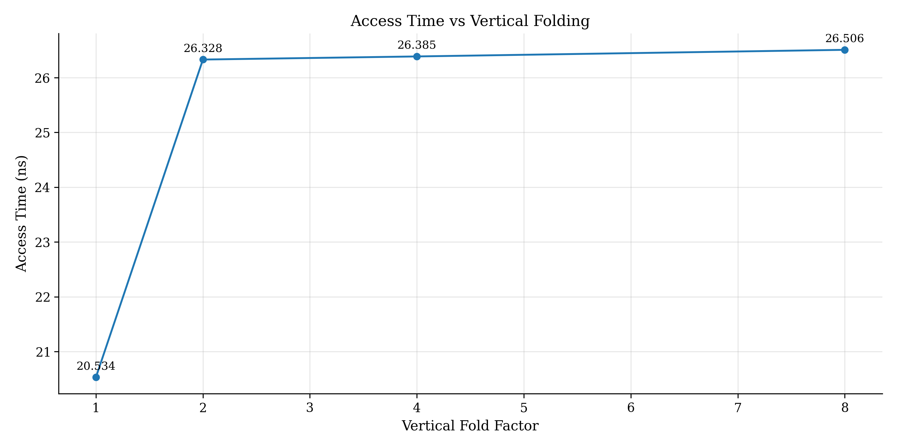
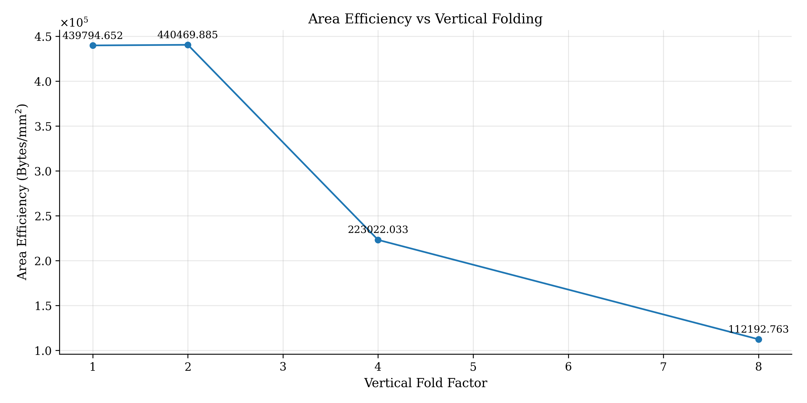

> This week was focused on completing the Scratchpad Final Report. 

## State
[NONE]

## Arch Updates
The number of banks needs to be fixed at 32. Swizzling rows ensures all the contiguous values at the same horizontal row, but swizzling columns means that these values will be at different horizontal rows (indices) in different banks. Thus, we can't coalesce multiple words together by reducing the NUM_BANKS parameter. Our only option is to increase FOLDING_FACTOR, which k-folds each bank. 

However, this gives very bad area efficiency and delay. Purely because all the sub-arrays are also 16-bit ports, and the wiring overhead kills us. 

## Progress
- Showed everyone how to use toggle and code covergae on QuestaSim. 
    > VLOG_FLAGS - ` -sv -compile_uselibs -cover bst -sv -pedanticerrors -lint -mfcu`
    > VSIM_FLAGS - ` -coverage -c -voptargs="+acc"`
- Please find our final report [here](https://docs.google.com/document/d/186o7OMmD8pstcT0LBeVNRixO5y7Undeff-K4Qaho2tY/edit?usp=sharing).
- I tried to synthesize the ROM on Flowkit, but I kept getting an `inferred memory unit` error during the optimization pas in `flow.yaml`. I intend to flush this out.
    > Note, this is technically useless, because the synthesis just gives FF numbers. 
- Worked with Joseph to set up [PCACTI](https://github.com/jo-ghanem/pcacti_vrf.git), and synthesized some SRAM bank designs. Only scaled up the vertical folding factor, as can be seen in the Group report above. (Navigate to the #Results chapter)

## Future Plan
- Clean up the code in Scratchpad Main for next semester. 
- Make a plan for compilers and simulation teams.  