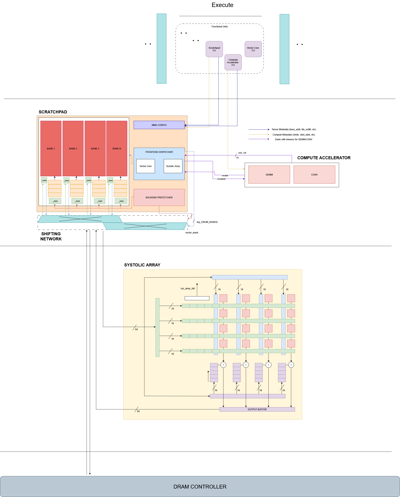

> This week was spent brainstorming with the GTAs on timelines and group formations. I focused primarily on getting the team up-to-speed, and ideating with Systolic Array on our interactions. 

## State

I am stuck on the Systolic Array <=> TCA <=> Scratchpad interactions. Tags: Saandiya, Jing, Sooraj. 
- Context: 
    - We've not defined a clear TCA architecture. There are tons of uncertainties with this FSM as of now. 
    - The TCA Sim, as defined [here](https://github.com/Purdue-SoCET/tensor-core/blob/tensor_compute_accelerator_akshath/tmp/TCA_Sim.ipynb) is incomplete. It does not contain `routing` algorithms of the PSUM outputs into the right buffer, nor do we handle timing of those transfers into the Scratchpad.
    - We do not have a clear understanding of how the data will be loaded into TCA. 
    - My suggestion? Have a crossbar sitting between the Scratchpad into TCA. Have the TCA maintain a large (deep) buffer, and another crossbar into the Systolic Array FIFOs
        - How will this help? It allows her to load data on a row-or-col basis, and then route the required values into the correct Systolic Array FIFOs. 
        - How will this scale? REALLY BADLY! 
- Update: None this week. This is currently blocked. 
    > **This will be clarified by Week 4-5 in [Saandiya's](../saandiya-kpsmohan/) well-maintaining logs. Hint: We offload this scheduling onus into the SW, and make Systolic Array an offload of the Vector Core. Check [Joseph's](../joseph-ghanem/) logs for a Vector Core perspective.**
- What's pending: 
    - A concrete algorithm, confirming the way TCA loads data from Scratchpad into the Systolic Array, and coordinates it out through PSUM Buffers. 
    - A SW Simulator for the same. 
    - A cycle-accurate simulator of the Systolic Array!

## Arch Updates
Cleaned up last semester's RTL. 


## Progress
- Onboarding presentation: https://drive.google.com/file/d/1yjtGIwYba1tQ_oEZ2nP-iKsl-h5MZtOR/view?usp=sharing
- Prepared a detailed reading list for Scratchpad members. I've linked it [here](./assets/reading-list.md). Please take a look if you want to get an intuition of the "Why?" of this project. Here is a summary of it: 
    ```
    Our Tensor Core enables higher throughput and an optimized way of performing GEMMs. We want to also do an interesting method of transforming Convolutions into GEMMs. 

    Scratchpad is the Cache and place where we get, store, and move matrices around for our main computing power-houses: Vector Core and Systolic Array. 

    To enable both GEMM and Convolutions as seperate operations, we need to do some fancy (and complex) things in the hardware. Complicating hardware is usually a bad idea,  but if we can promise that we sacrifice relatively few cycles in L1-level cache to avoid multiple L2 or higher cache reads (to create these Toeplitz matrices above), then great. 

    Main keywords for you all to know: 
    - Row-major, Column-major
    - Implicit CONV
    - Swizzling
    - Coalescing 
    - SRAM Banks
    - Crossbar Interconnects
    ``` 
- Ran students through [this](https://arxiv.org/abs/2110.03901) paper regarding implicit Conv and speedups. 


## Future Plan
- Complete the Simulator for the TCA. 
Week 3 Goals: 
- SCPAD Sim Complete. 
- TCA Sim Complete. 
- Interfaces + Modules + ISA (all very related) complete. 

