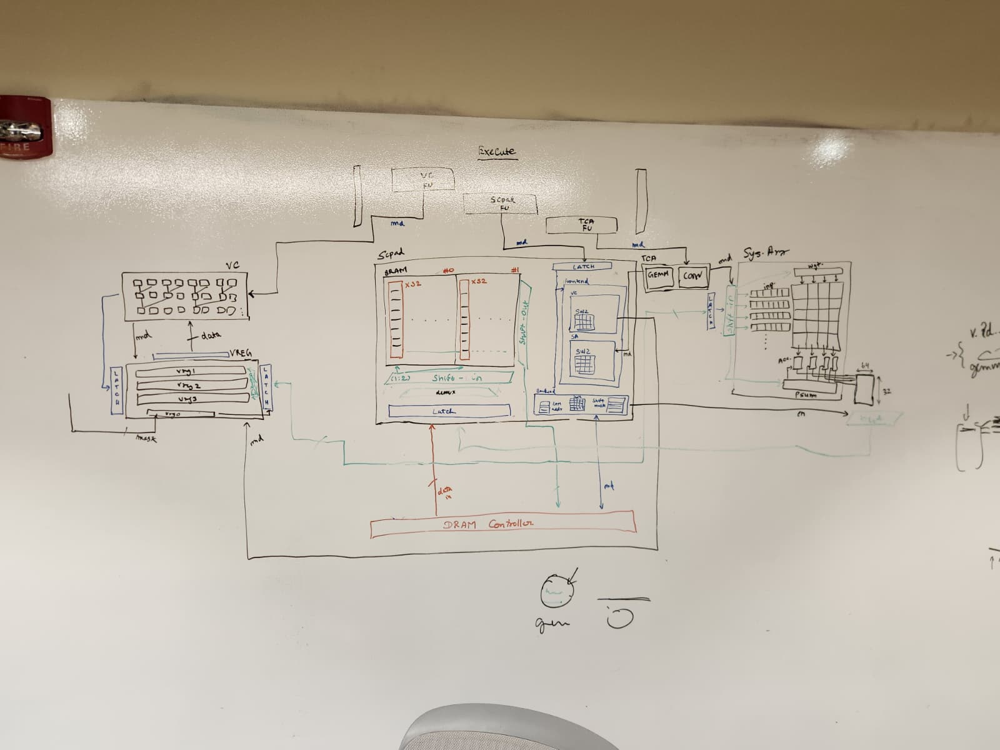
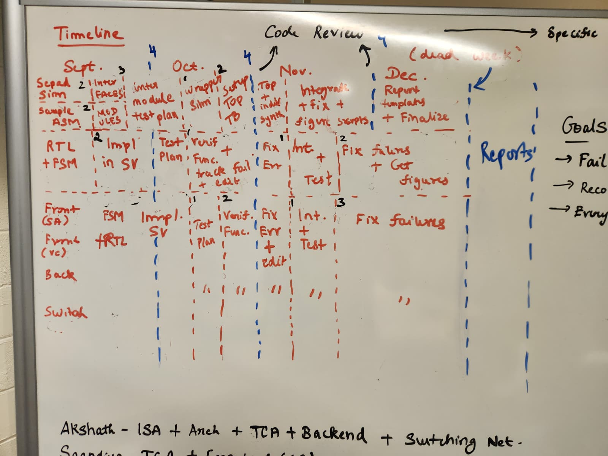
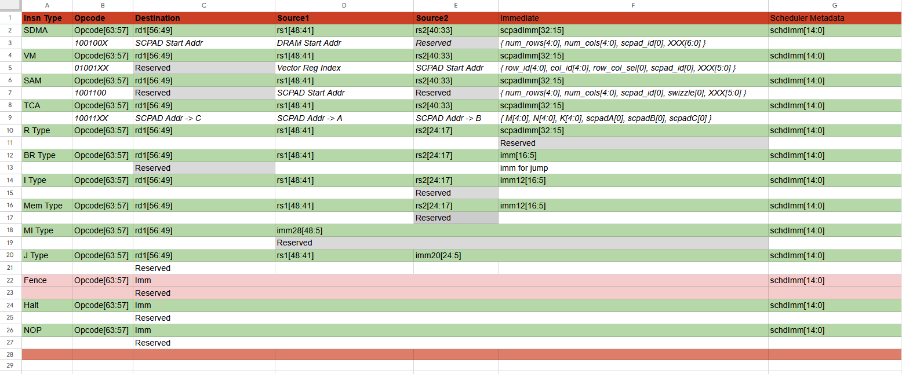

> This week was spent discussing Crossbar and TCA. We've spent a lot of time re-writing the Systolic Array architecture and logic. Sooraj and Saandiya are trying to come up with a input-stationary, vector-core offloaded algorithm for performing both GEMMs and CONVs. Emmi and Rafael are completing the RTL for Frontend, Julio is still ideating on Backend, Duc is reading crossbar literature.

## State

[NONE] I'd like to extend a discussion regarding the new GEMM and CONV logic.  The negative tone of this discussion is not aimed at anyone, but it highlights my awe of how TPUs and GPUs handle such intricate operations. 
- What's the problem here? 
    - First, Scratchpad stores data in a Swizzled manner. Swizzling is a mathematical function, so in-effect there is padding in each row (see the visualization below). 
    - Now, for a kernel to be loaded, we will waste a lot of the bandwidth in a "tile". Each "tile" is N rows deep, but W cols wide. If W is small (which kernels have), bandwidth is shot.  
    - If the TCA wants a load a kernel, it'll be a very inefficient operation. Crossbars are NOT cheap, and neither are large latches/buffers. The number of wires will destroy chip power and will be a PD nightmare!
    - Let's assume having these many crossbars (inside and outside the scratchpad with large fan-out, as shown [here](./assets/rtl_updated.jpeg)) is ok. **(Hint: it's not)**. What now? 
    - Now the TCA has loaded the kernel from Scratchpad into it's buffers. It needs to load some inputs into the buffers. 
    - But, wait! Since the kernels are placed in a 2D format inside the Systolic Array, we face two problems: 
        1. Ridiculously bad occupancy of the Sys Array. Common case of kernel size is 3x3. Compare this with the 32x32 PE Grid. 
        2. Inputs need to be latched/buffered, and then re-used many times. Re-use here looks like placing kW-wide (kernel width) vectors parallely (strided vertically) into the FIFOs.
    - This problem is easily visualized. Explaining it in text is difficult. Nonetheless, let's agree that our current arch is not clean enough to do this in an optimized way. 
- What's the solution? 
    - We don't know yet. Sooraj and [SysArray + Vector Core + Jing] are ideating over a better way to handle this by involving SW into the loop, and **utilizing the Vector Core as a "Tensor Memory"** (as is used Blackwell GPUs!) 
        > **Read B100 Micro Arch and the [Flash Attention 4 Reverse Engineering video](https://www.youtube.com/watch?v=VPslgC9piIw&list=WL&index=2)!** 
    - Another solution -- which was interesting to think about -- was converting the problem to an input-stationary workload. 
        - So, the weights will be streamed into a highly-occupied Systolic Array.  
            - Why? Because inputs, when tiled, will be very large tensors. Even with tiling, we see average tile size to be 32x32. Occupied the PE Grid well. 
        - But, our problem is that the weight-vectors -- which are to be streamed in -- become sparse. 
            - Why? We need the weight values to map directly into the input matrix. If you do the math, you'll see that you'd need to add in a lot of 0s **(Hint: [32-kW]*[0])** in between a few weight-vectors in order to get the PSUMs to flow correctly (downwards into the PSUM Buffers).
            - This will make the weight-streaming a very sparse operation. 

Exciting! 

## Arch Updates
#B1. We've decided that the Backend doesn't need to hold multiple MSHR-like queues next to each bank. Interactions between Backend and DRAM are vector based.

- Context: 
    - Initially, we wanted to model the SRAM Banks like our Split Transaction Banks from the ICache/DCache. 
    - However, they work on fundamentally different logic. SPAD Banks store 16 bit values, and are deep. Alternatively, the Cache Banks store large blocks of data, and contain ways/sets within them, thus wide.
        - Cache Banks need to independently deal with loads based on the ways MSHRs are allocated and popped, and require a HW-control mechanism to handle.  
        - SPAD Banks are SW controlled, and the loads are dealt with for each tile at a shot. Which means you can unify and load data in large busses, and then map them into the SRAM Banks. 
        > The workload is very regular and domain-specific, so we can amortize the cost of having control-logic in silicon and unncessary wiring (each bank having it's own port into the AXI-Bus => DRAM Cntrl.)
- Update: 
    - Backend takes in some "descriptors" regarding the tile to be loaded, and the logical matrix metadata, and fills its own queue that goes into the AXI-Bus<->DRAM-Cntrl. pipe. 
    - Responses are retrieved as 512b vectors, and then routed in-order STATICALLY into the banks. You do not need each bank to deal with loading it's own data, and how the data needs to get routed once it enters the overall scratchpad.  

#T1. Updated the RTL to visualize the Vector Core and Systolic Array communication. 

## Progress
- Finalized timelines for the team, coordinated with the VIP Deadlines. 
    
- Completed the functional SCPAD Simulator [here](https://github.com/Purdue-SoCET/AMP-sim/tree/atalla/sim/components/scratchpad). 
    - It's not cycle-accurate, but contains all the parts for Swizzling and Xbar. 
    - You can perform read and writes to the Scpad object, and visualize it like this: 
    
- Working with Duc and Haejune to conduct a proper lit.review of VLSI Crossbars for N:M interconnects. Check out [this list](./assets/crossbar-reading-list.md) if you are also interested. 
    - Here is the initial [Benes Network RTL](https://drive.google.com/file/d/1HUqxDwrh2MNsHn6P0KHmGRSXN1T8kBRc/view?usp=sharing) (Credit: Duc).
- Gave students [V1 Header/Interfaces](https://github.com/Purdue-SoCET/tensor-core/blob/b91dc6dad7b3678472cfd3018863d0c70de36b6d/src/include/scpad_types_pkg.vh) for the Scratchpad; Upgraded to [V2 Header/Interfaces](https://github.com/Purdue-SoCET/tensor-core/tree/8f405884fc35132359e3bc20b240ea5f860ad7b9/src/include/memory/scratchpad). 
- Here is the latest ISA spec!

## Future Plan
- Work with Duc and Haejune on the Crossbar. 
- Define Julio's SD Goals and expectations. 
- Finalize the ISA with [#T1, #S0] changes. 
