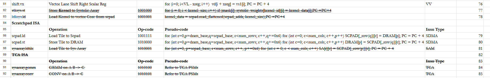
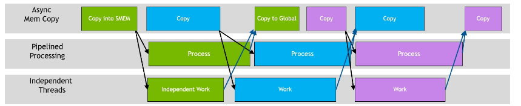
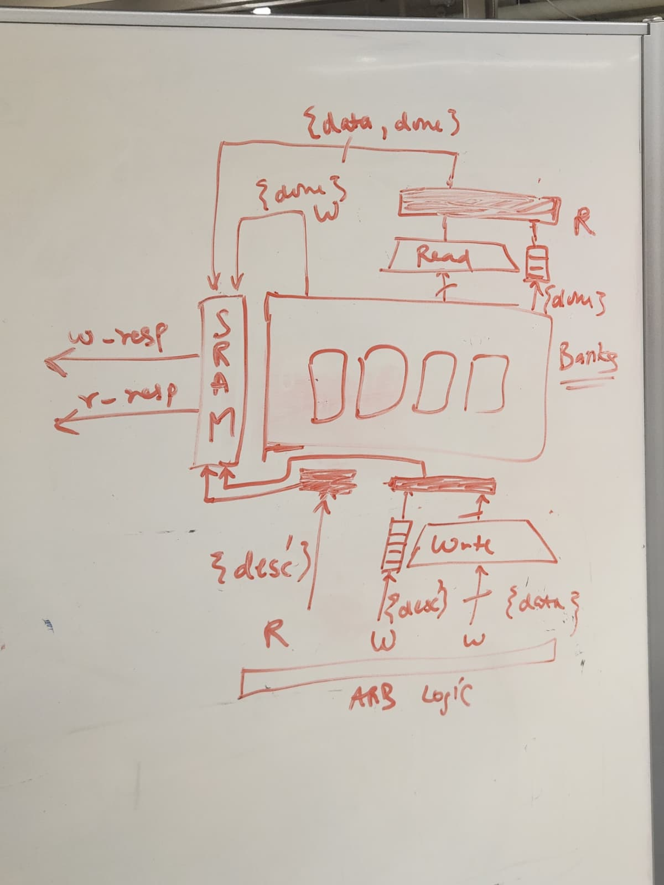

> Systolic Array has been officially converted into a Vector Core offload. Our interactions with the Systolic Array will be scrapped, and Scratchpad.Frontend will only be responsible for working with VC. 

## State
I am not stuck.

## Arch Updates
Atalla ISA has been updated to reflect the Vector Core offload, as discussed in the [last week's design log](./week3.md). Find the latest ISA Spec [here](https://docs.google.com/spreadsheets/d/1yDJ_oH0EXGIE4-4wVcwTeaw1Bg1vpoUSIkgTK3qDw_w/edit?usp=sharing). 

## Progress
- Gave students [V3 Header/Interfaces](https://github.com/Purdue-SoCET/tensor-core/blob/ad5f8f45c249d76dc10ad6b3a03bfab875a346ed/src/include/memory/scratchpad/scratchpad_if.vh). Updated based on discussions with Chase and Saandiya on specific handshake logic. 
- Reached a consensus regarding the Benes Network! Here, is a [V1 Crossbar Python Simulator](https://github.com/Purdue-SoCET/tensor-core/blob/scratchpad_main/sim/memory/scratchpad/crossbar.py). 
    - Control Bit Generation logic came from this [paper](https://www.cise.ufl.edu/~sahni/papers/benesSetup.pdf). 
- Created a reading list for Julio to understand the [async nature of Backend](./assets/async-mem-access-reading-list.md) memory-loading transactions.
    
- Defined a pipelined (II=1) structure for higher frequency and more MPC (memory_ops-per-cycle). 
    

## Future Plan
