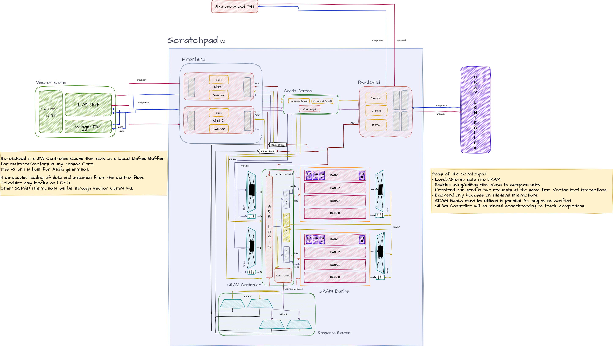

> Systolic Array has been officially converted into a Vector Core offload. Our interactions with the Systolic Array will be scrapped, and Frontend will only be responsible for working with VC. Frontend and Backend can parallely send in W/R requests into the SPAD Banks arrays, which means we need a select logic. 

## State

[STALLED] Need Chase and Jing to confirm how the GVLS loads data for Systolic Array Ops -- tile or vector based. Tags: Chase, Jing. 
- Context: 
    - Read [here](./week4.md#arch-updates) for context on why we need 2 SPAD, and this week's changes on the number of SRAM Banks. 
    - Now, for veggie file (check out [Joseph's](../joseph-ghanem/) logs) to get data, we load data out in a vector-specific format -- 2 vectors at a time. Atomic operation, RISCy.
    - But, for Systolic Array, now that we offload from Veggile File, will we have some Hardware FSM which focuses on tile-level operations? 
        - Make this a CISCy operation? 
        - Instead of having instructions focusing on a **single set of vectors**, but instead "streaming" out multiple vectors out of a **single set of tiles** in parallel. 
- Why? 
    - Throughput/MLP problem. 
    - Crossbars are slow. Caches are pipelined for frequency. This means we need optimized usage of these pipes to keep units busy, and to substantiate other arch changes. 
    - Systolic Array is also a throughput machine, not latency optimized. It's hungry and needs to be fed every cycle. 
- Update: Blocked for now. 
    > Check [Week 6](./week6.md) for the solution. 

## Arch Updates
#T2. Scratchpad will remain a single "module" while the SRAM Bank Arrays will be duplicated twice to allow for parallel load/stores, as the GEMM/CONV workloads require. Gives the illusion of two Scratchpads. 
- Context: 
    - For GEMM and CONV, we want to be able to stream the Activations and PSUMs in parallel. Weights are always pre-loaded first, so ignore that. 
    - To allow this, we need data to be stored in a way that does not require time-multiplexing the SRAM Array.
    - Thus, SW will store different tiles in 2 different SRAM/SPAD Arrays, and tells the GVLS (check out [Chase](../chase-johnson/)'s logs) to load 2 vectors out in parallel. 
- Update: 
    - Frontend no longer keeps the Vector Core and Systolic Array naming convention. Logic is the exact same, so we just call it Frontend Unit #1/#2. 
    - Frontend can send 2 R/W requests and Backend can send 1 R/W request at a time [Into the SRAM, not DRAM]. 
    - This means we need a muxing/credit-control logic on which of these requests can grab the pipe into which of the Scratchpads. 
    > This will get simplified/optimized in [Week 6](./week6.md).
#F0. Updated the RTL to reflect the Frontend datapath to the VC. 

#S1. Atalla ISA has been updated to reflect the Vector Core offload, as discussed in the [last week's design log](./week3.md). Find the latest ISA Spec [here](https://docs.google.com/spreadsheets/d/1yDJ_oH0EXGIE4-4wVcwTeaw1Bg1vpoUSIkgTK3qDw_w/edit?usp=sharing). 

## Progress
- Gave students [V3 Header/Interfaces](https://github.com/Purdue-SoCET/tensor-core/blob/ad5f8f45c249d76dc10ad6b3a03bfab875a346ed/src/include/memory/scratchpad/scratchpad_if.vh). Updated based on discussions with Chase and Saandiya on specific handshake logic. 
- Reached a consensus regarding the Benes Network! Here, is a [V1 Crossbar Python Simulator](https://github.com/Purdue-SoCET/tensor-core/blob/scratchpad_main/sim/memory/scratchpad/crossbar.py). Control Bit Generation logic came from this [paper](https://www.cise.ufl.edu/~sahni/papers/benesSetup.pdf). 
- Created a reading list for Julio to understand the [async nature of Backend](./assets/async-mem-access-reading-list.md) memory-loading transactions.
    
- Defined a pipelined (II=1) structure for higher frequency and more MPC (memory_ops-per-cycle). 
    

## Future Plan
- Finalize the ISA with [#S1, #B2] changes.
- Rework the Frontend Logic. How will Frontend accept and return responses. 
- Complete the Design Review Slides! 