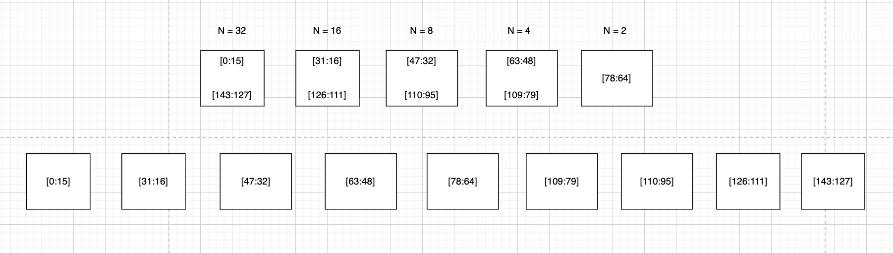
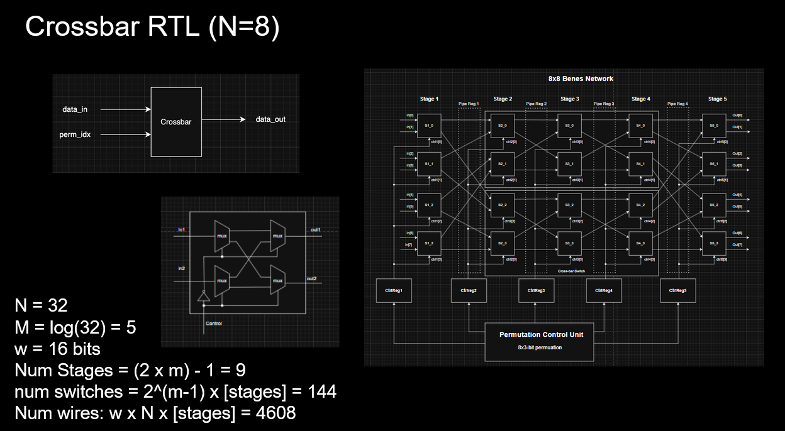
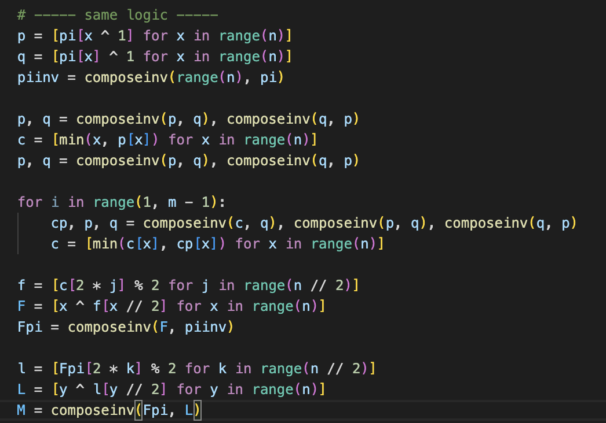

> Since SW completely abstracts away the GEMM and CONV logic, we can set a constaint that the new vector load instructions will be handling 2 "streams" of mem.load/store to 2 seperate SPADs. This means, we can avoid this complicated muxing of 4:2 requests from the Frontend=>Grant-Logic<=Backend. 

## State

[STALLED] [Week 4](./week4.md) GVLS question (explained in #State) not answered. Solidified in [Week 6](./week6.md).

[STALLING] I am stuck on the XBar design for the Scratchpad. Note to Systolic Array team -- This is not a shifting-network. Tags: Haejune, Duc, Sooraj. 
- Context: 
    - Currently, the only uncertain part of the design pertains to the crossbar. The math for Benes "topology" is well-defined, but the control-bit-logic is not. 
        - It's not that the Control Bit generation is a magic. 
        - This bit generation is a tree-travseral-based approach, and requires vertices and edges to be explored. 
            - Why? Because Benes aims to be re-arrangably non-blocking and avoid internal link contention. 
            - We DO NOT want buffers inside switches handling this contention situations. 
        - Thus, existing SW routines need to be parallelized to be unrolled and layed out in HW. 
        > Completing this in a single-cycle is literally impossible. The most efficient implementation we've found is explained in the [Bernstein paper](https://cr.yp.to/papers/controlbits-20200923.pdf).
    - We've understood that this is a common problem faced across the industry. PhD Dissertations have purely been focused on efficiently VLSI implementations of N:M crossbars. 
    > Most of these implementations are derived from the 1960s-1980s Telecom/Networking industry. Parallelization is a huge driving factor, and thus most of this logic is developed by Crypto and Math researchers.   
- Update: 
    - Haejune has mapped out how many control bits are needed (and at which stage), and how the control bit logic (above) maps across the stages. 
    > **Basically, 5 logical stages of CBG for 9 stages of Data Routing**
     
- What's pending: 
    - Define an efficient way to perform the CBG in Hardware. 
        - CBG logic is purely dependent on these "Compose-Inverse" operations. 
        - **Each of these operations maps ugly-ly to multiple mux-trees. Small trees of course, with very dense mux->mux wiring.**
        - WNS needs to be calculated to understand the realistic-ness of having this synthesized in hardware. 
    - Look into Bitonic Parallel Sorting networks. What do they need in Hardware? 
        > Can the extra comparison in each crossover switch be justified? (Hint: We might probably go here!)

## Arch Updates
#F1. #B2. We've moved around the control-data flow in the Frontend to allow for II=1 pipeling, which means Scratchpad can "accept" ops every cycle, and "respond" in parallel too. 

- Context: 
    - In [Week 4](week4.md), we discussed the 2 SPAD Arrays, and our design choices. 
    - There is still the problem of 2 Frontend **Req/Res** Sets and 1 Backend set. This requires some Grant/Slotting logic, like how CPUs have Select/Issue logic. 
    - This would lead to UNPREDICTABLE latencies. 
    - Each set could map to either SPAD Arrays too. We will need another crossbar here, but a MUCH simpler one. 3:1 and 1:2.
    - Wiring is NOT clean. Hell the RTL Diagram itself is not clean.
- Update: 
    - Updated the Backend to have 2 sets of Req/Res too. 
    - Let each Frontend-Backend set be clustered together into one pipe, and **statically** map into a single SPAD Array. 
    - Super simple logic, and RTL `generate` loops. 

#S2. ISA has been edited to define VREG <-> Scratchpad interactions to be defined as 2 Vector load/stores each cycle. 
    - One of them can be masked out (uncommon case).  SW should be able to reorder to fill up these `load-slots` in the GVLS every cycle. 
    - [Week 6](./week6.md) will define the real HW change to accomodate this instruction in a streaming-manner. 
        - It'll also explain the problem with relying on normal scoreboarding strategy. (Hint: These instructions need to be split-transactionable)

## Progress
- [Design Review Presentation](https://docs.google.com/presentation/d/1iEvYechSCiIgipsWWUsguGSQa5CKamQXyHnh3BL8s3I/edit?usp=sharing) finalized with the Frontend-Backend-XBar subteams. 
- Completed the following modules within the [V3 RTL](https://github.com/Purdue-SoCET/tensor-core/tree/1530080fdd34efb805dd82d5b0aa280dd81e7c8c/src/modules/memory/scratchpad). Built such that the Frontend and Backend teams just need to fill in the blanks. 
- Defined a clear Benes network diagram in RTL, and Switch schematic. (Credit to Duc)
    
- Python implementation of the Benes Network CBG from the Bernstein Controlbits paper: 
    

## Future Plan
- Run through the interfaces with the team, and have them start writing code. 
- Work with Haejune for a clear XBar plan. This is purely a trade-off game. How do we smartly analyze these tradeoffs? 