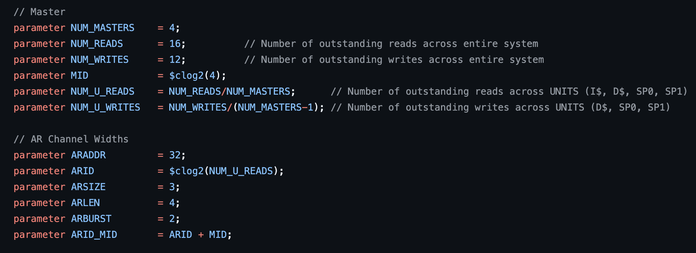
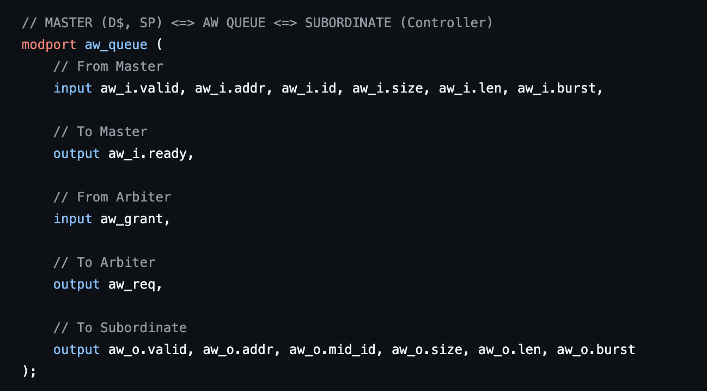

# Week 11

## State:
I am not stuck with anything, I would like to spend time viewing the blocking RTL code and testbench along with understanding the DDR simulator model. 

## Progress:

This week, on Friday (10/31/25), me and the DRAM team meet to discuss the progress of the RTL diagrams for Non-blocking controller. During this discussion, there were a few questions regarding my AXI-based interconnect and its functionality that the other DRAM members needed clarification on. 

During this meeting, two queestion arised that I want to think about and find solutions to:

  1. think about when reads comeback, since its double data rate. how can it be safely implemented (CDC issues)
  2. think about when the arlen can come back to axi bus. Would want a "rlen" upon a read response so nwe know how much beats did to be de-appended from the reading response. The   "rlen" should be known on the first cycle of a read beat but we then we need to decide when to pop the read request off of the load queue in the memory controller.

The first question is more of an overall goal that is something to be consider but does not need to be answered immediately. For the second question, this is something we must consider in our design because the scratchpad/caches might not always request for a full 512 bits value upon a read. The same goes for a write, the scrathpad/caches might not always write 512 btis of data. Since Physical DRAM must always read in or write out 64 bits for 8 cycles, we my AXI-interconnect but append the necessary 0s for WRITES and de-append unecessary data for reads. This logic will be added to the read response router for reads and to AW+W queue for writes. For reads, we must remember the number of bytes (rlen) the master requested which will add a bit more logic but is manageable. I plan for the registers to hold this values upon an outstanding load request so we know what can be de-appended. 

During this week's sunday AI Hardware Meeting (11/2/25), I begin to write the pkg file and interface for the AXI-based interconnect. This was able to be completed fairly fast and can be modified at any point to test out different values. For example, the number of outstanding transactions is variable but can be tested through simulation. Below is few images from the pkg and interface file for the AXI-based bus: 

  1. 

  2. 
     
# Future Steps:
This week, I have a ECE559 exam so not much work will be done until after that exam, but after it, I plan to start writing RTL code for a few units in the AXI-based interconnect. There is also design review 2 that me and my team will begin preparing for. 
