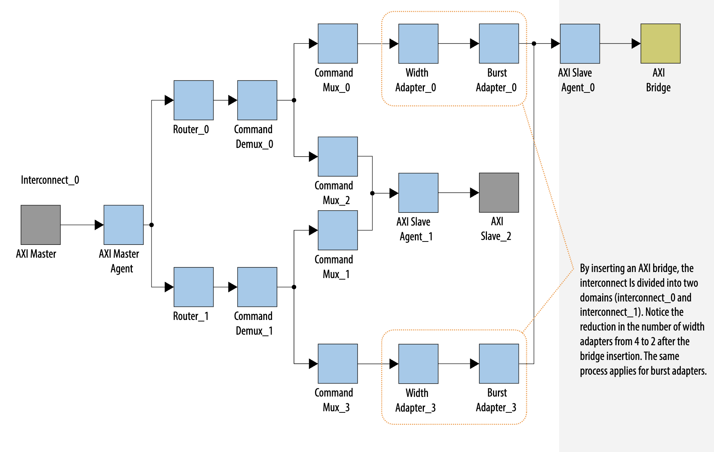

# Week 12

# State
I am not stuck with anything. Currently in progress of coding AR queue. The first component of the AXI bus that I am writing RTL code for. I would like to spend time viewing the blocking RTL code and testbench along with understanding the DDR simulator model.

## Progress:
This Thursday (11/6/25), The DRAM team met with our team leader to discuss the current progress of our AXI-based interconnect and non-blocking controller. We then discussed the expectations for the rest of the semester and upcoming deadlines. There will be the design review 2 on (11/10/25) where we will discuss our progress with Professor Raghunathan in attendance. There will also be a poster presentation and a final presentation for SoCET on 11/19/25. We also discussed how for 696, there will be a 25 page report that I must write by then end of the semester and the expectations for that. 
During this meeting, I had a few questions regarding how many outstanding requests the AXI-based interconnect can support, I was told to make this value parameterizable since its too difficult to determine that value at this time. Instead, we can make the value parameterizable and after writing the RTL, we can simulate possible combinations and utilize little's law to capture a value for best preformance. 

This Sunday (11/9/25), During the AI hardware meeting, me and the DRAM team spent time gathering all the progress we made since the last design review and put together a professional and informative set of slides that we will present for the design review 2. We spent time looking back at our feedback from design review 1 and some of the questions we were asked during it to better prepare ourselves for design review 2. During sunday's meeting I assisted the folks on the DRAM team specializing in the nonblocking controller to finalize their RTL diagrams. There was a question on how can we maintain consistency since although the controller is non-blocking, requests could be returned back to the sources out-of-order. I assisted them with how their design can be altered to protect againist this condition.

On monday (11/10/25), The DRAM team and I, met prior to them presentation to practice our slides. Then later in the day, we had our actual presentation which went very well I discussed the need for a split-transaction bus and how my implementation will support the non-blocking and out-of-order goals of our processor. Professor Raghunathan did have feedback for me saying to look into some AXI interconnect IPs made by Intel to add a validation feature to my design. I could use their spec and standards to see how functional my design can be. 
Intel had documentation on their AXI interconnect that I read through to get a better understanding on if my design will be functional. 

  1) 

# Future Steps:
This week, I plan to continue writing the code for the AR queue unit and hope to have progress on it by next week. 
