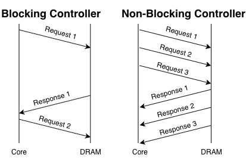

# Week 13

# State
I am not stuck with anything. Currently in progress of coding AR queue. The first component of the AXI bus that I am writing RTL code for. I would like to spend time viewing the blocking RTL code and testbench along with understanding the DDR simulator model. 
Also need to start thinking and collecting resources for the final report. 

## Progress:
This Thursday (11/13/25), the DRAM team met with our team leader to discuss the current progress of our AXI-based interconnect and non-blocking controller. We mostly discussed the feedback we received from our design reveiw 2 that we presented the week prior. We talked about areas we improved from since the first design review and where we still need to improve on for the final presentation. Mostly areas we need to improve on is to not get too technical in our designs and focus more on design choices ansd why we made them. 

This Sunday (11/16/25), During the AI hardware meeting, I helped the DRAM team prepare for their poster presentation that was coming up on the following tuesday (11/18/25). I ensured they included components that displayed our project but was not too technical and easy for viewers with no much of a background to understand. 
I put together this diagram below: 

  1) 

I wanted to ensure we express the main ideas that we are trying to exploit. In our case it is the feature of non-blocking. After we completed putting together a draft of the team's poster. We began to work on our upcoming final presentation on 11/19/25. This presenatation was for SoCET leads to see and undestand the background behind our project and our current status. We ensured to keep all feedback from the first and second design reviews in mind while preparing for the presentation. By the end of sundays meeting, we had a rough draft of our final presentation's slide deck. 

On Wednesday (11/19/2025), the DRAM team and myself met prior to our presenatation timeslot to practice our slides and add any finishing touches. We then presented at our scheuled time which went well and seemed like we had made progress from our first design review to this point. We explained the background and motivation of the nonblocking controller/split-transaction bus, then into what progress and design choices we made, then concluded with the future steps for next semester and what our expectations are for it. 

# Future Steps:
This week, I plan to continue writing the code for the AR queue unit and hope to have progress on it by next week. I also will start gathering resources for the final report and begin writing it. 

