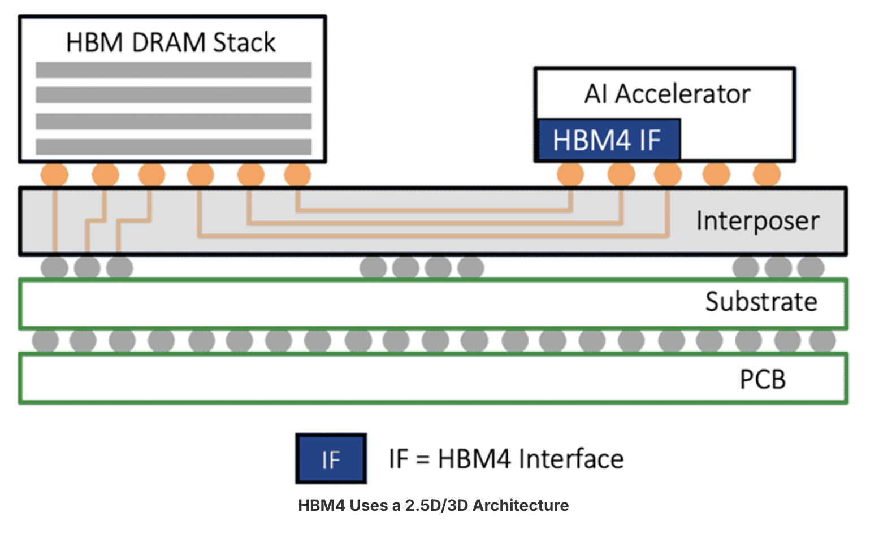

# Week 14

# State
I am not stuck with anything. Currently in progress of coding AR queue. The first component of the AXI bus that I am writing RTL code for. I would like to spend time viewing the blocking RTL code and testbench along with understanding the DDR simulator model. 
Also need to start thinking and collecting resources for the final report. 

## Progress:
This week was Thanksgiving break so not much progress was able to be made. During last thursday's (11/20/2025) DRAM meeting, our team leader, Sooraj, said how he has plans for next semester to look into utilizing Ramulator simualtor and HBM memory over the DDR memory model we are currently using. 
This shift would be tough since a lot of work has been done with testing and simulating the DDR4 model, but would be extremly useful as HBM memory is what is currently being used in AI processors. For this week, I spent time looking into the Ramulator simulator and HBM memory to better prepare us for what work might need to be done for next semester and if it is something feasible to implement. 

For learning about HMB, I utilized this source: https://www.rambus.com/blogs/hbm3-everything-you-need-to-know/
A few notes I look: 
  - HBM (High Bandwidth Memory) uses a 3D-stacked DRAM architecture to enable higher bandwidth than DDR memory making it much better suited for handling AI workloads.
  - HBM provides lower power per bit transferred due to shorter interconnects and wide interfaces.
  - Since HBM uses a wide and parallel interface, it requires a different controller and interconnect design considerations compared to DDR-based systems.

      

    Since it may not be feasible to create an entire controller specific to HBM, utilizing a simulator like Ramulator may be more fesabile at this time. Ramulator provides us with memory models like HBM where we can connect our split-transaction bus to and then geter stats and verify preformance on our system.

    # Future Steps:
Next week, I plan start gathering resources for the final report and begin writing it. I will meet will the rest of the DRAM team to devise a structed plan to allow for writing the report.

