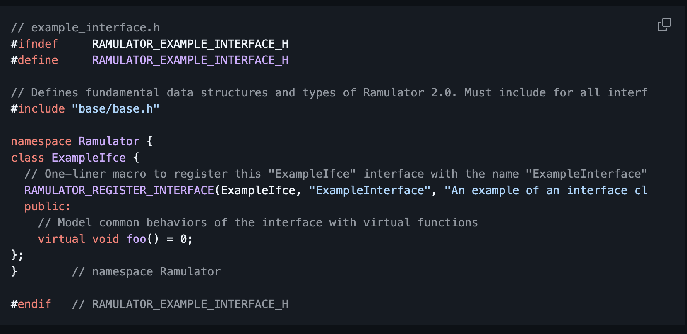
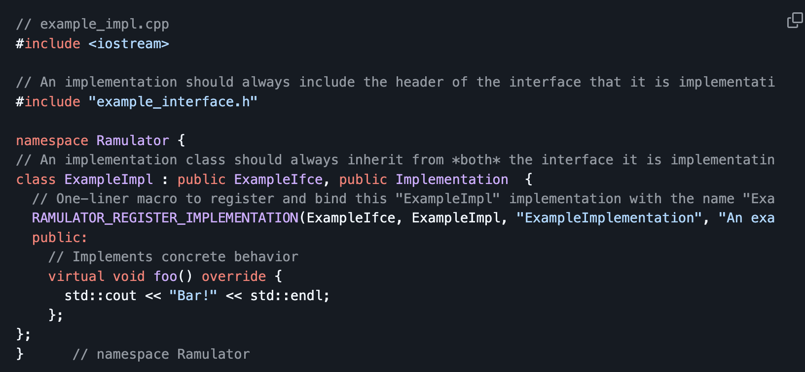

# Week 15

## State
I am not stuck with anything. I would like to spend time viewing the blocking RTL code and testbench along with understanding the DDR simulator model. Progress on the final report will start this week. 

## Progress:
This week, me and my team begin initial progress on the final report that is due on 12/12/25. We had a few inital questions on how it should be formatted since the DRAM subteam has 3 working projects (blocking controller, split-transaction bus, non-blocking controller). On 12/4/25, during the weekly DRAM subteam meeting, we discussed with our team lead, Sooraj, how our report should be formatted. He discussed how he would like all 3 working projects within one report. This way, any reader can understand the flow and choices made to go from the blocking controller to an optimized non-blocking controller and bus. 
This now gave us direction on where to start in regards to lating out a structured format for the report. After then 12/4/25 meeting, I spent time analyzing the rubric for the final report. A big section was on "design choices", why they were made and what tradeoffs do they entail. For the rest of the day, I spent time looking over all past design logs, notes, presentations, and diagrams to compile all design choices. 
I was able to compile this list of chioices regarding my bus. 
  
  1. Why was a custom design choosen over using open-source AXI bus or vendor IP.
  2. Why are write data and write address locked for this implementation.
  3. Why a limit is put on outstanding transactions and how that is enforced.
  4. Why we disallow duplicate IDs.
  5. How was arbitration policy chosen.

These design choices above are core choices that directed my design of the split-transaction bus and will be discussed in detail in my section of the report.

On 12/5/25, the DRAM team met together to decide (based on the rubric) of a structured format for the report since we will be making one report for the entire group. We were able to put together this overview:

  1. Abstract
  2. Introduction
  3. Background
  4. Blocking Memory Controller
  5. Split-transaction Bus
  6. Non-Blocking Memory Contorller
  7. Conclusion
  8. References

With each main section (Section 4, 5, 6). We decided to follow the rubrics flow of having an individual introduction for that specific project, design choices, microarchitecture, results, limitations, and future plans.
With this, we have a structure flow that allows the entire DRAM sub-team to build one report that is professionally developed and easy to read/understand. 

I also spent a bit of time looking into Ramulator simulator that was mentiones in last week's design log. I read the README of the opensource repository which can be found here: https://github.com/CMU-SAFARI/ramulator2.git. The README discussed the DRAM models the simulator supports like DDR3-5 and HBM2-3. It also discussed setup steps that I plabne to test out during winter break or next semester.

Below is an example of a Ramulator interface and then how the interface is implemented. 

  

  

# Future Steps:
Next week, I plan to continue writing and completing the final report. 
