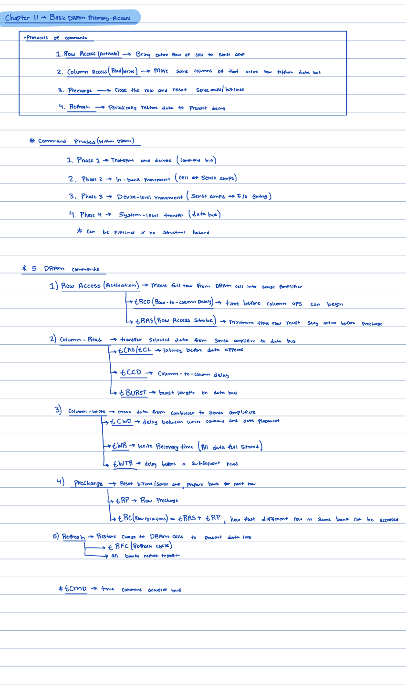
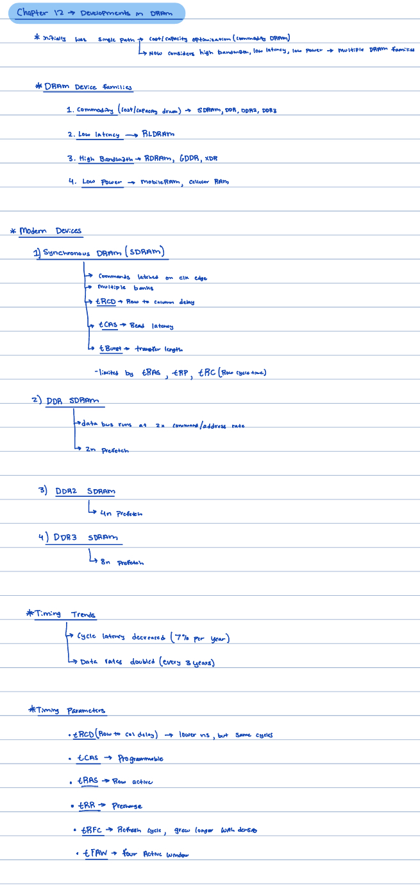
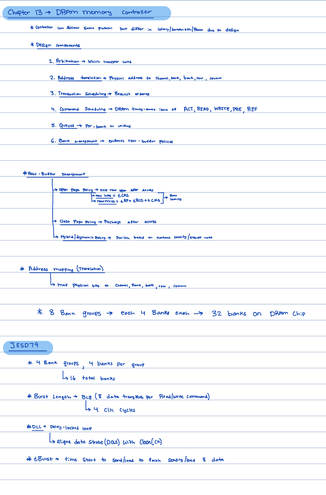

# Week 3 design log
## State: 
  I am not stuck with anything, would like discuss arbitration between caches/scratchpad and look into possible solutions.

## Progress:
  This week I began with watching the DRAM youtube video that went into the basics of DRAM structure/addressing and visually demonstrated basic transactions. I then began reading the 4 assigned chapters from the Memory System book. Chapter 10 discussed the basic DRAM organization. Chapter 11 discussed the DRAM commands and all needed parameters like tRCD, tRAS, tCAS, tRP, ect. Chapter 12 discussed the evolution of DRAM devices. Chapter 13 discussed the DRAM Memory Controller and its components. Attached below are notes I look from the 4 chapters   I read: 

  1. Chapter 11 notes: Basic DRAM memory access
     
     
  
  2. Chapter 12 notes: Developments in DRAM

     
  
  3. Chapter 13 notes: DRAM Memory Controller

     

## Next Steps: 
  After reading the 4 chapters, I began to review the rtl diagrams from last years and correlating my understanding from the reading into the diagram.  I am now in the process of reading the JEDEC DDR4 documentation and understanding the timing requirments needed for DDR4. The JEDEC discusses all the timing requirments that must be met for all transaction types. For next week, I plan to read through the JEDEC documentation and be able to verify all the timing requirments that were made last semester with what I will read. 
  
