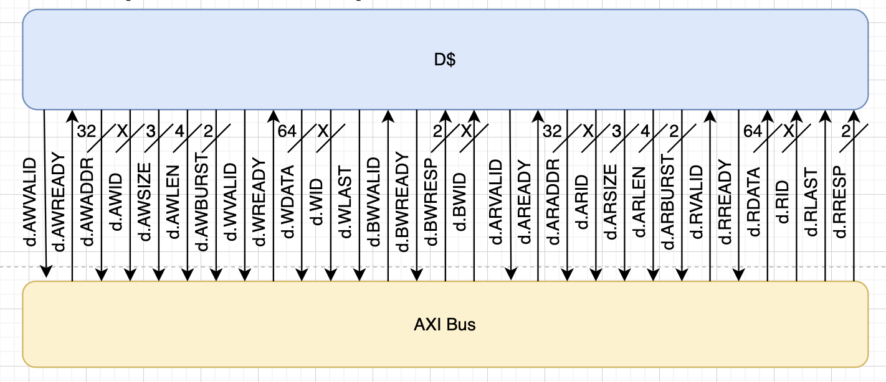
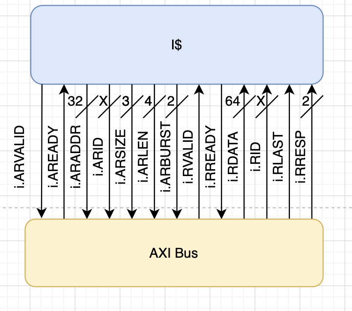
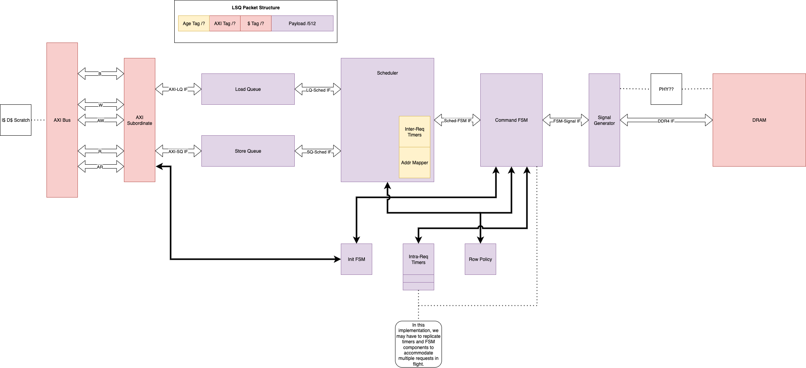
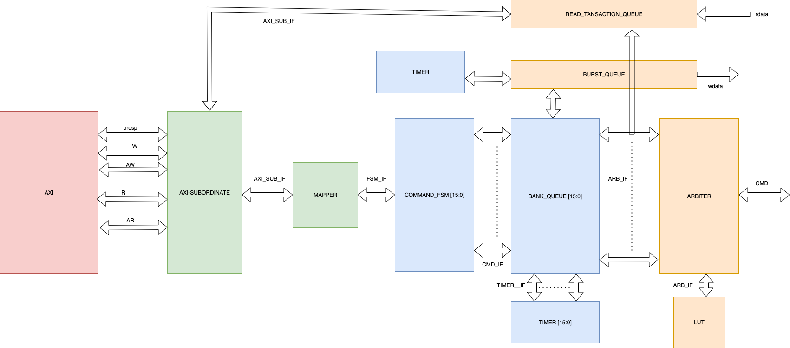

# Week 7

## State:
I am not stuck with anything, would like to get a better understanding of the lockup-free cahce and it functionality as it impacts the development of both the AXI bus and Non-blocking DRAM controller. 

## Progress:
This week, my progress started with continuing my reading and learning of the AXI interconnect. Most of what I learned was from last week, but this week I wanted to fully understandt he interface so I could define the naming and sizes of all top-level inputs/outputs. I spent time looking over the interface files for the scratchpad and lockup-free cache so understand what signals are being sent into DRAM, and if any changes need to be made. 

During Sundays (10/5/28) AI hardware meeting, I presented my finding on the AXI bus and interfaces to the rest of the DRAM team. From this, I was able to put together a top-level inferface view depecting all the signals the AXI bus with interface with and the sizes of each signal (note: since there was quite a bit of signals, for clarity, I seperated them):

  1. SCRATCHPAD <-> AXI (AW/W/B):

      .png)
  
  2. SCRATCHPAD <-> AXI (AR/R):

       .png)
  
  3. D$ <-> AXI (AW/W/B/AR/R):

       
  
  4. I$ <-> AXI (AR/R):

       
     
  5. AXI <-> CONTROLLER (AW/W/B/AR/R):

       

Continuing with Sundays AI Hardware Meeting, the DRAM team and myself, discussed the possibility to hold off on creating a out-of-order version of the DRAM controller, and just focus on a non-blocking implementation. This way, we can understand all the complexity and issues with creating a non-blocking implementation and ensure that is fully functional before we then integrate out-of-order. Out-of-order will bring about more complexity and issues, so its best to put all efforts towards non-blocking. And integrate Out-of-order later down the road.

Then on Wednesday (10/8/25), the DRAM team and myself meet and began discussing the top-level implemenation of the non-blocking DRAM controller. Our goal was to have a top level abstracted version to show Sooraj during our thursday meeting with him. We started with collecting all the units that could reused (possibly updated) from the blocking version. These units consisted of: 
  - Address Mapper
  - Command FSM
  - Initialization FSM
  - Row Policy
  - Signal Generator
  - Timing Control
Then we began dissusing what units will need updates and what new units will need to be added for non-blocking. We ended up dissusing two possible solutions to support non-blocking. One solution consists of a seperate load and store queue. The second solution consists of a per bank queue. Both solutions seem fiable and are able to support the non-blocking implementation. We plan to show Sooraj both solutions and get his feedback on what is a better route to follow in regards to complexity and area. Both top-level views are listed below:
  1. Solution 1 (Seperate load/store queues):

     
  
  2. Solution 2 (Per-bank queues):

     

## Questions:
  - Since we are split-transaction, say there is a write request from dcache, and say that the writes have been busy so the write request is stuck in the AXI queue and has not reached DRAM. Now say later in the program, a read is issued from dcache to the same address as the write. But the read passes through AXI and is in DRAM. Is that a case that needs to be handled? Does software or the cache protect against this? --ask akshath.

  - Does program order need to be maintained in AXI/DRAM controller?

  - In the AXI queues, should we pop the request when it passes through into AXI or when it gets a response back. I think it should pop when we get a response back. This is much safer but add slightly more complexity. We will need to leave a copy of the request in the queue when the original request gets passed into AXI. Then, there must be a pointer so other requests are able to get issued. Then once the response is sent out from DRAM then into AXI, we can safely clear the copy of the request from the queue. Moving foward when we add out-of-order to the non-blocking controller, we will have to copy the pointer along with the request to avoid converting the queues into CAMs.

  - Understand and determine how outstanding requests we will allow. (VERY IMPORTANT)

## Future Steps:
Moving forward, I would like to finalize the top-level RTL for the AXI-bus. We have finalized the interface for the AXI bus and have a rough draft of a top-level, but would like by next week to have a finished top-level that we can present to Sooraj and make receive feedback. 
