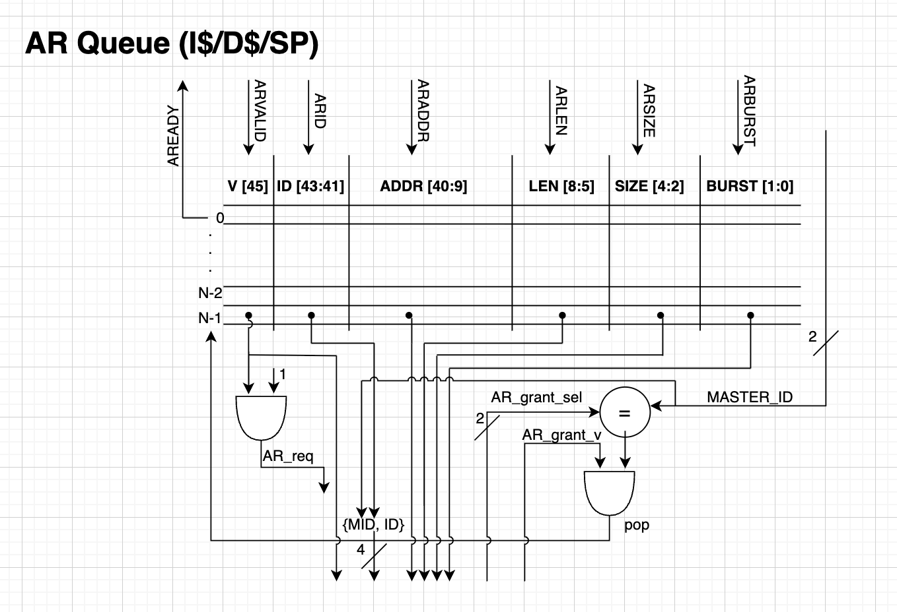

# Week 8

## State: 
I am not stuck with anything, would like to get a better understanding of the lockup-free cahce and it functionality as it impacts the development of both the AXI bus and Non-blocking DRAM controller. Also need to verify how many entries will be placed in the bank queues that are a part of non-blovking memory controller.

## Progress:
This week, my progress started with a meeting on friday (10/10/25) with scratchpad lead Akshath. He had a few questions about the interfacing and any changes he and his team must make to integrate with the AXI bus. My team also had a few questions in regards to the requests being sent from scratchpad which we were able to ask during the meeting. 
The main question me and my team were concerned about was: 
  
  - Since we are split-transaction, say there is a write request from dcache, and say that the writes have been busy so the write request is stuck in the AXI queue and has not reached DRAM. Now say later in the program, a read is issued from dcache to the same address as the write. But the read passes through AXI and is in DRAM. Is that a case that needs to be handled? Does software or the cache protect against this?

We were able to confirm that this is an issue the scheduler will handle and our unit won't have to face this issue. During the meeting, I showed Akshath the interface with all signals and sizes that I determined last week. A full description of meeting notes can be found in "aryan-kadakia/meeting notes/meeting 10-10-25.md".

This week was fall break so we did not have our weekly Sunday AI harward meeting. I did spend time during the break to finishup the AXI top level RTL. I am still in the progress of making changes but by next week I will have the top level finalized. I also spent time working on the RTL for a few of the AXI components. I finished the RTL for the AR queue which handles all the read requests. There will be 4 of these queues for each of the memory units. 
Below is the RTL: 
  
  1. AR Queue RTL

      

I am currently in the process of putting together the RTL for the AW and W queues. A bit for logic will be added since the W channel must be locked to the AW. This means a AW request cannot continue until the W data is present. During the weekend, I decided the number of outstanding transactions we will start off to support is 4 per read and write and per memory unit. Meaning the AXI AW and AR queues are 4 entryies deep with the W queue being 4*8 = 32. I plan to keep these values parametrizable to they can be changed if needed. 

After fall break, on Wednesday (10/16/25), I met with a member of my team, Tri, to discuss the current progress and steps we should take to move foward. I presented my RTL for the AR channel and got it verified. We then began discussing 
    

