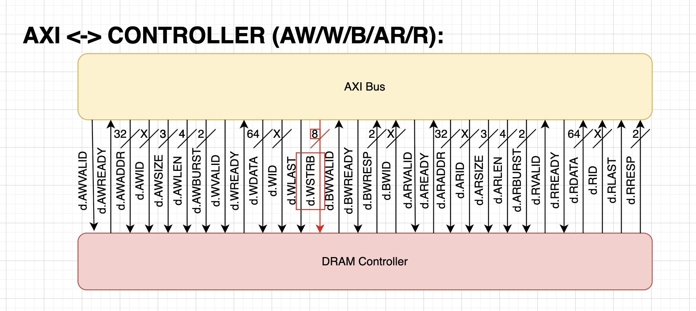

# Week 9

## State: 
I am not stuck with anything, would like to spend time understanding the DDR4 model that is being used in testing for the blocking memory controller. I would like to practice testing with the model before the end of the semester to get a good understanding and if there is any confusion, ask the members of my team who are currently working with it.

## Progress:
This week, I had an ECE565 exam, so most of the progress had to be stalled to prioritize that exam. But during our Sunday AI hardware meeting (10/19/25), we spoke with the scratchpad team and discussed implementing a write mask feature per each beat of data. We were able to mask an entire beat but to mask within a beat becomes a bit more tricky but can be done. The DRAM model has a feature to mask per byte so we can utilize this to mask within a data beat. 
To accomodate this change, I made updates to the AXI interfaces that I had finalized two weeks ago. I added in a "WSTRB[7:0]" signal as part of the W channel signals that signifies which bytes need to be masked upon a write. The scratchpad sends us a 4 bit signal but I will convert it into a 8 bit signal to match AXI standards. So within a 64 bit data beat, the 8 bit WSTRB tells us which of those 8 bytes need to be masked. Below is the updated top-level AXI interface: 

  1. AXI to Memory Controller

   

  Note: this change was added from Scratchpad to AXI and DCache to AXI. DCache won't do any masking but the change is added for consistency across the channels. 

## Future Steps:
Our weekly Thursday DRAM meeting was canceled due to the 565 exam but moving foward, I plan to complete the AW and W queue RTL. I completed the AR queue last week. I also plan to complete the arbiter RTL after the exam. By next week's Thursday's DRAM meeting, I hope to have RTL diagrams for AR, AW, and W queues completed to show to Sooraj and the rest of my team. And I plan to have the arbiter RTL and FSM completed as well. 
At this point, all main subunits part of the AXI interconnect should be complete and I hope to get some review on them so then I can start building a interface file next. 

