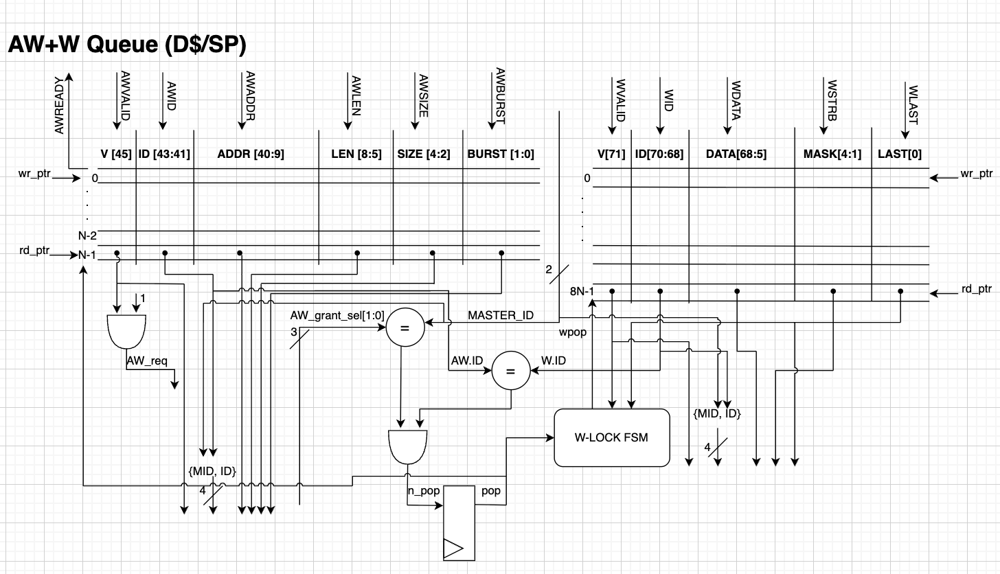
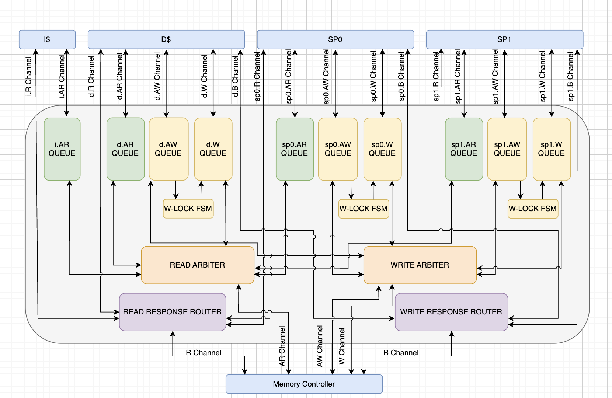

# Week 10

## State:
I am not stuck with anything, I hope to start RTL coding soon. I would like to spend time viewing the blocking RTL code and testbench along with understanding the DDR simulator model. 

## Progress:

This week, I was unable to attend our weekly Sunday AI hardware meeting (10/26/25), but I continued my progress on the RTL diagrams for the AXI bus. I had showed the RTL of the AR channel queue 2 week ago, this week I was able to finish the RTL diagram of the AW and W channel queue. 
Below is an image of the RTL diagram for the AW+W channel queue: 

  

AXI supports unlocking the AW and W channels so write requests and write data and proceed independently to optimize bandwidth. I decided for this implementation, I will keep the AW and W locked for now due to the non-blocking being already complex so adding optimizations at this time is not the best idea. In the future I would like to implement this to analyze how much of an improvement in bandwidth we could get. 
Since I will not be implementing the independent AW and W channel at this time, I will add in a "W-LOCK FSM" which is local to each AW+W queue (there will be 3 AW+W queues for d$, sp0, and sp1). This FSM will safely send out the data beats of a write request. 

Now since the AW+W are locked, the question arose that how will the Write arbiter respond to this. For context, the Read arbiter sends out grants every cycle when there are pending requests. The write arbiter will have to be different since it takes 8 cycles to transmit all of a write request's 512 bits of data. 
I thought of two ways to solve this issue, the first is to let the write arbiter to operate normally (new grant every cycle) and incorporate a "W-Channel manager" that would queue up all write request grants from the arbiter and then globally look at all 3 AW+W queues and send the write grant appropriately. 
the second is to add for logic to the Write arbiter so it would wait till the original write request is done sending all 8 cycles of data until the next grant. 

I decided to go with the second option in adding more logic to the write arbiter as this avoids us adding an additional queue. Both solutions have no difference in latency. 

This Tuesday (10/30/25), I met with the other members of the DRAM team to discuss interfaces for the non-blocking controller. I had finalized the interfaces to/from AXI bus, so I was able to relay my interfaces to them and decided what is needed. We were able to determine all interfaces for the front-end side of the non-blocking controller which focuses more on the load/store queueing, address mapping, axi subordinate, and bank queues. We will now meet again tomorrow (10/31/25) to discuss the back-end interfaces of the non-blocking controller.

I also put together a updated top-level diagram for the full AXI bus: 

  

This top level diagram shows a high level view of the interconnects of the AXI bus and the units within it. It shows the W-LOCK fsm that I newly added in and also a "write response router" and a "read response router" which returns a reponse to the correct originating source. 

## Future Steps:
Moving foward, there is a main "memory subsystem repo" that I plan to branch from and begin my code from there. I will start with an interface file and package and plan to have that done by next week. I also want to put thought into removing the "SIZE" signal across all channels since the size seems to be fixed to 64 across all sources and may be a wasted field in the queue. I will be thought into this and update next week if I remove that signal. 
