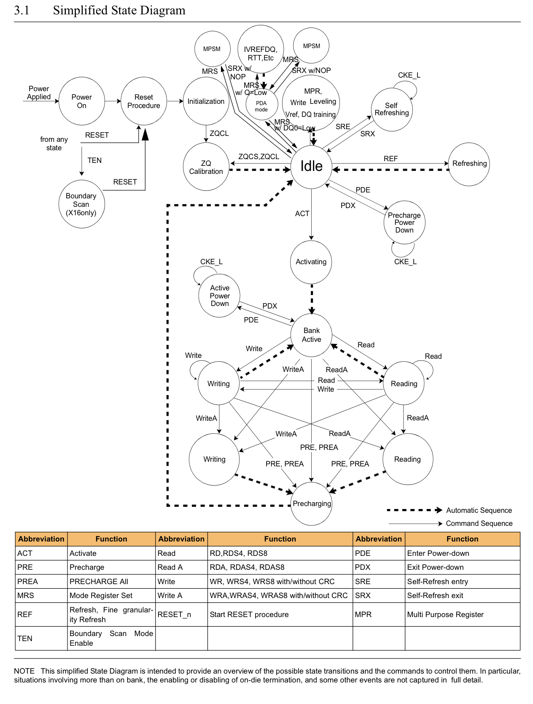
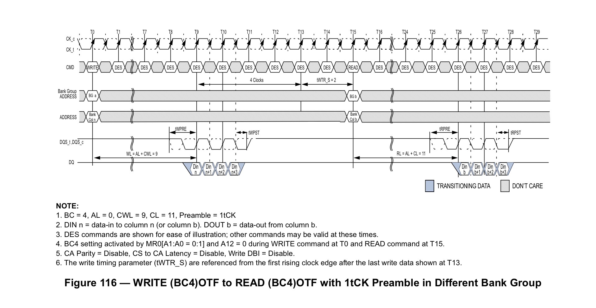
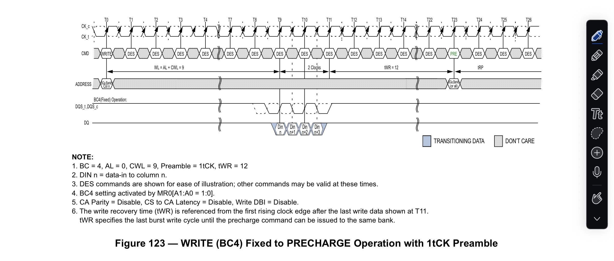

# Week 4

## State:
I am not stuck with anything, would like to continue understanding non-blocking and implementation methods. 

## Progress:
This week I finished up reading the JEDC documentation. This explained all timing constraints that need to be followed in all possible scenarios. I was able to then validate the timing requirments spreadsheet. The JEDEC first began by discussing the different states our DRAM can be in and how the controller has to send specific commands to operate a full transaction. THe JEDEC also mentioned the optimizations and benefits of a row-open policy which is what is being implented in the blocking DRAM controller. Below I have listed some of the takeaways from the JEDEC document. 

  1. DRAM Command FSM:

     

      - This FSM will be implemented in both Blocking and non-Blocking DRAM controller to follow the states a bank can be in. Note: multiple will need to be implemented for nonblocking version
  
  2. Write to Read timing (Different Bank groups):

      

     - This image depicts the timing requirment between a write then read to different bank groups. We must take account for this timing requirment as we continue to develop and test. For Non-blocking and out-of-order, our scheduler must take account of this latency to attempt to hide it. 

  3. Write to Precharge timing:

      

     - This image depicts the timing requirment between a write operation then precharging the row it operated on. This, along with many other scenarios were listed in the JEDEC documentation and were analzed to verify the timing requirments spreadsheet our team has developed. 

## Future Steps: 
Currently, I am working on verifying the timing requirments after reading the JEDEC documentation. I will present my finding to the reset of my team and we hope to finalize on the timing constraints. I am also working on the RTL for a memory arbiter to be used in a blocking version. In reality, we will need an arbiter to be used in a non-blocking version but working on a simple arbiter for the blocking version introduces me into the interfaces from I/D caches and scratchpad, and will assist me when I move towards a non-blocking implementation. 
