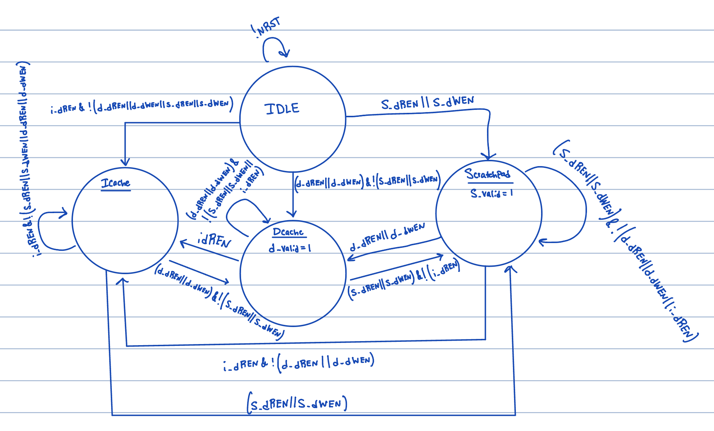

# Week 5

## State:
I am not stuck with anything, would like to continue understanding AXI bus, non-blocking and implementation methods.

## Progress:
This week I was able to finish my verification of the DRAM timing requirements and present my findings to the rest of the team for an overall confiramtion of the requirments. Now all confusion with the timing parameters have been discussed and any missing requirments have been added. This spreadsheet is now at a state where it can be viewed and utilized for current and future use.
  - Below is an image of an update we made to the table. Prior, we had combined these two requirements but after reading the JEDEC documentation, we realized that these must be seperated for correct operation:

    

I then put together a rtl for the blocking arbiter, this was essentially to understand the interfaces between Icache, Dcache, and scratchpad. I will now put efforts into a Non-blocking memory system. We decided that the best start is to look into the AXI bus implementation, that way we can communicate with the scratchpad, icache, and dcache units to ensure that the interface is met. 

  - Below is the mock up of the blocking arbiter:

     

## Future Steps
This week I spent reading up on AXI bus protocol to get an understand of the architecture and timing of the protocol and what our version will need to contain. Further reading will be required for the coming weeks.

I am now in the progress and understanding the interface needed for the AXI bus. I am working on putting together a top-level rtl view of the memory system to discuss during this sunday's design review. 
