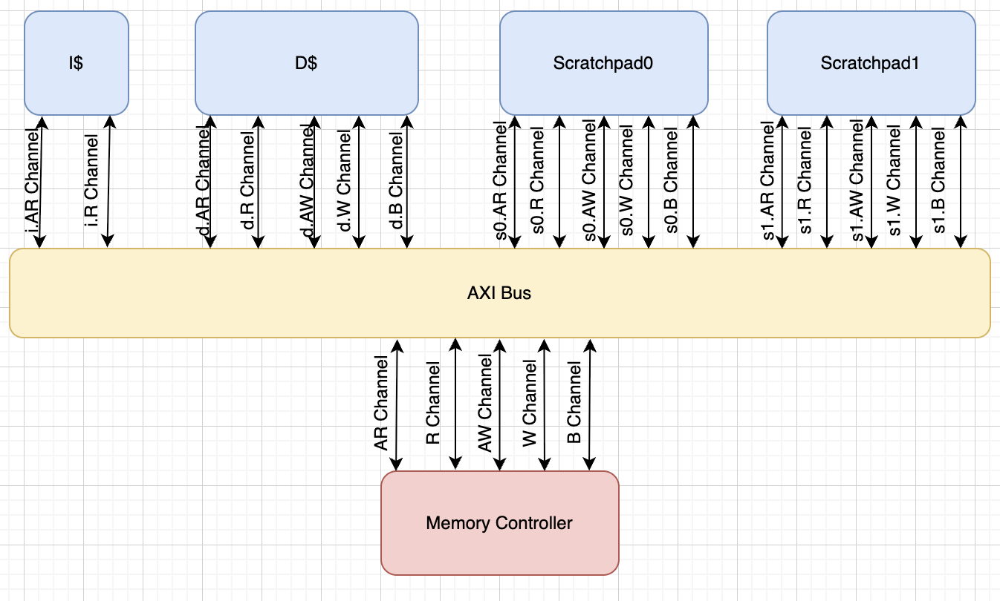
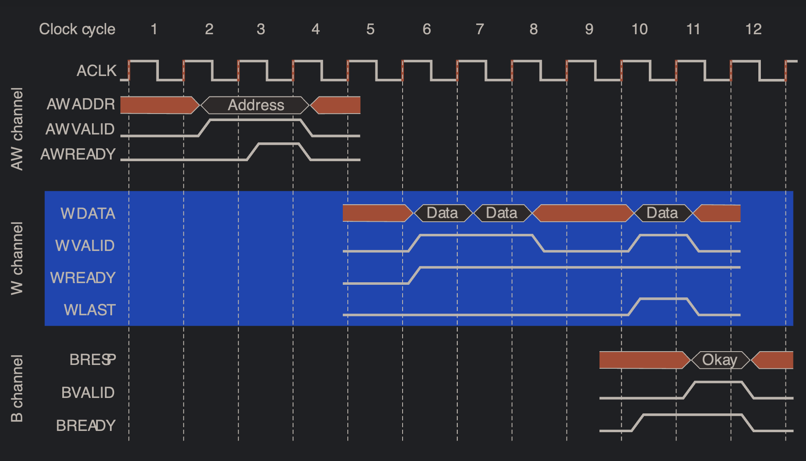

## State: 
I am not stuck with anything, would like to discuss size options for axi queues. Max amount of requests till we start backpressure. 

## Progress:
This week I spent time reading over the ARM AXI protocol overview and documentation. I will like both below. After reading the documentation. I was able to establish a good understanding of the protocol. And what feature of AXI, we should include in our implementation.
I decided that the features would consist of: 1) Split transactions 2) 5 Channels: AR/R (reads), AW/W/B (writes) per memory system​ 3) Transaction tags to track requests​ 4) VALID/READY handshakes​ 5) INCR Burst​. The documention mentioned other features like out-of-order write interleaving and atomicity in AXI. I choose at this time, they will not ne needed in this implementation. 

I was able to then read on the 5 channels used in the protocol and put together a very abstracted view of the interface between the AXI bus with the I$/D$ and Scratchpads:

  

Following the presentation, I spent time reading more in depth on the ARM AXI protocol documentation. I was able to understand protocol during different transaction scenarios. The documentation went into to basic reads and writes and then into bursts of reads and writes and how it gets handeled. List below is an image from the documentation that depicts multiple write transactions. 

  

Into the week, I begin looking at the interface files from the scratchpad and the non-blocking cache to understand what signals and sizes they are sending to the DRAM, and how the AXI bus can adapt to those signals and if any changes need to be made. 

## Future Steps:

Now I am finishing up the full interface of the top-level where I go into each of the 5 channels and determine the size and specific signal needed into the AXI bus. I will finish up this diagram and begin looking into components needed for the non-blocking conttoller for next week. I plan to setup a meeting with the rest of the DRAM team to draw out ides to begin assembling a top-level view of the non-blocking controller.
