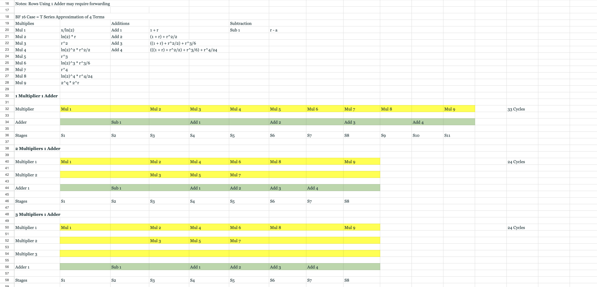
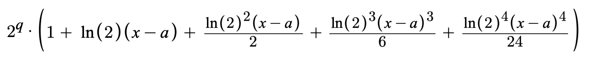

## State: I am not stuck with anything

## Sub-Team - Vector Core
The Vector Core is a seperate piece of hardware from the rest of the tensor-core as it aims to focus on processing vector-based instructions. The purpose of the vector core is speed up AI model learning processes and work in conjunction with other pieces of hardware in the tensor core.

## Progress: 
This week I worked on finding the new implementation for the exp unit and compared the tradeoffs between using a specific number of multipliers and adders. I made table showing all the computations needed for a taylor series approximation using 4 terms. I found that using more than two multipliers were useless as terms needed for the taylor sereis depended on eachother. I met with Jing to discuss my findings and we decided on using the implementation that used one multiplier and one adder as it used the least amount of hardware. The issue rate was on the slow side of 11 cycles, assuming that the multipliers and adders used were both one cycle versions but the benefits outweighed the positives as the performance tradeoff wasn't worth the 50% increase in hardware usage.

1. VExp Comparison Table

2. VExp Series Equation

## Future Plans:
- Implement New VExp Unit Design
- Verify New Unit