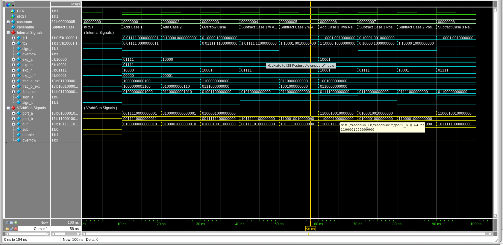
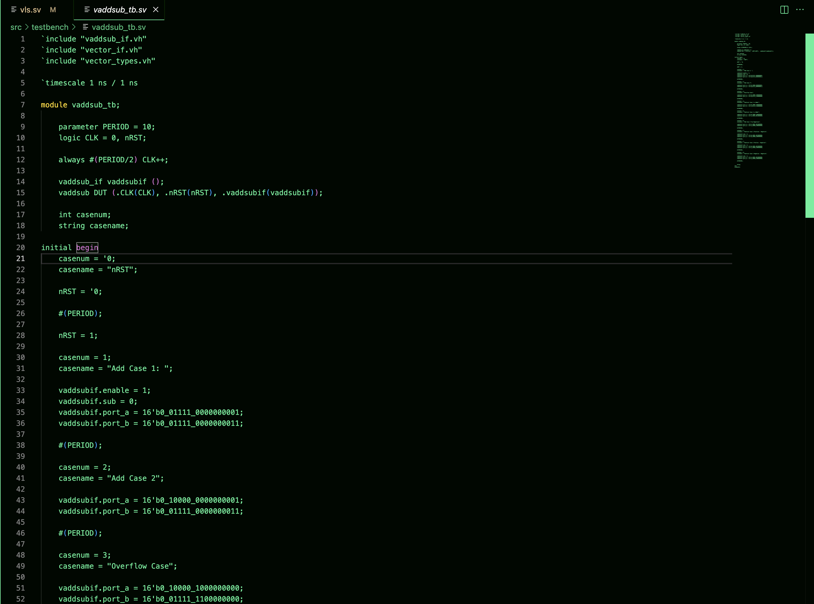
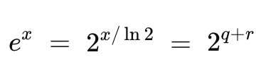
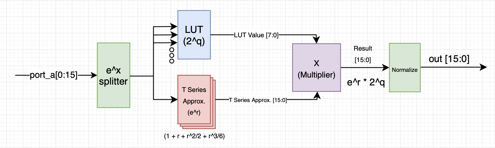

## State: I am not stuck with anything, don't need help right now. 

## Sub-Team - Vector Core
The Vector Core is a seperate piece of hardware from the rest of the tensor-core as it aims to focus on processing vector-based instructions. The purpose of the vector core is speed up AI model learning processes and work in conjunction with other pieces of hardware in the tensor core.

## Progress:
This week I worked on verifying the vector add/subtraction module and was able to make the code compile. I then created a testbench for it and tracked the signals in questasim. Currently the add/subtracion module is almost verified as it works for the addition of two positives, one positive/one negative, and overflow cases. The three cases I still have to verify are the one negative/one positive, two negatives, and the subtraction case.

1. Screenshot of Test Bench Signals

2. Vector Add/Sub Testbench:

When verifying I realized that including the implicit bit as the MSB on each alligned mantissa caused overflow errors everytime. To fix this I added padded bits at the start and end of the mantissa and then only took the middle 10 bits when repacking the fp16 value. This fixed is so far but some more logic changes may be needed in the future when I finish verifying the module. 
I also figured out exp() module as I will split the x value into a LUT value and Taylor Series Approximation. This done by decomposing the e^x into different parts usign the CORDIC Approach

3. Cordic Approach:

4. Vector Exp() Module RTL Diagram

Following this I will multiply the two values and then perform normalization. I will use the existing FP16 multipler that is already present to perfrom this action. I realized that the total operation for one exp() operation would take 24 cycles. So now I just need to implement the code.

## Future Plans:
- Write code for Vector Exp()
- Fully Verify the Add/Sub Module
- Synthesize the Add/Sub Module