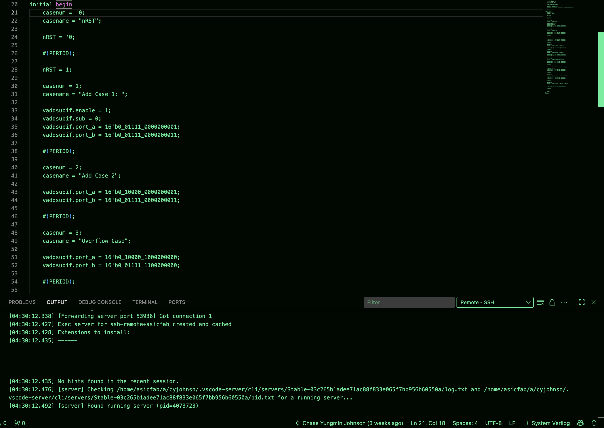
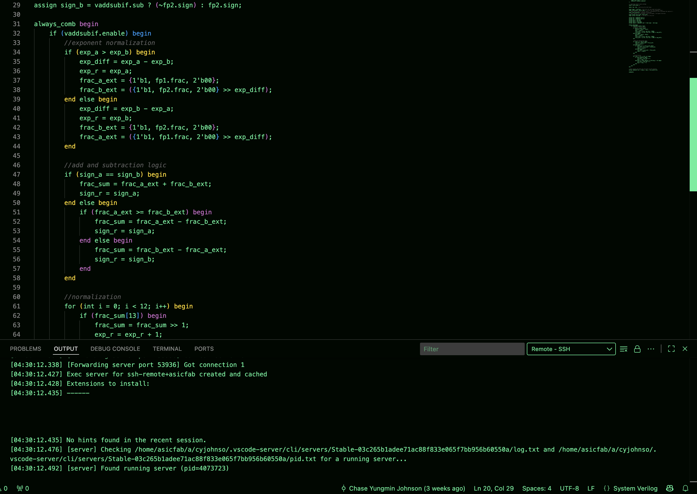
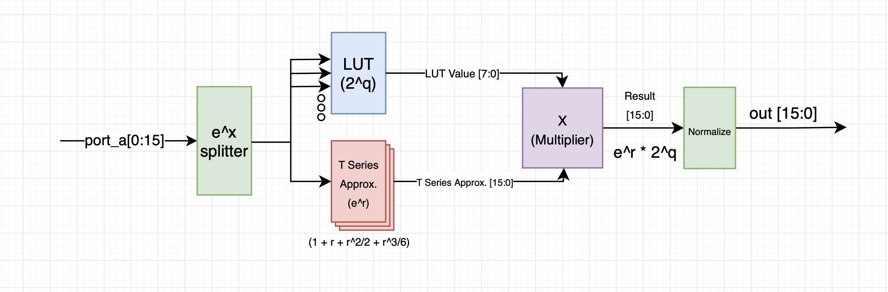
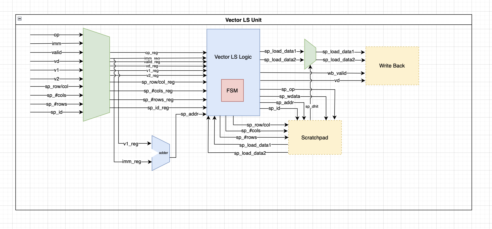

## Week 4

## State: I am not stuck with anything, don't need help right now. 

## Sub-Team - Vector Core
The Vector Core is a seperate piece of hardware from the rest of the tensor-core as it aims to focus on processing vector-based instructions. The purpose of the vector core is speed up AI model learning processes and work in conjunction with other pieces of hardware in the tensor core.

## Progress:
This week I worked on verifying the vector add/sub module and fully verified it. I also added a subtraction control signal to the input of the module so that the adder could perform addition/subtraction as well. I verified a the adder/subtraction module using a series of test cases including adding/subtracting two positives, two negatives, one negative/one positive and vice versa. I also completed an RTL for the vector exp() diagram and realized some mistakes in the design after talking with Timmy today during the Sunday work meeting. 

1. Vector Add/Sub Test Bench:

2. Vector Add/Sub Code:

3. Vector Exp() Updated Diagram

4. Vector L/S RTL Diagram

I also created an RTL for the load/store unit in the vector core and talked with Akshath today about what additional signals that I would be receiving. This week I will begin implementing the exp() and l/s functional units so that we can have a code review of them by Wednesday.

## Future Plans
- Synthesize Vector Add/Sub
- Add Special Test Cases for Vector Add/Sub
- Implement Code for Vector Exp
- Implement Code For Vector L/S