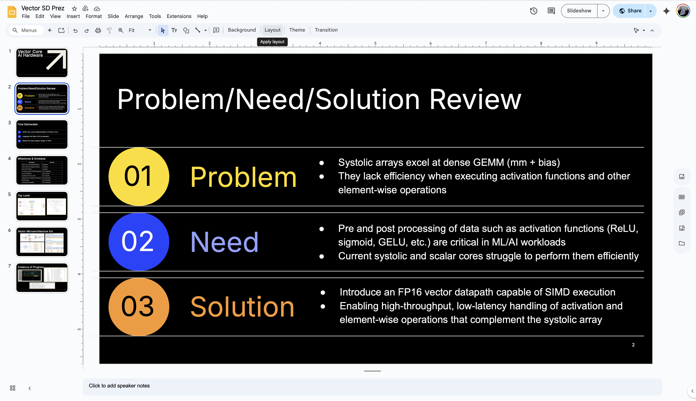
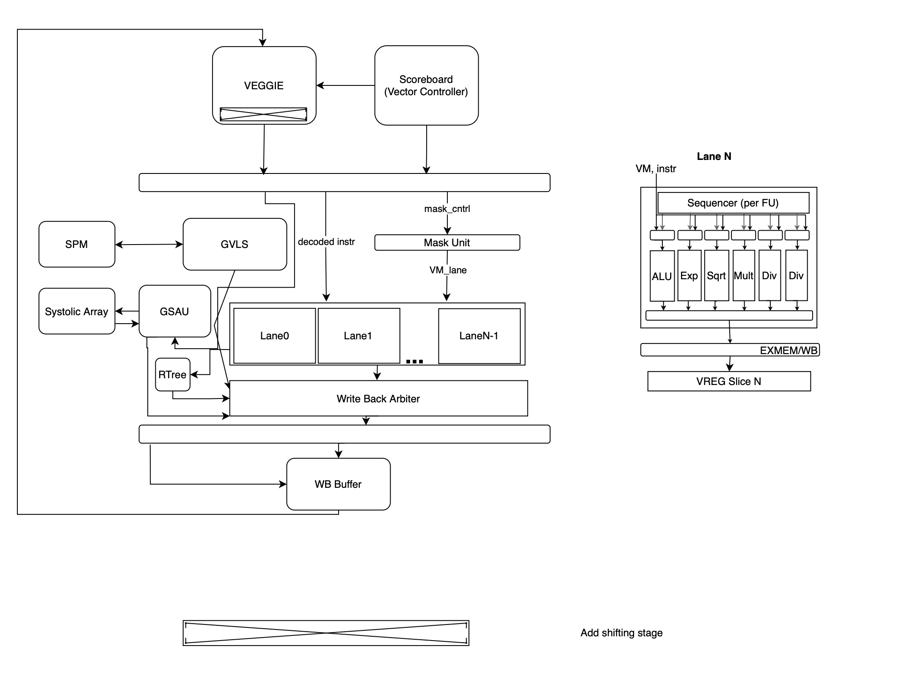
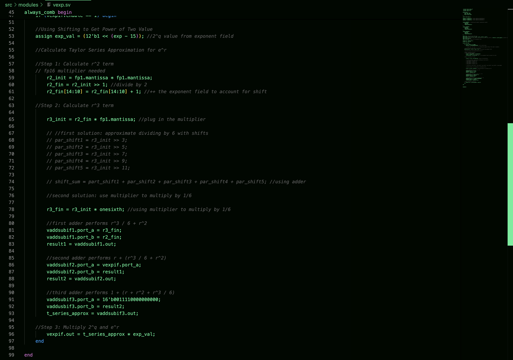
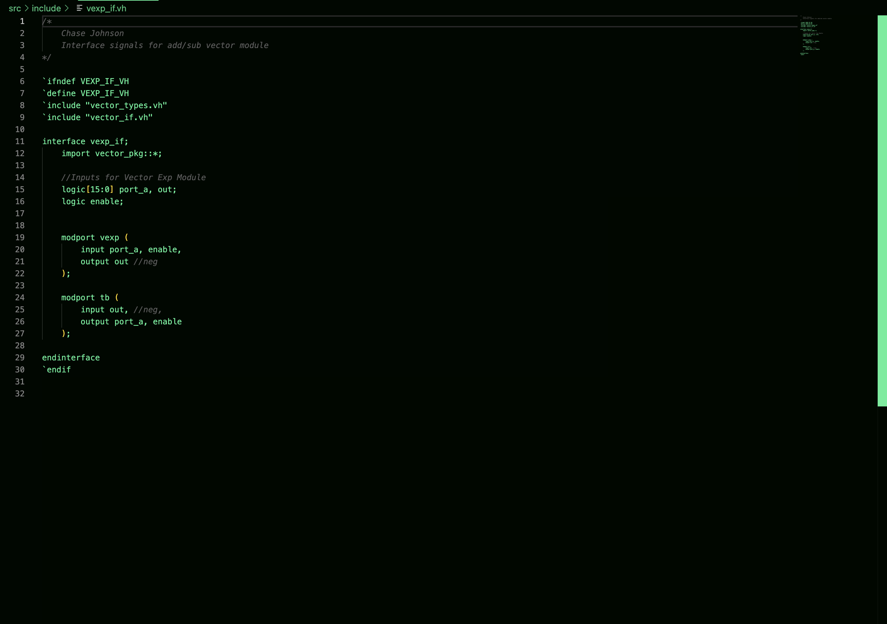

## State: I am not stuck with anything, don't need help right now. 

## Sub-Team - Vector Core
The Vector Core is a seperate piece of hardware from the rest of the tensor-core as it aims to focus on processing vector-based instructions. The purpose of the vector core is speed up AI model learning processes and work in conjunction with other pieces of hardware in the tensor core.

## Progress:
This week we had our design presentations on Sunday so during the Sunday meeting we created the slides for the presentation. 

1. Presentation Slides:

The design of the vector exp() unit was also changed in the sense that we are no longer supporting negative values for the 2^(exponent) portion of the e^x approximation. This is because negative exponent values will now be handled by the software and will not be have to handled by a LUT. The thought for this change was that the implementation would be simpler and take up less hardware space. Another important change is that the load/store unit that I was designing would be performing two loads/stores at a time. This would essentially double the read and write bandwidth of the vector core from the scratchpad. Other major architectural changes were explained at the meeting such as the move to a lane-based implementation that is parametizable rather than the original 16 functional unit set up. The reason for this that hardware usage could be maximized as having parametizable lanes for an arbitrary vector length would to efficient hardware usage. 

2. Updated Vector Top Level Diagram:

I also constructed an RTL diagram for the Load/Store Unit this week and completed a rough draft of the load/store unit code. 

3. Updated L/S Unit RTL Diagram:

After hearing the changes about doubling read/write bandwidth, I knew my RTL code was incorrect but it could be fixed pretty easily. I also implemented the adders into the exp unit and used three to calculate all the intermediate sums before adding up everything together.

4. Vector Exp() Updated Code with Adders Implemented

5. Vector Exp() Interface:

## Future Plans:
- Update L/S Unit RTL diagram for load/storing two pieces of data
- Update L/S Unit RTL code
- Plug in Multiplier to exp() unit
- Synthesize the Add Sub Module