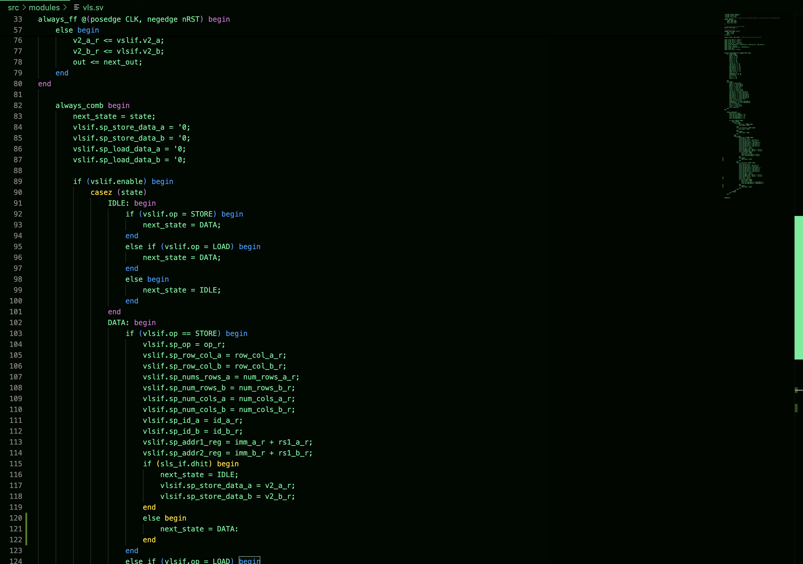
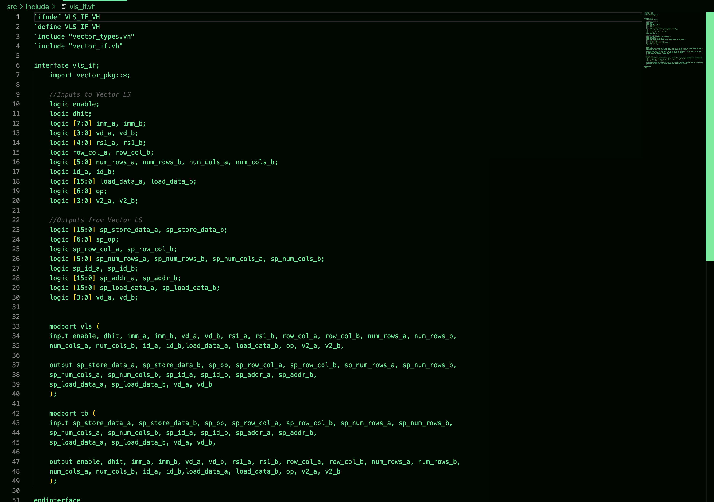
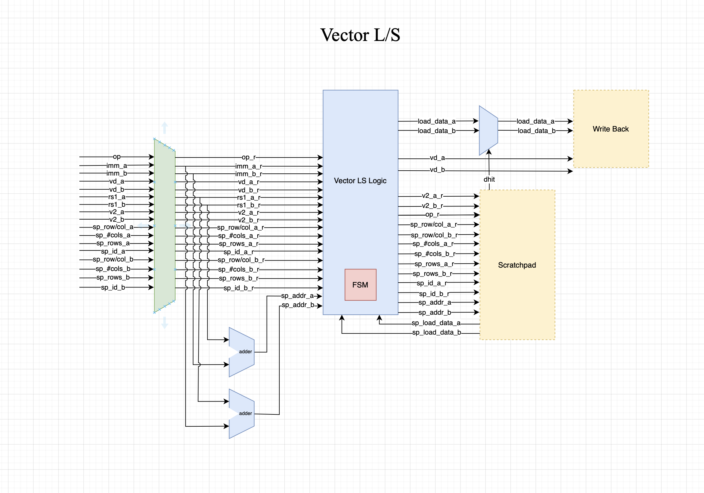

## State: I am not stuck with anything, except synthesis

## Sub-Team - Vector Core
The Vector Core is a seperate piece of hardware from the rest of the tensor-core as it aims to focus on processing vector-based instructions. The purpose of the vector core is speed up AI model learning processes and work in conjunction with other pieces of hardware in the tensor core.

## Progress: 
This week we were having a code review session on Wednesday as technically we are out of our design phase for the vector core timeline. So I was preparing my code this week for the review session, I finished implementing the exp() unit and just needed to plug in the multiplier into my module but it was not ready yet. So I completed a rough draft of my vector l/s unit so that comments could be made on it at the code review. 

Vector L/S Code:

Vector L/S Interface:

Vector L/S RTL Diagram:

I also updated my RTL diagram for the vector l/s unit so that it could handle two loads/two stores. I also had a compilers exam on Thursday so I was not as productive as usual on the vector core modules. I also learned synthesis thanks to Rishi and changed the appropriate files so that the synthesis could work but I have had no luck unfortunately. I reached out to Vinay Pundith for help as he has successfully synthesized before and for now I will just work on my load/store module. There was also a change for the vector exp() which simplifies the logic, so instead of using a LUT to compute the exponent value, a simple bit shift of the exponent value will be used. Negatives will be treated as positives too because this will be handled in the final computation from sign bit of the fp16 value. Another possible change would be that our team might convert to bf16 values instead of fp16 values because of a chip area concern. This would in turn also change my exp() module as the instruction format would now be different.

## Future Plans:
- Update L/S Unit RTL code
- Plug in Multiplier to exp() unit
- Synthesize the Add Sub Module
- Parametize Modules