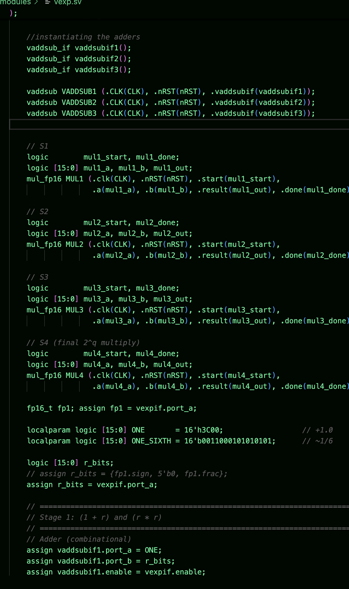
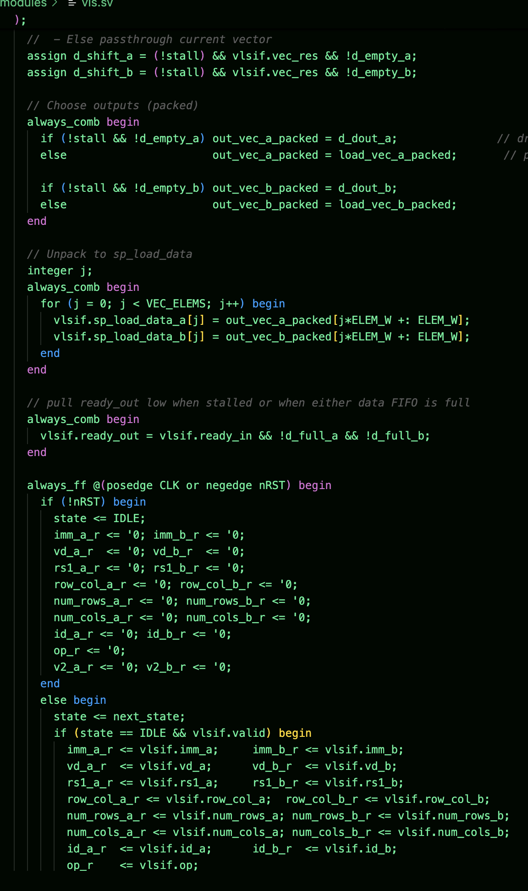
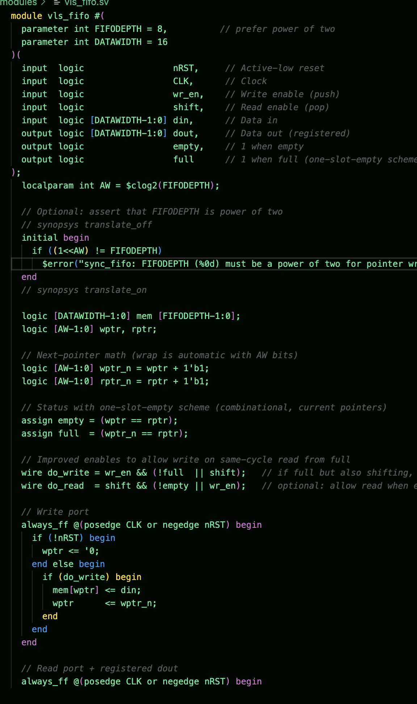

## State: I am not stuck with anything

## Sub-Team - Vector Core
The Vector Core is a seperate piece of hardware from the rest of the tensor-core as it aims to focus on processing vector-based instructions. The purpose of the vector core is speed up AI model learning processes and work in conjunction with other pieces of hardware in the tensor core.

## Progress: 
This week I spent finalizing changes on the adder and adding functionality for handling special cases. I was also intructed to not care about subnormals so I implemented the changes necessary to do so. I also continued to work on the exp and l/s unit. For the exp unit I finished writing the RTL code and reviwed the code with Jing. I decided to go with using 3 adder and four mulitpliers so that I could maximize throughput and issue every cycle. The exp unit design turned about to be a 4 stage unit with 3 pipeline register stages. The code was not too complicated but I realized that I needed to pass inputs to the next stage based on the done signal of the multiplier, otherwise there would be timing issues.

1. VExp Code:

For the l/s queue I added extra functionality of usign a FIFO queue from Jing's reccomendation in order to store destination registers that would eventually be passed to writeback stage with the data. The pupose of this is so that when performing loads, the queue stores the according destination registers with the incoming data because the scratchpad may take longer to pass the data. The queue is a depth of 8 because the scrathpad would take 8 cycles to send the data back to l/s unit. I also needed to support split transaction requests where the l/s unit could send data to the writeback stage while recieving new data instructions from the scheduler core.

2.Vector L/S Code:

3. Vector FIFO Code:

## Future Plans:
- Finish L/S Unit
- Finish VExp Unit