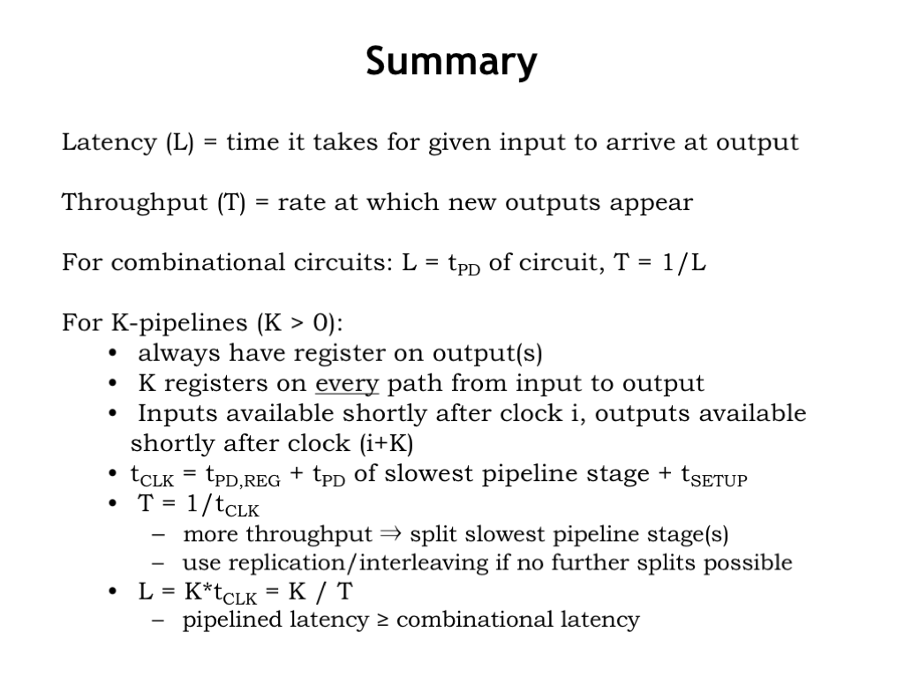
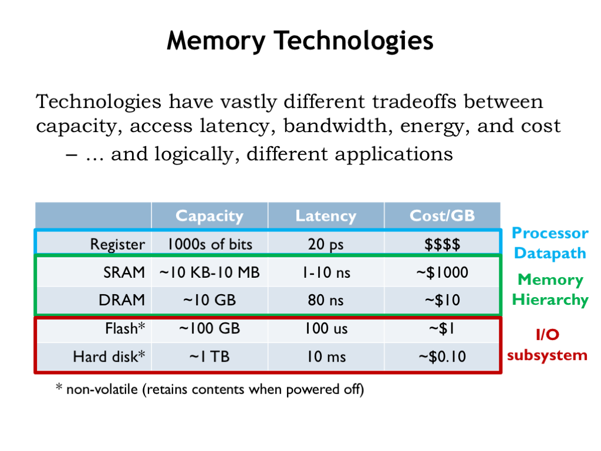
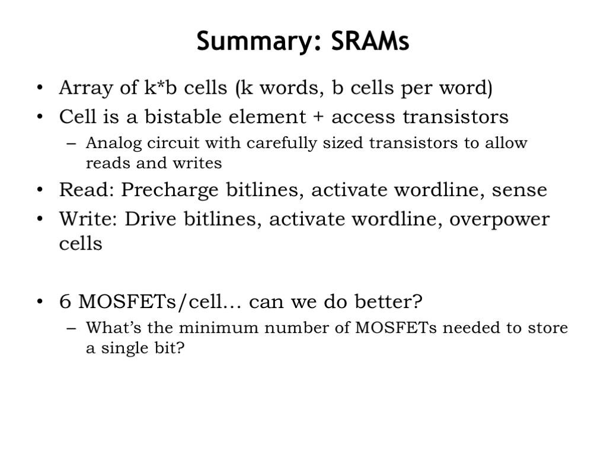
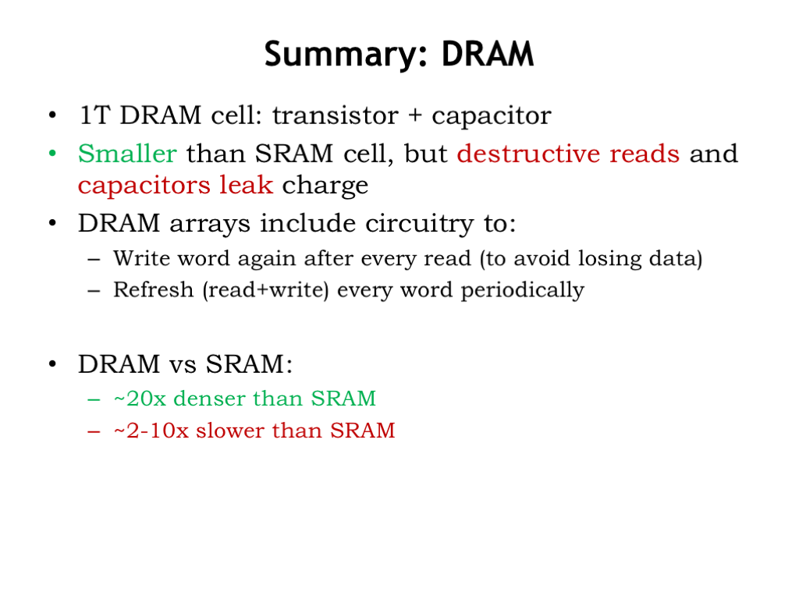
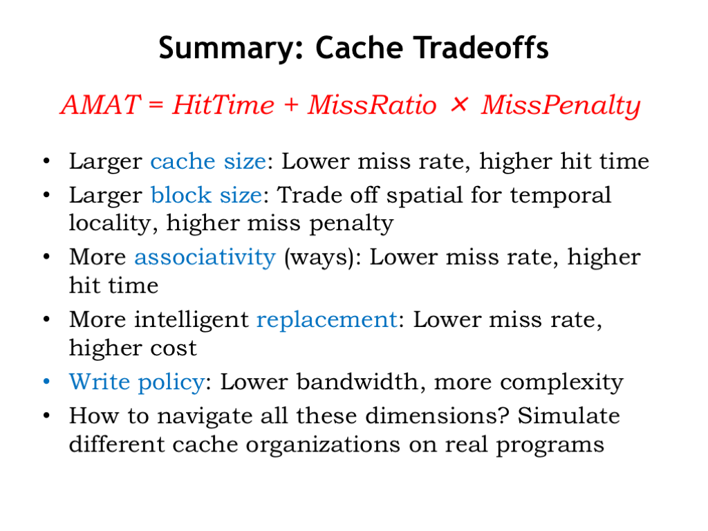
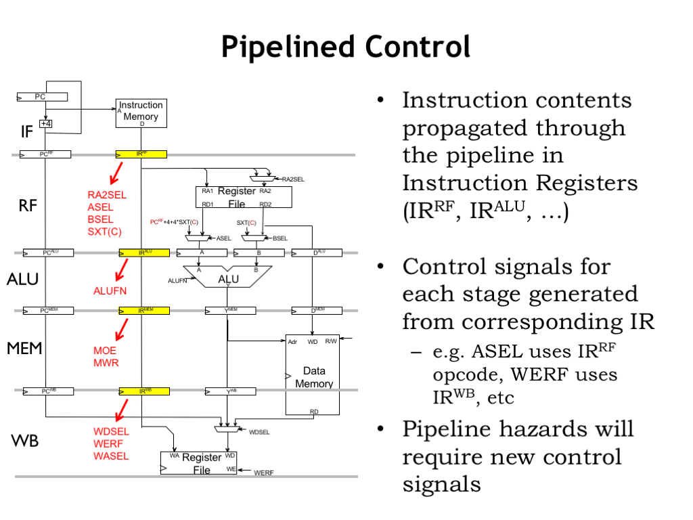

# State:
I am not stuck with anything, don't need help right now. 

# Progress:

- First time in AI Hardware. Catching up with the team's progress so far. Will be in the Scratchpad team.
- Computational Structure Textbook review notes below

Chapter 7:
-
Latency and Throughput:

- pipelined systems: systems that overlap processing of a sequence of inputs
- each processing step is a stage of pipeline
- Total propagation delay = N * Max(PD1, PD2) + (setup transient delay)
- rate at which inputs move thorugh pipeline is slowest pipeline stage
- for combinational systems: total PD = N*(PD1+PD2)
- latency: the delay from when an input is established until the output associated with that input becomes valid
- throughput: rate/SPEED at which inputs or outputs are processed
- if process is used many times (N), more efficient to pipeline
- tradeoff: latency usually increases when use pipeline/increasing throughput as every stage is bottlenecked by slowest stage

Pipelined Circuits:

- latency of combinational logic: $t_{pd}$
- throughput of com logic: $1/t_{pd}$
- throughput = $1/Maxstage_{pd}$
-  K-stage pipeline (or K-pipeline for short) as an acyclic circuit having exactly K registers on every path from input to output. An unpipelined combinational circuit is thus a 0-stage pipeline.
- composition convention: every pipeline stage (K-stage pipeline) has a register on its OUTPUT (not input)
- the CLK for all registers must have period sufficient to cover propagation over com paths + (input) register $t_{pd}$ + (output) register $t_{setup}$
- latency of K pipeline is K * period of system's clock
- throughput of K pipeline: frequency of clock

Pipelining Methodology:

- all input to output paths must have same number of registers
- how to determine where put registers
    
    1. draw line that crosses every output in circuit, mark ends points as terminal points
    2. draw new lines between terminal points across various circuit connections. every connection must cross each line in same direction. lines demarcate pipeline stages and where to put register
- ideal: max throughput with fewest registers
- pipelined will never have smaller latency than unpipelined
- components inside each "block" can also have registers and be pipelined
- simulate pipelined version of a slow component by replicating the critical element and alternate inputs between various copies

Control Structures:

- synchronous, globally timed: all stages operate in lock step and clock period accommodates worst case stage processing time. centralized clocked FSM generates all control signals
    
    - easy to design but fixed sized interval can be wasteful
- synchronous, locally timed: local FSM control flow of data using "handshake signal". start and finish signals generated by each major subsystem, synchronously with global clk.

    - good for large systems with independent timing components
- asynchronouse, locally timed system: transition signaling. each subsystem takes asynchronous start, and generates asynchronous finish (perhaps using local clk)

    - hard to design, "next big idea"
- asynchronous globally timed: bad idea for large systems. complicated
- self-timed: each component specificies its own time constraints. local adaption to special cases. can be asynchronous or synchronous

Summary
-

Chapter 14
-

- system's performance limiter is CPU waiting on main memory
- hierarchical system: faster + smaller memories closer to CPU, slower + larger further away
    
    - LOCALITY: access to address X at time t implies that access to addres X + $\Delta$ X at time t + $\Delta$ t becomes more probable as $\Delta$ X and $\Delta$ t approach zero
    
    - expose hierarchy: registers, sram, dram, flash, hard disk each available as storage alternatives. let programmers decide how to best allocate memory
    - hide hierarchy: programming model - single memory, single address space. machine transparently stores data in fast or slow memory depending on usage
- cache: small interim storage component that transparently retains (caches) data from recently accessed locations. very fast access if memory is cached. exploits locality principle. computer systems normally use many levels of cache

Chapter 15
-

- Pipelined beta CPU: divide datapath in multiple pipeline stages to reduce t_clk. each instruction executes over multiple cycles. consecutive instructions overlapped to keep CPI approx 1.0

    - classic 5 stage pipeline:

        1. instruction fetch (IF): maintains PC, fetches instruction and passes to...
        2. register file (RF): reads source operands from register file, passes to...
        3. ALU (ALU): performs indicated operation, passes result to...
        4. memory stage (MEM): if it's a LD, use ALU result as an address, pass mem data (or ALU result if not LD) to...
        5. write-back stage: writes result back into register file
        

- resolving hazards:

    - strat 1: stall and wait for result to be available by freezing earlier pipeline stages.
        - simple, wastes cycles, higher CPI
    - strat 2: bypass/forward. route data to the earlier pipeline stage as soon as it is calculated
        - more expensive, lower CPI
    - strat 3: spectulate. guess a value and continue executing. when actual value is available:
        - guessed correctly -> do nothing
        - guess incorrectly -> kill & restart with correct value
        - lower t_ck, but higher CPI