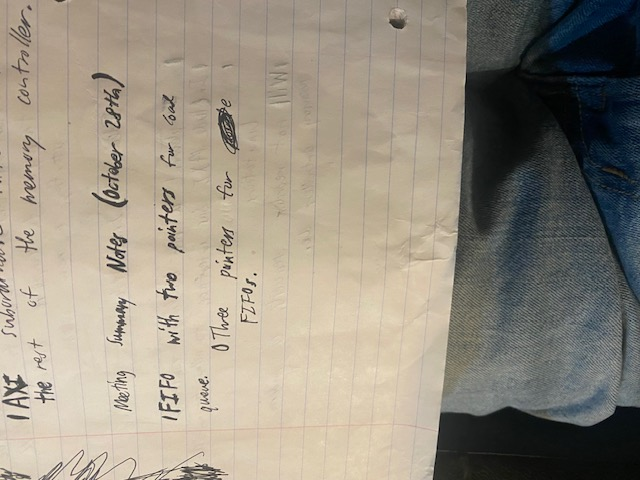
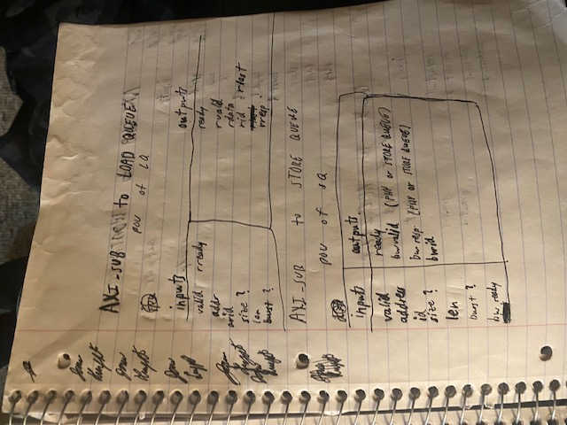
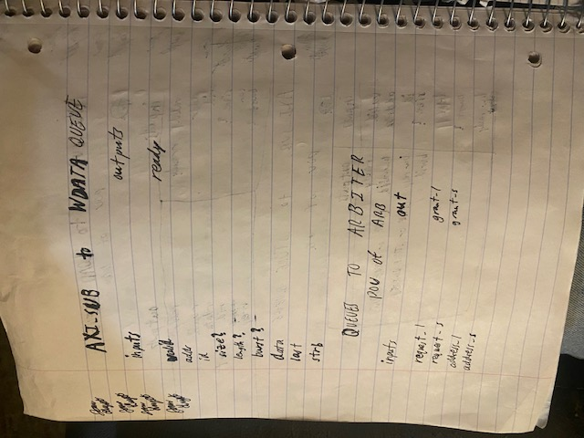
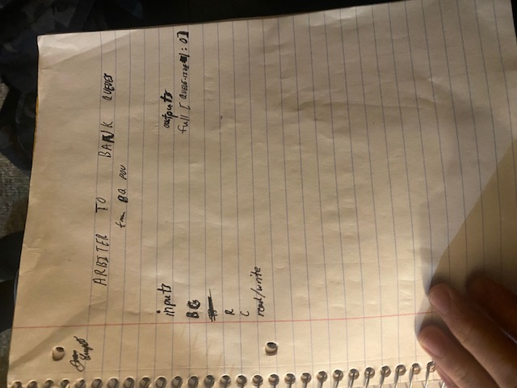
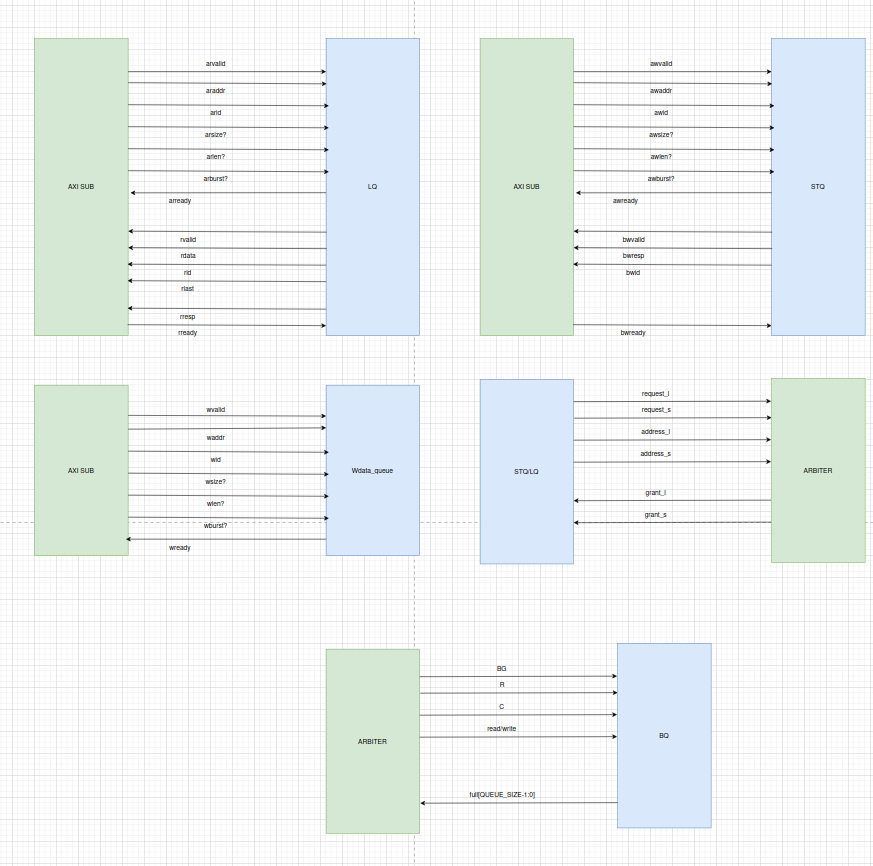

# Week 10 (October 23rd to October 30th)

## State: 
    I have no blockers at the moment. 

## Progress

### October 28th
    Met with Aryan and Adrian to discuss and finalize the interfaces between each of the individual 
    submodules within the DDR4 non-blocking controller. 
    
    Additionally, we decided to exclude a 
    queue to hold read data from DDR to the AXI bus because the caches should always be ready 
    to receive data through the AXI channels, and the AXI bus can queue data itself. We made 
    this decision because it is simpler and cheaper to implement. Finally, we floated the possiblility
    of passing certain signals through the controller from AXI like burst length, size, and burst type.
    I debated that they are not necessary but we will decide on their inclusion later. 

### October 30th
    Before our team meeting with Sooraj, I finished the final interface diagrams on draw.io in order
    to provide necessary signal information for us three when we begin RTL design of the individual 
    submodules. 

    During the meeting, we discussed the necessity of the signals the debated signals from AXI and 
    concluded that none of them are needed because of the simplicity of the data streams coming 
    from the caches, and the simplicity of implementation. 

## Near Future Goals
### Before Team Meeting on 10/31
    1. Finish RTL diagrams for load data queue.
### Before AI Hardware meeting on 11/2
    2. Meet with Aryan and Adrian on 10/31 to discuss backend interfaces and RTL assignments for 
       backend submodules. Finish all other assigned RTL diagrams by Sunday. 

