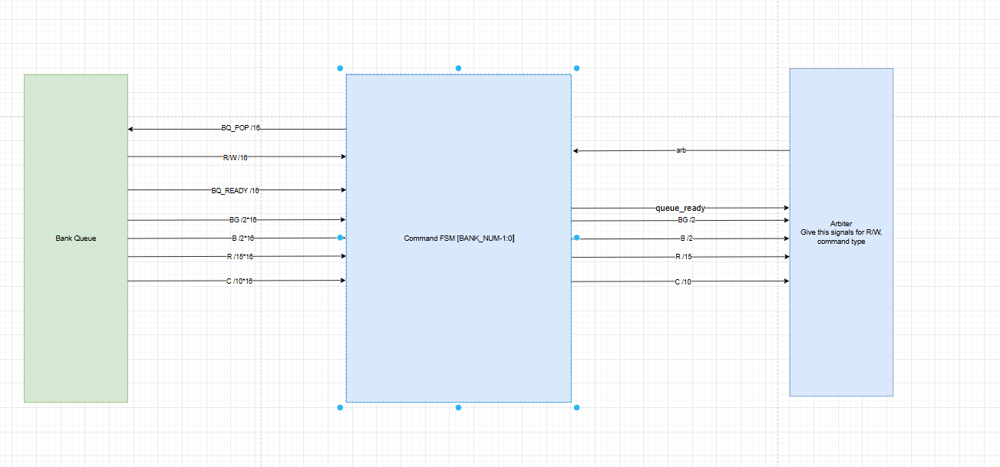
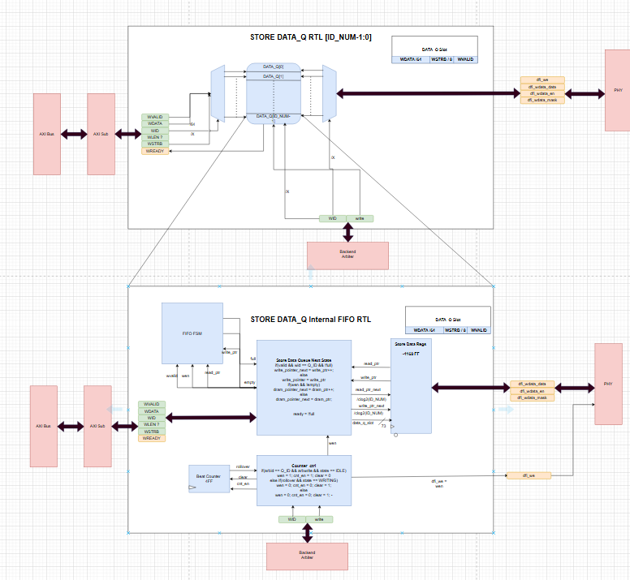
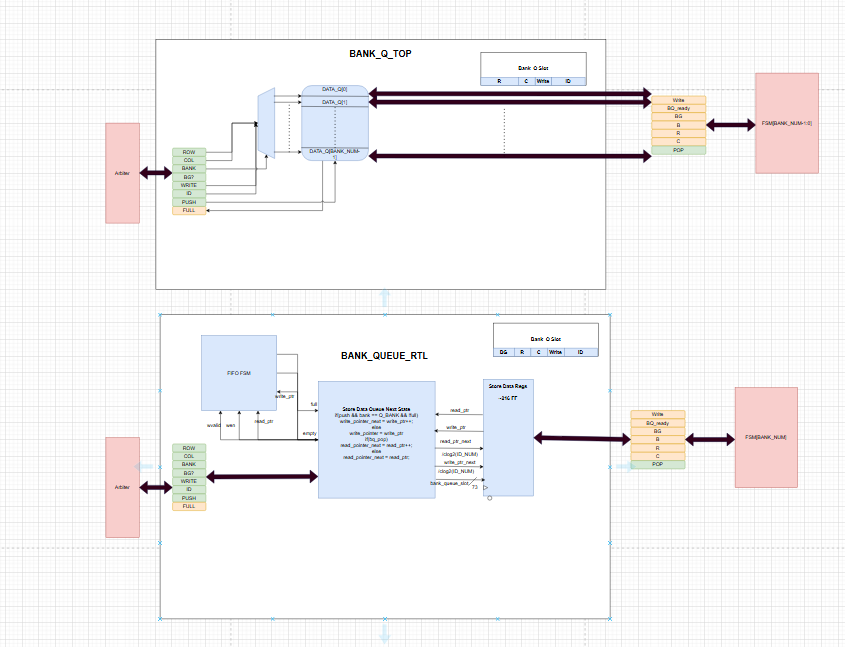

# Week 10 (October 31st to November 6th)

## State: 
    I have no blockers at the moment. 

## Progress

### November 2nd
    At our Sunday meeting, Adrian and I completed the interface for the bank queue to the DDR4
    FSM and the interface between the FSM and backend bank arbiter. Our main points of debate
    for design choices included how an FSM would tell a bank queue to pop its head element.
    We decided that a transition from write to writing (or read to reading) would signal
    a FIFO to pop. We believed that this ensures any commands before a row access would 
    have ample opportunity to be issued (precharge, activate, ect.) and would not be negated,
    preventing undefined behavior with DRAM. We finally split tasks, with me finishing RTL diagrams
    for the bank queues and the backend arbiter.
    

### November  5th 
    Met in MSEE with Tri and Adrian to discuss completed RTL diagrams, which in this case, 
    involved the frontend queues for loads, stores, store data, and the bank queues. 
    More importantly, I discussed with Adrian and Tri how we would handle refreshes and ZQ
    calibration events. We decided that the backend arbiter and a seperate block for 
    refresh timing would have global timers which would signal to the bank FSMs when 
    a refresh or ZQ calibration needs to take place. Additionally, we would not issue the 
    command until all FSMs are ready for it. This way, we can refresh and calibrate in a 
    timely manner without interrupting critical transactions. 

### November 6th
    Completed and finalized RTL for bank queues. Met with the whole team to discuss 
    a finalized state machine, and all the responsibilities and specs of the backend
    arbiter, the final submodule I have to create an RTL diagram for. We decided the arbiter
    is in charge of issueing ZQ calibration, sending the data over the data wires in a timely manner,
    and issuing refreshes when all FSMs show they are ready. This helps keep the FSMs and their 
    related timers simpler and less bug-inducive. Additionally, this eleminates contention for control
    of the DRAM signals, as the arbiter will have the final say, and it will prioritize ZQ calibrations
    or refreshes when the need arises. Otherwise, it will just round-robin between banks. We figured 
    round robin is best because this maximizes bank-level parallelism, and is also most simple to 
    implement. 

## Near Future Goals
### Before Team Meeting on 11/10
    1. Finish RTL diagrams for backend arbiter.
    2. Finish slides draft for design review on Monday. 

