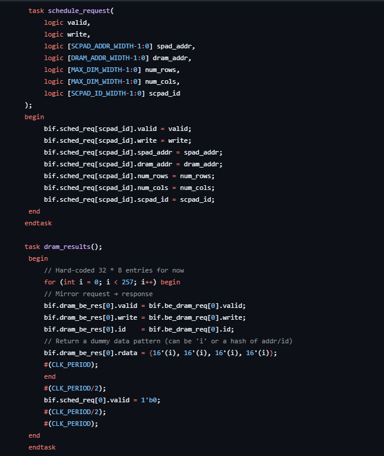
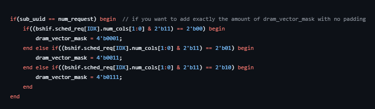
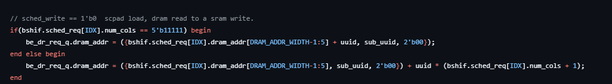

## Project Update

### State: I am not currently stuck or blocked.

### Progress
1. This week has been mostly about testbenching. So far only the a basic testbench has been constructed.
2. There were two design decision that had to change. One the num_bytes signal has become the vector_mask signal. The vector mask is a 4 bits long and is used by the dram to easily tell which elements in a single burst is valid. Since dram only handles 64 bits at a time and our 32 element vector is 512 bits long then 8 request. These 8 request each have 4 elements AKA 64 bits. The second design change is that since not every request will feature the full 64 bits, for example the last request of a 5 element long vector would only be 1 element, then the addressing scheme for dram_addr had to change. For now there is a mutliplier that multiplies uuid by num_cols as this tell us what row we are on and how many address that row has jumped. This was just a quick fix and in the future it is possible to just have a latch that holds the result of an addition that adds num_cols every time uuid is increased. This allows us to skip multiplying as we can just add the total addition to our dram_addr, rather than multiply then add.
    1. Testbenching
        - For testbenching two simple task have been created to simulate a basic scpad load. The task schedule_request simply mimics a schedule request and is just a pass through for the bits we set. The second task is dram_results which mimics a 1 cycle dram return. The function of schedule request and dram/sram results are seperate. The generation of request can be tested individual from results as request don't rely on results. This is why I believe a 1 cycle basic dram_result is fine for basic testing of the request portion. To thoroughly test the result portion a better scheme should be made. For now a simple 32x32 matrix with no stalls has been thouroughly tested for a scpad load using this scheme. Some non standard 32x32 matrices were tested however I will hold off on saying the module is fully complete until more non standards have been tested, the ones that were passed the test.

        

    2. Vector Mask
        - Since only the last burst/request of a transaction can be oddly shaped(A non 4 element vector) vector mask checking only happens on the last request. To check when to pull the vector slots down the last 2 bits of num_cols can be checked. The last two bits represent 1,2,3,4 so if the last two bits is 2'b00 then we know it to pull down the vector mask except for slot 0. This will be passed along with our dram request so the dram controller can know which elements in our request are valid.

        

    3. Dram Addr Calculations.
        - Since Matrices can be oddly shaped, AKA not a 32x32, then the dram addr calculation cannot be a simple uuid left shift and addition. To quickly remedy this problem a multiplier was added that multiplied uuid (current row) times the num_cols, the addresses we needed to jump to reach the address of the current row. As mentioned this was just a quick fix to further optimze this a simple latch and adder can be made. We simple need to increment the latch by num_cols every time the uuid is updated. This will allow us to mimic multiplication and get rid of the multiplier.

        

### Next Steps
1. Create better task that can help simulate non standard matrices and stalls.
2. Create better sram/dram result simulators to help test benching.
3. After testbenching is done make the latch and adder change for the dram calculations.
4. Once all test are ran code optimization will begin. 
