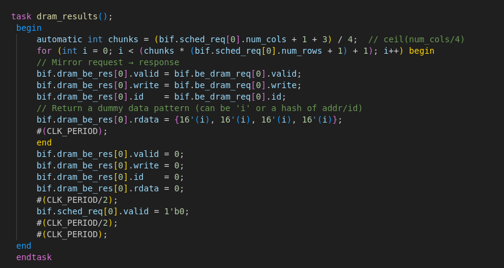
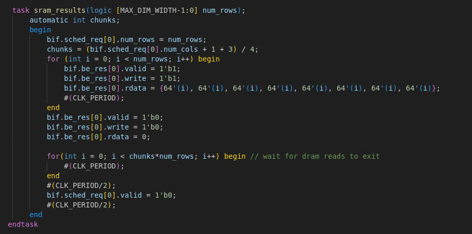
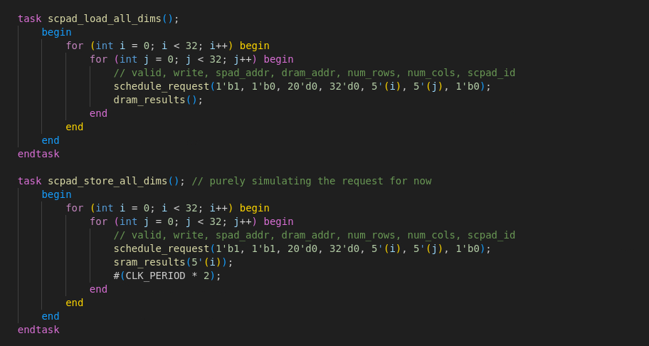

## Project Update

### State: I am not currently stuck or blocked.

### Progress
1. This week has been mostly about testbenching. Tasks to simulate 1x1 to 32x32 matrices have been created for both scpad_loads and scpad_stores.
2. None of the major design choices for backend have changed and only some bug fixes have been implemented. There is an idea for replacing dram_write_latch however this would need to be discussed further.
    1. Testbenching
        - The creation of simulated dram and sram responses have lead to an easier way to test for 1x1 to 32x32 matrix. The task assumes a 0 latency dram/sram (so results are given the next cycle they are requested). This way every combination of 1x1 to 32x32 matrix have been tested. The simulation of stalls from dram/sram is yet to be made. Currently stalls at the beginning, end, and random points in the middle for different sized matrices have been tested. There have been no problems but I cannot say it's 100% verified. However with this basic testbenching has been completed and for more complicated testbenching the instantiation of SRAM/DRAM controllers will be done.

        
        
        

### Next Steps
1. Create better task that can help simulate stalls.
2. Begin cleaning up the code by having includes go into one file, pkg.sv and if.sv, no comments in rtl modules, and no duplicated code/only generate loops.
