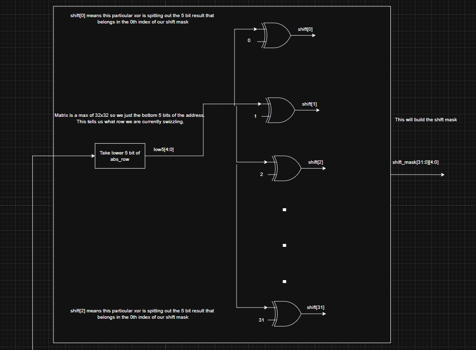
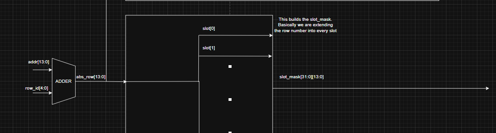
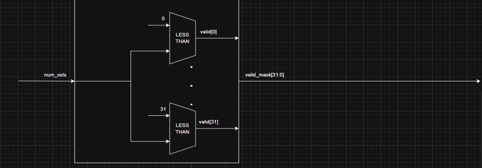
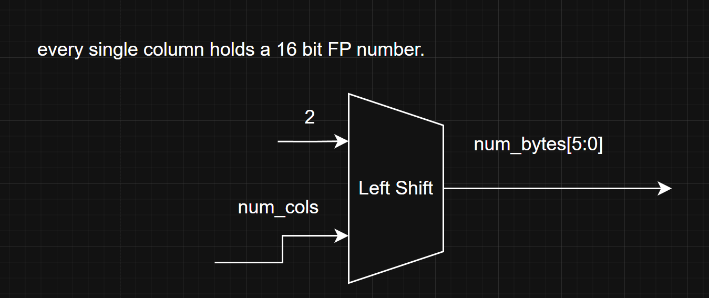
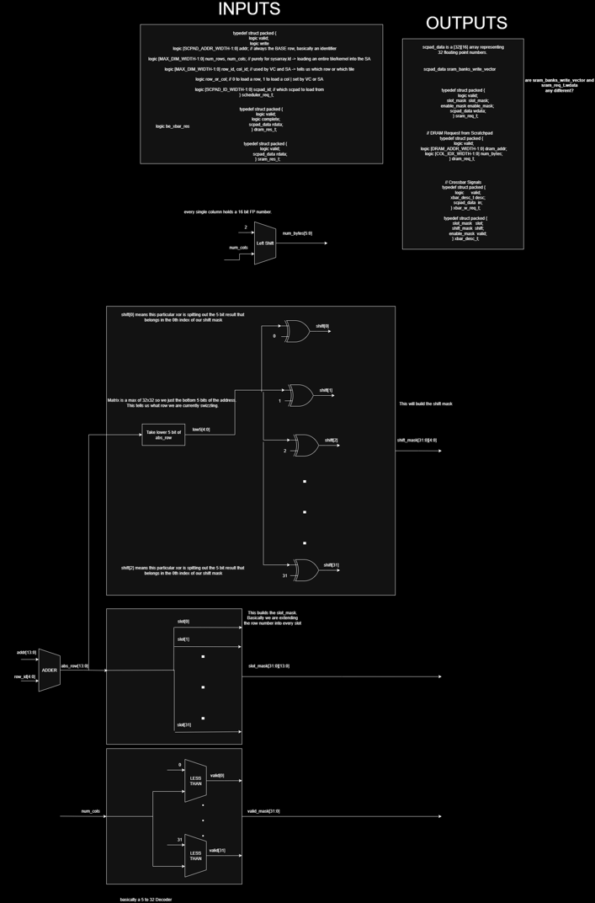

## Project Update

### State: I am not currently stuck or blocked.

### Progress
1. Attended the Sunday Scratchpad meeting, had a discussion on whether or not to include a queue for DRAM operations. This is still in discussion however, it is being leaned more toward no queue since the benefits are potentially very small.
2. Lots of progress was made on the RTL, specifically for the swizzling algorithm, the connections to DRAM are still being discussed for now. Here are the 3 main compononets of the swizzling algorithm as well as how we determine the num-bytes to request from the DRAM. 

    1. Shift mask
        - The slot mask is determined by looking at the starting address, adding the current row_id, repeated num_row times, and extracting the bottom 5 bits. Once this number is calculated, called low5 in our design, it will be xored with 0,1,2 ... , 32 to create our shift_mask[31:0][4:0]. This shift_mask will then have the numbers of where to shift the data to avoid bank conflicts in our SRAM. 

        

    2. Slot mask
        - The slot mask is simply an array that tells the crossbar what row in the SRAM the current data should go too. It is determined by the base address plus the current row_id.

        

    3. Valid mask
        - This 32 bit long array tells the crossbar how much of the previous masks actually contain a valid number. This is determined by simply seeing the num_cols passed in and saying anything over the num_cols is invalid.

        

    4. num_bytes
        - Determined by simply shifting the num_cols left since every column contains 2 bytes.

        

### Next Steps
1. With the base of the module settled the next steps will be to iron out the communication between backend and the dram arbiter and to finalize the full state machine.
2. Have a meeting Saturday to finalize the discussion on the queue and to determine the timings of all the signals coming in and out of the backend.
3. Once these decisions are made the RTL will be finalized and coding can begin. We hope to achieve basic functionality next week.