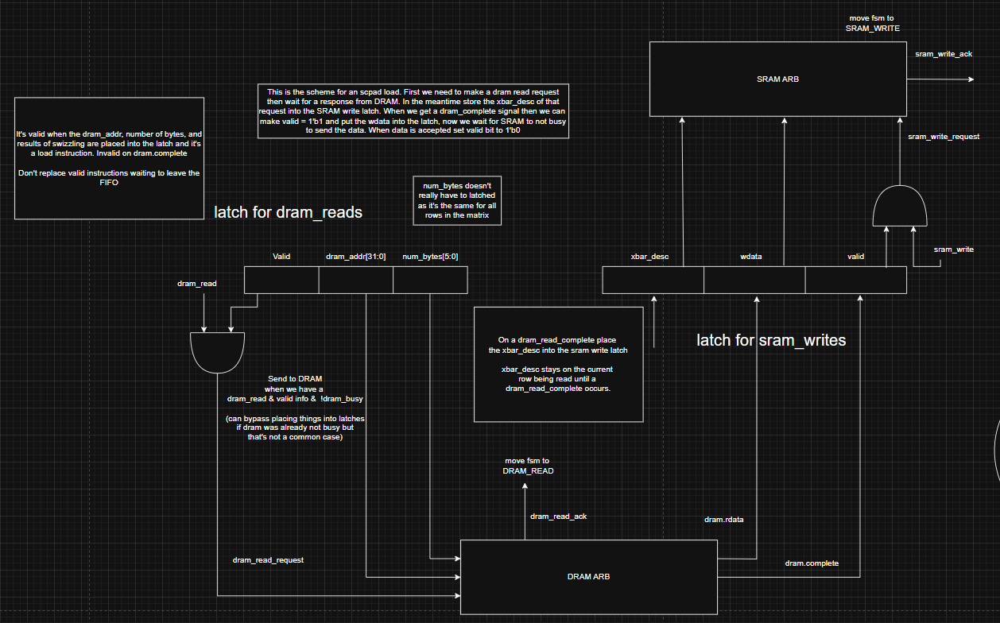
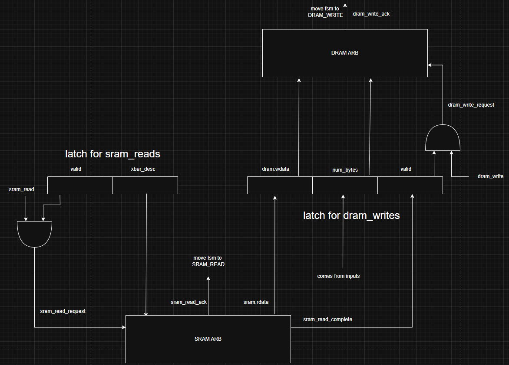
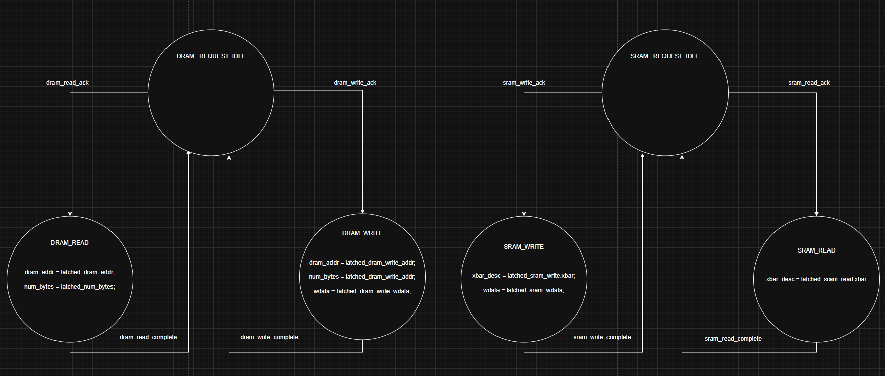

## Project Update

### State: I am not currently stuck or blocked.

### Progress
1. Attended the Sunday Scratchpad meeting where we did a design review for the entire team. Learned more about DRAM and saw how signals from the DRAM and Scratchpad could combine in the DRAM controller.
2. RTL is nearly finalized. All the basics have been drawn out and the only discussion left is on how large the latches should be. Additionally some signals and modules may be renamed. 

    1. SCPAD Load Scheme
        - For a scratchpad load we will need to read from DRAM and place the read data into the SRAM. To accomplish this at least two latches are need. One to hold the current vectors dram address and num_bytes and one to hold the data given by DRAM and the SRAM cross bar description. With these two latches we can accomplish simultaneous DRAM read and SRAM writes. 

        

    2. SCPAD Write Scheme
        - For a scratchpad write we will need to read from SRAM and place the read data into the DRAM. Again we will have at least two latches. One will hold the SRAM signals and one to hold the read data and DRAM signals. For this scheme I believe additional latches will be needed for the DRAM latch. This is because SRAM will spit out it's read data at a speed significantly greater than DRAM can write the data. This means the latch that holds the data for DRAM may be full when data is sent out from the SRAM. 

        

    3. Load/Write FSM
        - This FSM is mainly to illustrate how seperate the DRAM and SRAM schemes. The ack signals are needed because it's possible DRAM/SRAM is busy completing other operations and our unit will have to wait its turn. The complete signals tells us when our request are done and to validate our waiting latches with data.

        

### Next Steps
1. With all the basic logic finalized for the RTL, verilog code will begin. Specifically the interface signals will be updated and the basic logic seen in the RTL should be written.
2. The RTL also has much room for improvement and needs to add the counting scheme for keeping track of the current row we are calculating.
3. Will need to discuss with the DRAM team to make sure the DRAM controller will have those ack and complete signals.