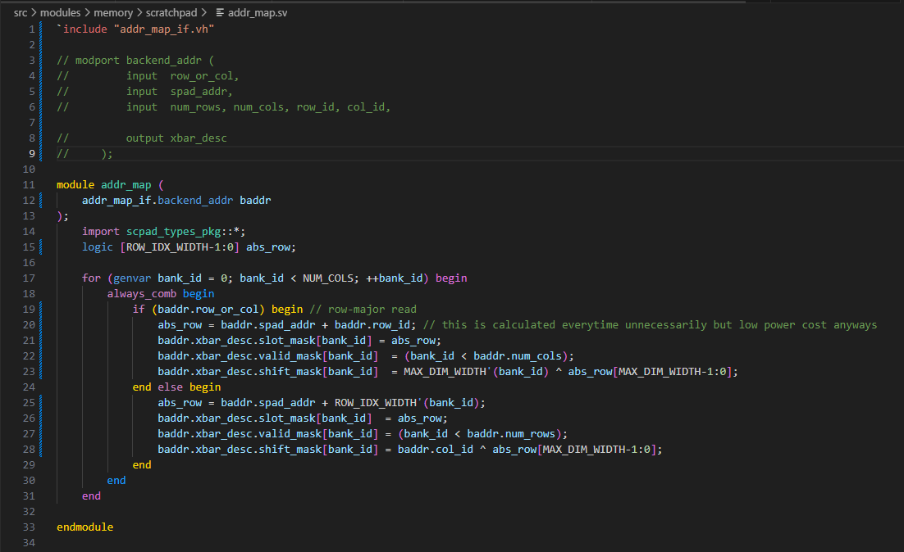
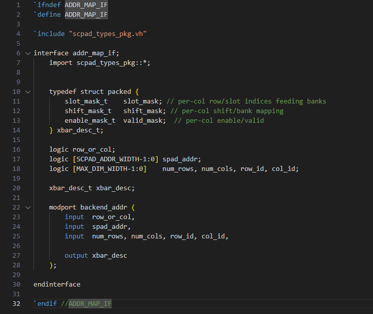
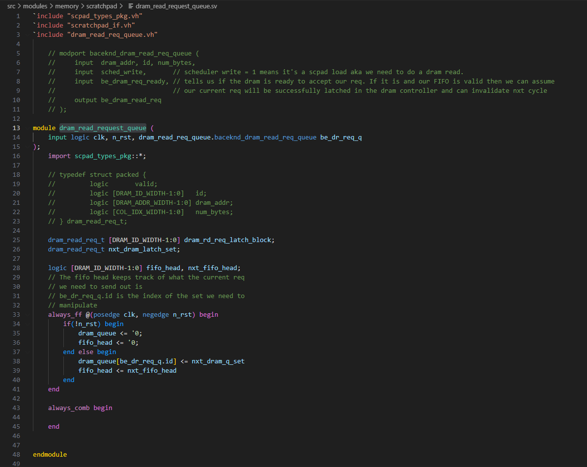
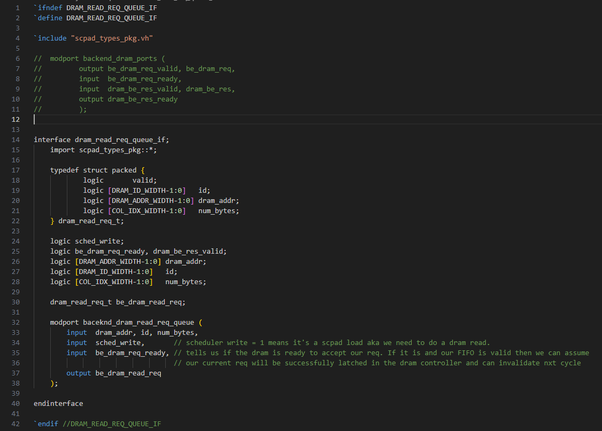
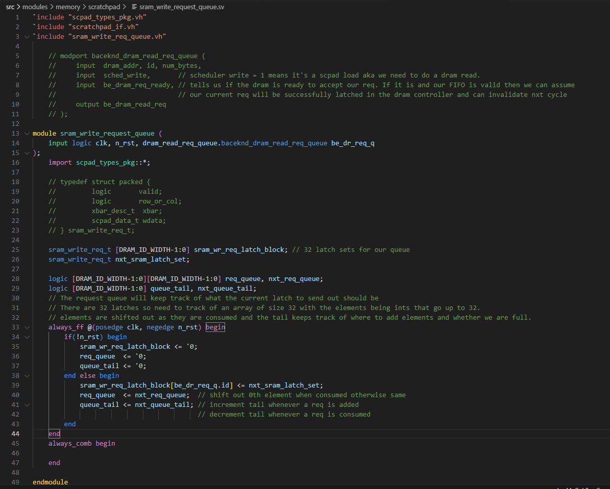
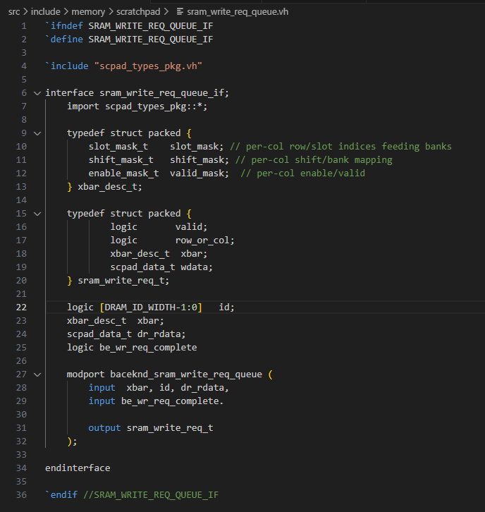

## Project Update

### State: I am not currently stuck or blocked.

### Progress
1. Attended the Sunday Scratchpad meeting where we discussed having 2 seperate scratchpads. In order to accomplish this the scheduler will have to tell me what request the current scratchpad is for (SCPAD ID) and I will have to keep track of the IDS when making filling the queues. I believe the easiest way to achieve this would be to instantiate 2 backend modules. The first will be for SCPAD 0 data and the second for SCPAD 1 data and the ID will simply be passed into their respective modules.

2. Changes made to the DRAM controller have neccessitated a need for UUIDS to be attached to every request. This is because request to the DRAM may come back OOO so in order to know what xbar desc went where we will have to refer to the UUID.

3. There was another discussion for how to best seperate the latches. There was the idea of having a DRAM and SRAM latch block that will have writes and reads in them, or seperate writes and reads so there will be a DRAM read, DRAM write, SRAM read, and SRAM write. I have decided on seperate by writes and reads as the behavior of a DRAM read and a DRAM write is drastically different and could benefit by keeping them seperate. The main benefit would be the ability to treat DRAM read and SRAM reads as a simple FIFO since uuids are created by the backend in that scenario.

4. Code has officially begun for the backend. Current progress has been setting up modules and creating interfaces for addr_map, dram_read_req, and sram_write_req.

    1. addr_map module and interface
        - The module is fairly straight forward it simply calculates the swizzle metadata The main progress this week was cleaning up the previous and adding the interface. Below the code for the module and interface can be seen. Essentially all 32 elements of each mask are calculated in parallel in this module, for more detail on the swizzling algorithm and the RTL refer to week 5.

        
        

    2. DRAM Read Request
        - The module and interface have been created for the DRAM read request queue. This module is responsible for keeping track of our created DRAM request, invalidating when request are fulfilled, and sending out the appropriate data at the right time. The DRAM Read request can be a FIFO, since we create the UUIDs and that is in order. The current progress was mostly ironing out the signals featured in the interface. It's possible as things change signals can be added or removed but for now these are the basic signals. We will recieve the information for the request from the scheduler and will can invalidate when DRAM grabs our data. Since our data will mostly be follow through we can assume DRAM grabs our data almost every cycle except for when it is full, aka when it is !ready.

        
        

    3. SRAM Write Request
        - The module and interface have also been created for the SRAM write request queue. When data is recieved from the DRAM it will go here. This is also a FIFO however it doesn't match 1:1 with the DRAM read request latch as our UUIDs can come back OOO. I plan on treating the UUIDs as our index and creating an array to keep track of which index should be sent out first. This will need a tail that keeps track of the array and tell us whether or not the queue is full. From it's simply sending the data to SRAM and invalidating on SRAM completes.

        
        

### Next Steps
1. Testing will begin for the addr_map module to ensure proper functionality
2. The DRAM read request and SRAM write request modules should be finalized and ready for testing.
3. Create the SRAM read request and the DRAM write request modules and interfaces.