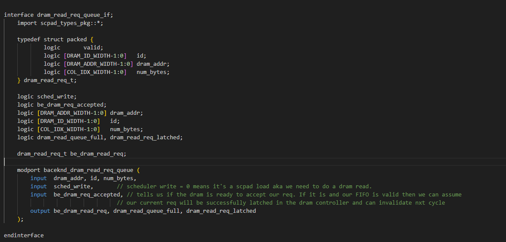
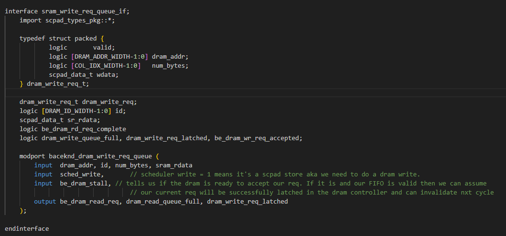
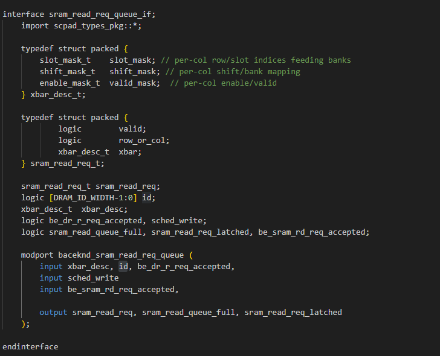
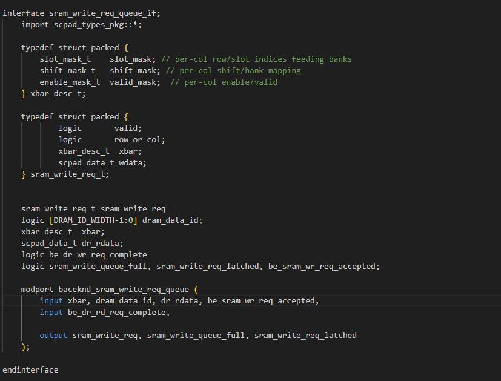

## Project Update

### State: I am not currently stuck or blocked.

### Progress
1. The main progress made was in having the initial modules coded. This is however already out of date as once the initial coding was done a discussion was had about whether or not some were necessary. The outdated modules will still be here for documentation purposes.

2. During a discussion it was discovered that a queue to store the request to SRAM will not be necessary. This is because the sram memory controller and data pipeline will take care of queuing sram request. It can be assumed that as soon as the backend makes a valid request and the scratchpad isn't stalled then it will fly out in the next cycle. There will still need to be a latch to catch the DRAM results and build the data, since dram can only return 64 bits at a time and we need 512. Once the data is built again we can assume it will be sent out the next clock cycle. For sram read request it might be possible to avoid latching entirely and just send it straight to the sram controller. This will 1 clock cycle and avoid latching but we will see if the timings can work out.

3. There was another discussion for how the AXI bus will give us information. As mentioned before the bus can only return 64 bits at a time thus we will have to keep track of how many burst we have seen and how many burst were need to complete our request. Once the request is known to have completed is when we can validate our SRAM write latch. Now the only queue in our system will be for DRAM memory request as DRAM is slow and will be busy most of the time. Since the number of needed burst isn't necessarily known we will have to calculate how many burst is are need then latch that information. Then our check will simply compare that latch to the seen burst counter.

4. Finally, since the amount of queues has been reduced and the only needed queue is a dram request queue then the dram_read and dram_write queues will be placed combined. This means a new module will be created and the queue there will be able to store all needed information.

5. The following code will provide the basic understanding of our old design.

    1. dram_read_request_queue module and interface
        - The purpose of this module is to be a basic FIFO. The dram request will be stored here until the AXI is ready to start accepting request. The tail keeps track of where we can store our request and the head keeps track of the current request to send out. Then some basic error checking for if it's full or empty is needed to handle any structural hazards.

    ```system verilog
            
        module dram_read_request_queue ( // UUID now needs to have 2 lower bits for an offest since dram can only handle 64 bits at a time
            input logic clk, n_rst, 
            dram_read_req_queue.baceknd_dram_read_req_queue be_dr_rd_req_q
        );
            import scpad_types_pkg::*;

            // typedef struct packed {
            //         logic       valid;     
            //         logic [DRAM_ID_WIDTH-1:0]   id;         
            //         logic [DRAM_ADDR_WIDTH-1:0] dram_addr; 
            //         logic [COL_IDX_WIDTH-1:0]   num_bytes;  
            // } dram_read_req_t;

            dram_read_req_t [DRAM_ID_WIDTH-1:0] dram_rd_req_latch_block; // 32 frames
            dram_read_req_t nxt_dram_head_latch_set, nxt_dram_tail_latch_set;

            logic [DRAM_ID_WIDTH-1:0] fifo_head, nxt_fifo_head, fifo_tail, nxt_fifo_tail;
            
            always_ff @(posedge clk, negedge n_rst) begin
                if(!n_rst) begin
                    dram_rd_req_latch_block <= 'b0;
                    fifo_head <= 'b0;
                    fifo_tail <= 'b0;
                end else begin
                    dram_rd_req_latch_block[fifo_head] <= nxt_dram_head_latch_set;
                    dram_rd_req_latch_block[fifo_tail] <= nxt_dram_tail_latch_set;
                    fifo_head <= nxt_fifo_head;
                    fifo_tail <= nxt_fifo_tail
                end
            end

            always_comb begin
                nxt_dram_head_latch_set = dram_rd_req_latch_block[fifo_head];
                nxt_dram_tail_latch_set = dram_rd_req_latch_block[fifo_tail];
                be_dr_rd_req_q.be_dram_read_req = 0;
                nxt_fifo_head = fifo_head;
                nxt_fifo_tail = fifo_tail;
                dram_read_req_latched = 1'b0;
                be_dr_rd_req_q.dram_read_queue_full = 1'b0;

                if(be_dr_rd_req_q.sched_write == 1'b0) begin
                    nxt_dram_tail_latch_set.valid = 1'b1;
                    nxt_dram_tail_latch_set.id = be_dr_rd_req_q.id;
                    nxt_dram_tail_latch_set.dram_addr = be_dr_rd_req_q.dram_addr;
                    nxt_dram_tail_latch_set.num_bytes = be_dr_rd_req_q.num_bytes;
                    nxt_fifo_tail = fifo_tail + 1;
                    be_dr_rd_req_q.dram_read_req_latched = 1'b1;
                end

                if(be_dr_rd_req_q.be_dram_req_accepted && (fifo_head != fifo_tail)) begin //the dram is accepting request and we aren't empty
                    be_dr_rd_req_q.be_dram_read_req = dram_rd_req_latch_block[fifo_head];
                    nxt_dram_head_latch_set = 0; // invalidate head when our request are accepted.
                    nxt_fifo_head = fifo_head + 1;
                end

                if((fifo_tail + 1) == fifo_head) begin 
                    nxt_dram_tail_latch_set = dram_rd_req_latch_block[fifo_tail];
                    nxt_fifo_tail = fifo_tail;
                    be_dr_rd_req_q.dram_read_req_latched = 1'b0;
                    be_dr_rd_req_q.dram_read_queue_full = 1'b1;
                end

            

            end
            

        endmodule
    ```

    

    2. DRAM write Request 
        - This module is basically an exact copy of DRAM read request so I won't go too much into detail. The only difference is that the queue would've been capable of storing the read data but combining this with the DRAM read request queue will reduce duplication, and two aren't needed since a single backend will not be doing simultaneous reads and writes.


        ```system verilog
            
        module dram_write_request_queue (
            input logic clk, n_rst, 
            dram_write_req_queue.baceknd_dram_write_req_queue be_dr_wr_req_q
        );
            import scpad_types_pkg::*;

            // typedef struct packed {
            //         logic       valid;           
            //         logic [DRAM_ADDR_WIDTH-1:0] dram_addr;
            //         logic [COL_IDX_WIDTH-1:0]   num_bytes; 
            //         scpad_data_t wdata;
            // } dram_write_req_t;

            dram_read_req_t [DRAM_ID_WIDTH-1:0] dram_wr_req_latch_block; // 32 frames
            dram_read_req_t nxt_dram_head_latch_set, nxt_dram_tail_latch_set;

            logic [DRAM_ID_WIDTH-1:0] fifo_head, nxt_fifo_head, fifo_tail, nxt_fifo_tail;
            
            always_ff @(posedge clk, negedge n_rst) begin
                if(!n_rst) begin
                    dram_wr_req_latch_block <= 'b0;
                    fifo_head <= 'b0;
                    fifo_tail <= 'b0;
                end else begin
                    dram_wr_req_latch_block[fifo_head] <= nxt_dram_head_latch_set;
                    dram_wr_req_latch_block[fifo_tail] <= nxt_dram_tail_latch_set;
                    fifo_head <= nxt_fifo_head;
                    fifo_tail <= nxt_fifo_tail
                end
            end

            always_comb begin
                be_dr_wr_req_q.be_dram_read_req = 0;
                nxt_dram_head_latch_set = dram_wr_req_latch_block[fifo_head];
                nxt_dram_tail_latch_set = dram_wr_req_latch_block[fifo_tail];
                nxt_fifo_head = fifo_head;
                nxt_fifo_tail = fifo_tail;
                dram_read_req_latched = 1'b0;
                be_dr_wr_req_q.dram_read_queue_full = 1'b0;

                if(be_dr_wr_req_q.sched_write == 1'b0) begin
                    nxt_dram_tail_latch_set.valid = 1'b1;
                    nxt_dram_tail_latch_set.id = be_dr_wr_req_q.id;
                    nxt_dram_tail_latch_set.dram_addr = be_dr_wr_req_q.dram_addr;
                    nxt_dram_tail_latch_set.num_bytes = be_dr_wr_req_q.num_bytes;
                    nxt_fifo_tail = fifo_tail + 1;
                    be_dr_wr_req_q.dram_read_req_latched = 1'b1;
                end

                if(be_dr_wr_req_q.be_dram_req_accepted && (fifo_head != fifo_tail)) begin
                    be_dr_wr_req_q.be_dram_read_req = dram_wr_req_latch_block[fifo_head];
                    nxt_dram_head_latch_set = 0; // invalidate head when our request are accepted.
                    nxt_fifo_head = fifo_head + 1;
                end

                if((fifo_tail + 1) == fifo_head) begin 
                    nxt_dram_tail_latch_set = dram_wr_req_latch_block[fifo_tail];
                    nxt_fifo_tail = fifo_tail;
                    be_dr_wr_req_q.dram_read_req_latched = 1'b0;
                    be_dr_wr_req_q.dram_read_queue_full = 1'b1;
                end

            end

        endmodule
        ```
    

    3. SRAM Read Request
        - This was going to be a simple FIFO but as discussed earlier it will no longer be necessary. The only significant difference from the DRAM Read Request module is that it takes in an xbar description instead of an address.

        ```system verilog
            
        module sram_read_request_queue (
            input logic clk, n_rst, 
            sram_read_req_queue.baceknd_dram_read_req_queue be_sr_rd_req_q
        );
            import scpad_types_pkg::*;

            // typedef struct packed {
            //         logic        valid;     
            //         logic        row_or_col;        
            //         xbar_desc_t  xbar;
            // } sram_read_req_t;

            sram_read_req_t [DRAM_ID_WIDTH-1:0] sram_rd_req_latch_block; // 32 frames
            sram_read_req_t nxt_sram_head_latch_set, nxt_sram_tail_latch_set;

            logic [DRAM_ID_WIDTH-1:0] fifo_head, nxt_fifo_head, fifo_tail, nxt_fifo_tail;
            
            always_ff @(posedge clk, negedge n_rst) begin
                if(!n_rst) begin
                    sram_rd_req_latch_block <= 'b0;
                    fifo_head <= 'b0;
                    fifo_tail <= 'b0;
                end else begin
                    sram_rd_req_latch_block[fifo_head] <= nxt_sram_head_latch_set;
                    sram_rd_req_latch_block[fifo_tail] <= nxt_sram_tail_latch_set;
                    fifo_head <= nxt_fifo_head;
                    fifo_tail <= nxt_fifo_tail
                end
            end

            always_comb begin
                nxt_sram_head_latch_set = sram_rd_req_latch_block[fifo_head];
                nxt_sram_tail_latch_set = sram_rd_req_latch_block[fifo_tail];
                nxt_fifo_head = fifo_head;
                nxt_fifo_tail = fifo_tail;
                sram_read_req_latched = 1'b0;
                be_sr_rd_req_q.sram_read_queue_full = 1'b0;

                if(be_sr_rd_req_q.sched_write == 1'b0) begin
                    nxt_sram_tail_latch_set.valid = 1'b1;
                    nxt_sram_tail_latch_set.row_or_col = be_sr_rd_req_q.row_or_col;
                    nxt_sram_tail_latch_set.xbar = be_sr_rd_req_q.xbar;
                    nxt_fifo_tail = fifo_tail + 1;
                    be_sr_rd_req_q.sram_read_req_latched = 1'b1;
                end

                if(be_sr_rd_req_q.be_sram_rd_req_accepted && (fifo_head != fifo_tail)) begin
                    nxt_sram_head_latch_set = 0; // invalidate head when our request are accepted.
                    nxt_fifo_head = fifo_head + 1;
                end

                if((fifo_tail + 1) == fifo_head) begin 
                    nxt_sram_tail_latch_set = sram_rd_req_latch_block[fifo_tail];
                    nxt_fifo_tail = fifo_tail;
                    be_sr_rd_req_q.sram_read_req_latched = 1'b0;
                    be_sr_rd_req_q.sram_read_queue_full = 1'b1;
                end

            be_sr_rd_req_q.sram_read_req = sram_rd_req_latch_block[fifo_head];

            end
            
        endmodule
        ```
        

        4. SRAM Write Request
            - Now here is where something interesting would have happened. It is mostly a regular FIFO however a seperate FIFO queue would've been kept to keep track of what ID arrived first. Using the IDs we could index the Latches and turn the OOO served DRAM request into a regular FIFO. As discussed earlier this queue is no longer needed. Instead the interesting part will become about keeping track of the amount of needed burst and the amount of seen burst to determine if the data is done loading into our latch. Besides that method of keeping track of IDs it is a regular FIFO as discussed in the DRAM Read section.

        ```system verilog
            
        module sram_write_request_queue (
            input logic clk, n_rst, 
            sram_write_req_queue.baceknd_sram_write_req_queue be_sr_wr_req_q
        );
            import scpad_types_pkg::*;

            // typedef struct packed {
            //         logic       valid;     
            //         logic       row_or_col;        
            //         xbar_desc_t  xbar;  
            //         scpad_data_t wdata;
            // } sram_write_req_t;

            sram_write_req_t [DRAM_ID_WIDTH-1:0] sram_wr_req_latch_block; // 32 latch sets for our queue
            sram_write_req_t nxt_sram_latch_set;

            logic [DRAM_ID_WIDTH-1:0][DRAM_ID_WIDTH-1:0] req_queue;
            logic [DRAM_ID_WIDTH-1:0] nxt_req_queue, queue_head, nxt_queue_head, queue_tail, nxt_queue_tail; 
            // The request queue will keep track of what the current latch to send out should be
            // There are 32 latches so need to track of an array of size 32 with the elements being ints that go up to 32.
            always_ff @(posedge clk, negedge n_rst) begin
                if(!n_rst) begin
                    sram_wr_req_latch_block <= 'b0;
                    req_queue  <= 'b0;
                    queue_head <= 'b0;
                    queue_tail <= 'b0;
                end else begin
                    sram_wr_req_latch_block[be_sr_wr_req_q.dram_data_id] <= nxt_sram_latch_set;
                    req_queue[queue_head]  <= nxt_req_queue; 
                    queue_head <= nxt_queue_head;
                    queue_tail <= nxt_queue_tail;                            
                end
            end

            always_comb begin
                be_sr_wr_req_q.sram_write_req = 0;
                nxt_sram_latch_set = sram_wr_req_latch_block[be_sr_wr_req_q.dram_data_id];
                nxt_req_queue = req_queue;
                nxt_queue_head = queue_head;
                nxt_queue_tail = queue_tail;
                sram_write_req_latched = 1'b0;
                be_sr_wr_req_q.sram_write_queue_full = 1'b0; 

                if(be_sr_wr_req_q.be_dr_rd_req_complete) begin
                    nxt_sram_latch_set.valid = 1'b1;
                    nxt_sram_latch_set.row_or_col = be_sr_wr_req_q.row_or_col;
                    nxt_sram_latch_set.xbar = be_sr_wr_req_q.xbar;
                    nxt_sram_latch_set.wdata = be_sr_wr_req_q.dr_rdata;
                    nxt_req_queue = be_sr_wr_req_q.dram_data_id; 
                    // This is what seperates it from dram_r_req. In the request queue's head store the dram_data_id we got from dram
                    // Then our output will be based on that head and they can be queued up.
                    nxt_queue_tail = queue_tail + 1;
                    be_sr_wr_req_q.sram_write_req_latched = 1'b1;
                end
                // This is if the whole packet came back at once (it doesn't). Will need to discuss how that looks with DRAM
                // Most likely an fsm but it's possible a request is less than 4 packets so can't just say when we see the 
                // dram_data_id 4 times it's considered done
                // Would need to know how many packets to expect before considering when it's done. Keep track in backend or dram? 

                if(be_sr_wr_req_q.be_sram_wr_req_accepted && (queue_head != queue_tail)) begin
                    be_sr_wr_req_q.sram_write_req = sram_wr_req_latch_block[req_queue[queue_head]];
                    nxt_sram_latch_set = 0; // invalidate the set
                    nxt_queue_head = queue_head + 1; // increase the queue_head to the next dram_data_id
                    // don't have to "invalidate" the previous head of the request queue
                    // The head can only move if we have a valid in the head anyways
                end

                if((queue_tail + 1) == queue_head) begin 
                    nxt_sram_latch_set = ;
                    nxt_queue_tail = fifo_tail;
                    be_sr_wr_req_q.sram_write_req_latched = 1'b0;
                    be_sr_wr_req_q.sram_write_queue_full = 1'b1;
                end

            end

        endmodule
        ```

        

### Next Steps
1. As discussed earlier the DRAM write and read request latches will be combined into one queue.
2. SRAM reads could be sent out without the need of a latch inside the backend and the SRAM writes will need to be built up from the smaller DRAM read results.
3. A new method for keeping track the burst and validating our SRAM Write latch will need to be made.
4. The code should be done by Friday and the Testbenches should be made by Sunday.
5. Once synthesis and testbenching is done we can move on to optimization.
