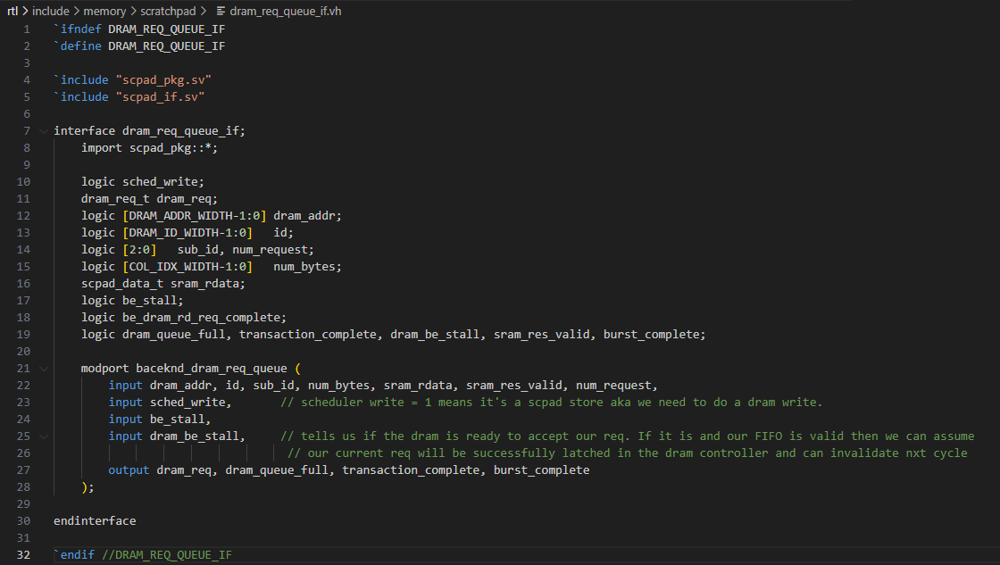
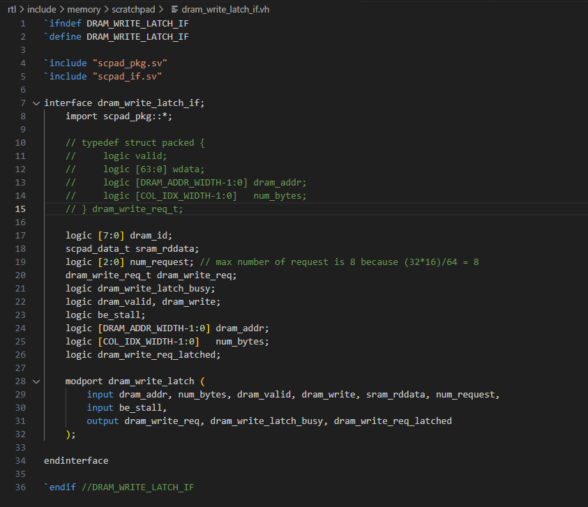
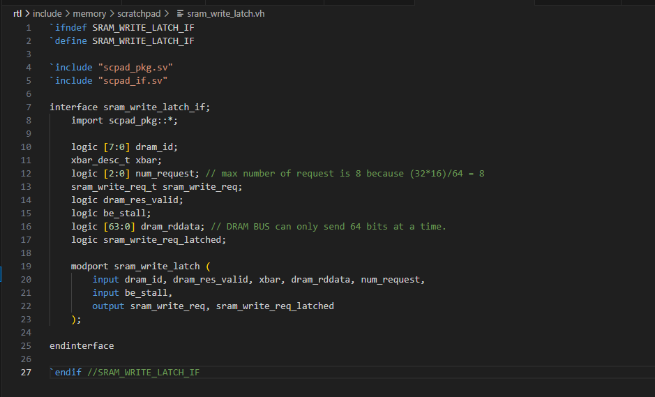

## Project Update

### State: I am not currently stuck or blocked.

### Progress
1. The main code is done and was checked for any compilation errors. The modules are now backend, dram_request_queue, dram_write_latch, and sram_write latch.
    1. backend module
        - This module is simply the top level that host the dram_request_queue, dram_write_latch, and sram_write_latch. It also contains the logic to drive those signals and generate the uuid based on whether we are doing a scpad load or a scpad write. It will be posted in it's entirety here. The most interesting part of the code is how we determine the uuid and dram/scpad addr. The uuid is simply based on handshake signals from the request latches to keep track of the current row being serviced for the request. We begin at 0 and iterate until we reach the num_rows. Another signal will be added to handle when to drive the schedule res valid. Depending on if it's a scpad load or write it will increment at different times, dram writes or sram writes. Finally the addresses are calculated based off the first address passed in from the schedule request and added by what row we are on. The interface was developed by Akshath and can be found in the scratchpad_main branch under scpad_if and scpad_pkg. 

    ```system verilog
            
        `include "scpad_pkg.sv"
    `include "scpad_if.sv"
    `include "swizzle_if.vh"
    `include "dram_req_queue_if.vh"
    `include "sram_write_latch_if.vh"
    `include "dram_write_latch_if.vh"

    /*  Julio Hernandez - herna628@purdue.edu */
    /*  Akshath Raghav Ravikiran - araviki@purdue.edu */

    import scpad_pkg::*;

    module backend #(parameter logic [SCPAD_ID_WIDTH-1:0] IDX = '0) 
        (scpad_if.backend_sched bshif, 
        scpad_if.backend_body bscif, 
        scpad_if.backend_dram bdrif
    ); // grab clk and n_rst from any interface

        logic [DRAM_ID_WIDTH-1:0] be_id, uuid, nxt_uuid;
        logic [2:0] sub_uuid, nxt_sub_uuid, num_request; 
        logic [2:0] num_bytes;
        logic nxt_sched_res_valid;

        always_ff @(posedge bshif.clk, negedge bshif.n_rst ) begin
            if(!bshif.n_rst) begin
                uuid <= 'b0;
                sub_uuid <= 'b0;
            end else begin
                uuid <= nxt_uuid;
                sub_uuid <= nxt_sub_uuid;
            end
        end

        swizzle_if baddr();
        dram_req_queue_if be_dr_req_q();
        sram_write_latch_if sr_wr_l();
        dram_write_latch_if dr_wr_l();

        swizzle swizzle_metadata(baddr);
        assign baddr.row_or_col = bshif.sched_req.row_or_col; // Should always be 1'b1;
        assign baddr.spad_addr = {bshif.sched_req.spad_addr[19:5], 5'b00000}; // ignore lower 5 bits
        assign baddr.num_rows = bshif.sched_req.num_rows;
        assign baddr.num_cols = bshif.sched_req.num_cols;
        assign baddr.row_id = be_id;  // no matter which orientation we are in the      
        assign baddr.col_id = be_id;  // be_id keeps track
        // If sched_write == 1'b0 then it's a scpad load, so a dram read to a sram write.
        // This means the crossbar description we need is going to be based on the id that comes back from dram.

        // If sched write == 1'b1 then it's a scpad store, so a sram read to a dram write.
        // This mean the swizzle data we need can just come from our uuid.

        dram_request_queue dr_rd_req_q(bshif.clk, bshif.n_rst, be_dr_req_q);
        assign be_dr_req_q.sched_write = bshif.sched_req.write;
        assign be_dr_req_q.be_stall = bscif.be_stall;
        assign be_dr_req_q.dram_be_stall = bdrif.dram_be_stall || dr_wr_l.dram_write_latch_busy;
        // output dram_req, dram_queue_full, dram_req_latched

        sram_write_latch be_sr_wr_latch(bshif.clk, bshif.n_rst, sr_wr_l);
        assign sr_wr_l.dram_id = bdrif.dram_be_res.id;
        assign sr_wr_l.dram_res_valid = bdrif.dram_be_res.valid;
        assign sr_wr_l.xbar = baddr.xbar_desc;
        assign sr_wr_l.dram_rddata = bdrif.dram_be_res.rdata;
        assign sr_wr_l.num_request = num_request;
        assign sr_wr_l.be_stall = bscif.be_stall;
        // output sram_write_req, sram_write_req_latched

        dram_write_latch dr_wr_latch(bshif.clk, bshif.n_rst, dr_wr_l);
        assign dr_wr_l.dram_addr = {bscif.sched_req.dram_addr[DRAM_ADDR_WIDTH-1:5] + uuid, 5'b00000};
        assign dr_wr_l.num_bytes = num_bytes;
        assign dr_wr_l.dram_valid = be_dr_req_q.dram_req.valid;
        assign dr_wr_l.dram_write = be_dr_req_q.dram_req.write;
        assign dr_wr_l.sram_rddata = be_dr_req_q.dram_req.wdata;
        assign dr_wr_l.num_request = num_request;
        assign dr_wr_l.be_stall = bscif.be_stall;
        // output dram_write_req, dram_write_latch_busy, dram_write_req_latched

        always_comb begin
            num_request = 1;
            be_id = bdrif.dram_be_res.id[7:3];

            if(bshif.sched_req.num_cols > 28) begin // need to determine num_packets so we can invalidate unneeded ones. Will always do 8 burst though
                num_request = 8;
            end else if(bshif.sched_req.num_cols > 24) begin
                num_request = 7;
            end else if(bshif.sched_req.num_cols > 20) begin
                num_request = 6;
            end else if(bshif.sched_req.num_cols > 16) begin
                num_request = 5;
            end else if(bshif.sched_req.num_cols > 12) begin
                num_request = 4;
            end else if(bshif.sched_req.num_cols > 8) begin
                num_request = 3;
            end else if(bshif.sched_req.num_cols > 4) begin
                num_request = 2;
            end

            nxt_sub_uuid = sub_uuid;
            nxt_uuid = uuid;
            nxt_sched_res_valid = 1'b0;
            num_bytes = 8; // num_bytes can be a static 8 bytes unless you want to get rid of padding
            
            // sched_write == 1'b0  scpad load, dram read to a sram write.
            be_dr_req_q.dram_addr = {bscif.sched_req.dram_addr[DRAM_ADDR_WIDTH-1:5] + uuid, sub_uuid, 2'b00};
            be_dr_req_q.id = uuid;
            be_dr_req_q.sub_id = sub_uuid;
            
            be_dr_req_q.sram_rdata = 0;
            be_dr_req_q.sram_res_valid = 0;

            // if(sub_uuid + 1 == num_request) begin                // if you want to add exactly the amount of num_bytes with no padding
            //     if(bshif.sched_req.num_cols % 4 == 1) begin      // will also need to change dram_addr calculations.
            //         num_bytes = 2;
            //     end else if(bshif.sched_req.num_cols % 4 == 2) begin
            //         num_bytes = 4;
            //     end else if(bshif.sched_req.num_cols % 4 == 3) begin
            //         num_bytes = 6;
            //     end
            // end

            be_dr_req_q.num_bytes = num_bytes;

            if(be_dr_req_q.burst_complete == 1'b1) begin
                nxt_sub_uuid = sub_uuid + 1;
                if(sub_uuid == num_request) begin
                    nxt_sub_uuid = 0;
                end
            end

            if(be_dr_req_q.transaction_complete == 1'b1) begin
                nxt_uuid = uuid + 1;
                if(uuid == bscif.sched_req.num_rows) begin
                    nxt_uuid = 0;
                end
            end

            if(sr_wr_l.sram_write_req_latched == 1'b1) begin // be_stall is checked in sram latch 
                bscif.be_req = sr_wr_l.sram_write_req;
            end

            bdrif.be_dram_req.valid = be_dr_req_q.dram_req.valid;
            bdrif.be_dram_req.write = 1'b0;
            bdrif.be_dram_req.id = be_dr_req_q.dram_req.id;
            bdrif.be_dram_req.dram_addr = be_dr_req_q.dram_req.dram_addr;
            bdrif.be_dram_req.num_bytes = be_dr_req_q.dram_req.num_bytes;
            bdrif.be_dram_req.wdata = 0;
            

            // typedef struct packed {
            //     logic valid; 
            //     logic write;
            //     logic [DRAM_ID_WIDTH-1:0]   id;
            //     logic [DRAM_ADDR_WIDTH-1:0] dram_addr;
            //     logic [COL_IDX_WIDTH-1:0]   num_bytes;
            //     scpad_data_t wdata;
            // } dram_req_t;

            if(bshif.sched_req.write == 1'b1) begin // sched write == 1'b1, scpad store, sram read to a dram write.
                be_id = uuid;
                if(bscif.be_stall == 1'b0) begin
                    bscif.be_req.valid = 1'b1;
                    bscif.be_req.write = 1'b0;
                    /* needed?
                    bscif.be_req.addr = {bshif.sched_req.spad_addr[19:5] + uuid, 5'b00000};
                    bscif.be_req.num_rows = 0;
                    bscif.be_req.num_cols = 0;
                    bscif.be_req.row_id = 0;
                    bscif.be_req.col_id = 0;
                    */
                    bscif.be_req.row_or_col = bshif.sched_req.row_or_col;
                    bscif.be_req.xbar = baddr.xbar_desc;
                    bscif.be_req.wdata = 0;
                end

                bdrif.be_dram_req.valid = dr_wr_l.dram_write_latch.valid;
                bdrif.be_dram_req.write = dr_wr_l.dram_write_latch.valid;
                bdrif.be_dram_req.id = 0; // doesn't matter it's just a write
                bdrif.be_dram_req.dram_addr = dr_wr_l.dram_write_latch.dram_addr;
                bdrif.be_dram_req.num_bytes = dr_wr_l.dram_write_latch.num_bytes;
                bdrif.be_dram_req.wdata = dr_wr_l.dram_write_latch.wdata;    
            end
            
        end

    endmodule
    ```

    2. dram_request_queue and interface
        - The previous dram_write_request_queue and dram_read_request_queue were combined into one queue. This is because the scratchpad does not do simultaneous read/writes and one queue would have just been sitting idle and duplicated dram_addr, and num_bytes for no reason. The dram_request_queue is simply a fifo that pushed its head out whenever the respective dram/sram recieving latches aren't stalled. The interesting part here comes from how reads and write will now be handled in the same queue and thus we need an if statement to determine the data written to the latch. Reads can simply go as is but write will need to be stalled in the head for at least 8 cycles. This is because the DRAM can only handle a 64 bit bus and our vectors are 512 bits, so 512/64 = 8. It's possible to stall less than 8 cycles depending on how many cols in a row. Once the required amount of request have been served we can finally pop the head and continue. The interface inputs simply come from our top module and the output depends on a write or read but its mostly just sending the request to dram. 

        ```system verilog
            
        `include "scpad_pkg.sv"
        `include "scpad_if.sv"
        `include "dram_req_queue_if.vh"

        /*  Julio Hernandez - herna628@purdue.edu */
        /*  Akshath Raghav Ravikiran - araviki@purdue.edu */

            // modport baceknd_dram_req_queue ( 
            //     input dram_addr, id, num_bytes, sram_rdata, sram_res_valid
            //     input sched_write,       // scheduler write = 1 means it's a scpad store aka we need to do a dram write.
            //     input be_stall,
            //     input dram_be_stall,     // tells us if the dram is ready to accept our req. If it is and our FIFO is valid then we can assume 
            //                               // our current req will be successfully latched in the dram controller and can invalidate nxt cycle
            //     output dram_req, dram_queue_full, dram_req_latched
            // );

        module dram_request_queue ( // UUID now needs to have 2 lower bits for an offest since dram can only handle 64 bits at a time
            input logic clk, n_rst, 
            dram_req_queue_if.baceknd_dram_req_queue be_dr_req_q
        );
            import scpad_pkg::*;

            // typedef struct packed {
            //     logic valid; 
            //     logic write;
            //     logic [7:0]   id;
            //     logic [DRAM_ADDR_WIDTH-1:0] dram_addr;
            //     logic [COL_IDX_WIDTH-1:0]   num_bytes;
            //     scpad_data_t wdata;
            // } dram_req_t;

            dram_req_t [DRAM_ID_WIDTH-1:0] dram_req_latch_block; 
            dram_req_t nxt_dram_head_latch_set, nxt_dram_tail_latch_set;

            logic [DRAM_ID_WIDTH-1:0] fifo_head, nxt_fifo_head, fifo_tail, nxt_fifo_tail;
            logic [3:0] request_completed_counter, nxt_request_completed_counter;
            
            always_ff @(posedge clk, negedge n_rst) begin
                if(!n_rst) begin
                    dram_req_latch_block <= 'b0;
                    fifo_head <= 'b0;
                    fifo_tail <= 'b0;
                    request_completed_counter <= 'b0;
                end else begin
                    dram_req_latch_block[fifo_head] <= nxt_dram_head_latch_set;
                    dram_req_latch_block[fifo_tail] <= nxt_dram_tail_latch_set;
                    fifo_head <= nxt_fifo_head;
                    fifo_tail <= nxt_fifo_tail;
                    request_completed_counter <= nxt_request_completed_counter;
                end
            end

            always_comb begin
                be_dr_req_q.dram_req = 0;
                be_dr_req_q.transaction_complete = 1'b0;

                nxt_dram_head_latch_set = dram_req_latch_block[fifo_head];
                nxt_dram_tail_latch_set = dram_req_latch_block[fifo_tail];
                nxt_fifo_head = fifo_head;
                nxt_fifo_tail = fifo_tail;
                nxt_request_completed_counter = request_completed_counter;

                be_dr_req_q.dram_queue_full = 1'b0;
                be_dr_req_q.burst_complete = 1'b0;

                if(be_dr_req_q.sched_write == 1'b1) begin // sched write is 1 when doing a scpad store, aka sram read to dram write
                    if(be_dr_req_q.sram_res_valid == 1'b1) begin
                        nxt_dram_tail_latch_set.valid = 1'b1;
                        nxt_dram_tail_latch_set.write = be_dr_req_q.sched_write;
                        nxt_dram_tail_latch_set.id = {be_dr_req_q.id, be_dr_req_q.sub_id};
                        nxt_dram_tail_latch_set.dram_addr = be_dr_req_q.dram_addr;
                        nxt_dram_tail_latch_set.num_bytes = be_dr_req_q.num_bytes;
                        nxt_dram_tail_latch_set.wdata = be_dr_req_q.sram_rdata;
                        nxt_fifo_tail = fifo_tail + 1;
                        be_dr_req_q.transaction_complete = 1'b1;
                    end
                end else begin // dram read to sram write
                    nxt_dram_tail_latch_set.valid = 1'b1;
                    nxt_dram_tail_latch_set.write = be_dr_req_q.sched_write;
                    nxt_dram_tail_latch_set.id = {be_dr_req_q.id, be_dr_req_q.sub_id};
                    nxt_dram_tail_latch_set.dram_addr = be_dr_req_q.dram_addr;
                    nxt_dram_tail_latch_set.num_bytes = be_dr_req_q.num_bytes;
                    nxt_dram_tail_latch_set.wdata = 0;
                    nxt_fifo_tail = fifo_tail + 1;
                    nxt_request_completed_counter = request_completed_counter + 1;
                    be_dr_req_q.burst_complete = 1'b1;
                end

                if((be_dr_req_q.dram_be_stall == 1'b0) && (fifo_head != fifo_tail)) begin //the dram is accepting request and we aren't empty
                    be_dr_req_q.dram_req = dram_req_latch_block[fifo_head];
                    nxt_dram_head_latch_set = 0; // invalidate head when our request are accepted.
                    nxt_fifo_head = fifo_head + 1;
                end

                if((fifo_tail + 1) == fifo_head) begin 
                    nxt_dram_tail_latch_set = dram_req_latch_block[fifo_tail];
                    nxt_fifo_tail = fifo_tail;
                    be_dr_req_q.dram_req_latched = 1'b0;
                    be_dr_req_q.dram_queue_full = 1'b1;
                end

                if(nxt_request_completed_counter == be_dr_req_q.num_request) begin
                    be_dr_req_q.transaction_complete = 1'b1;
                    nxt_request_completed_counter = 0;
                end
            
            end

        endmodule
        ```
    

    3. dram_write_latch
        - As previously discussed the DRAM can only serve 64 bits at a time so when making write request we have to split our 512 bit vector. To do this a seperate write latch is created that only 64 bits and sends the request to DRAM from there. The head of the dram queue is stalled until the number of request we expect per transaction is hit and we can then send a signal that the transaction is done and pop the head. It is simply a holding cell until all the request necessary for one transaction is complete. 

        ```system verilog
            
        `include "scpad_pkg.sv"
        `include "scpad_if.sv"
        `include "dram_write_latch_if.vh"

        /*  Julio Hernandez - herna628@purdue.edu */
        /*  Akshath Raghav Ravikiran - araviki@purdue.edu */

            // modport dram_write_latch (
            //     input dram_addr, num_bytes, dram_valid, dram_write, sram_rddata, num_request,
            //     input be_stall,
            //     output dram_write_req, dram_write_latch_busy, dram_write_req_latched
            // );

        module dram_write_latch ( // UUID now needs to have 2 lower bits for an offest since dram can only handle 64 bits at a time
            input logic clk, n_rst, 
            dram_write_latch_if.dram_write_latch dr_wr_l
        );
            import scpad_pkg::*;

            // typedef struct packed {
            //     logic valid; 
            //     logic [63:0] wdata;
            //     logic [DRAM_ADDR_WIDTH-1:0] dram_addr;
            //     logic [COL_IDX_WIDTH-1:0]   num_bytes;
            // } dram_write_req_t;

            dram_write_req_t dram_write_latch,  nxt_dram_write_latch;

            logic [3:0] request_completed_counter, nxt_request_completed_counter; // max completed request is 8
            
            always_ff @(posedge clk, negedge n_rst) begin
                if(!n_rst) begin
                    dram_write_latch <= 'b0;
                    request_completed_counter <= 'b0;
                end else begin
                    dram_write_latch <= nxt_dram_write_latch;
                    request_completed_counter <= nxt_request_completed_counter;
                end
            end

            always_comb begin
                nxt_request_completed_counter = request_completed_counter;
                dr_wr_l.dram_write_latch_busy = 1'b0;
                dr_wr_l.dram_write_req_latched = 1'b0;

                if(dr_wr_l.dram_be_busy == 1'b0) begin
                    if(dr_wr_l.dram_write == 1'b1 && dr_wr_l.dram_valid == 1'b1 && request_completed_counter != dr_wr_l.num_request) begin
                        dr_wr_l.dram_write_latch_busy = 1'b1;
                        nxt_dram_write_latch.valid = 1'b1;
                        if(request_completed_counter[2:0] == 3'b000) begin
                            nxt_dram_write_latch.wdata = dr_wr_l.sram_rddata[63:0];
                        end else if(request_completed_counter[2:0] == 3'b001) begin
                            nxt_dram_write_latch.wdata = dr_wr_l.sram_rddata[127:64];
                        end else if(request_completed_counter[2:0] == 3'b010) begin
                            nxt_dram_write_latch.wdata = dr_wr_l.sram_rddata[191:128];
                        end else if(request_completed_counter[2:0] == 3'b011) begin
                            nxt_dram_write_latch.wdata = dr_wr_l.sram_rddata[255:192];
                        end else if(request_completed_counter[2:0] == 3'b100) begin
                            nxt_dram_write_latch.wdata = dr_wr_l.sram_rddata[319:256];
                        end else if(request_completed_counter[2:0] == 3'b101) begin
                            nxt_dram_write_latch.wdata = dr_wr_l.sram_rddata[383:320];
                        end else if(request_completed_counter[2:0] == 3'b110) begin
                            nxt_dram_write_latch.wdata = dr_wr_l.sram_rddata[447:384];
                        end else if(request_completed_counter[2:0] == 3'b111) begin
                            nxt_dram_write_latch.wdata = dr_wr_l.sram_rddata[512:448];
                        end
                        nxt_dram_write_latch.dram_addr = {dr_wr_l.dram_addr[DRAM_ADDR_WIDTH-1:5], request_completed_counter[2:0], 2'b00};
                        nxt_dram_write_latch.num_bytes = dr_wr_l.num_bytes;
                        nxt_request_completed_counter = request_completed_counter + 1;
                    end

                    if(dram_write_latch.valid == 1'b1) begin
                        dr_wr_l.dram_write_req = dram_write_latch;
                    end

                    if(request_completed_counter == dr_wr_l.num_request) begin
                        dr_wr_l.dram_write_latch_busy = 1'b0;
                        dr_wr_l.dram_write_req_latched = 1'b1;
                        nxt_request_completed_counter = 0;
                        nxt_dram_write_latch = 0;
                    end
                end
                
            end

        endmodule
        ```
        

        4. sram_write_latch
            - Similar to the dram_write_latch the sram will only recieve 64 bits at a time. This means we must wait until the 512 bits (at max) vector transaction is loaded. At most we count out 8 cycles and the consider the latch built and send the data to sram, after making the sizzle data from the recieved uuid out of dram. Again as long as SRAM is not currently stalled we pop the data out of the latch on the next cycle. 

        ```system verilog
            
        `include "scpad_pkg.sv"
        `include "scpad_if.sv"
        `include "sram_write_latch_if.vh"

        /*  Julio Hernandez - herna628@purdue.edu */
        /*  Akshath Raghav Ravikiran - araviki@purdue.edu */

            // modport sram_write_latch (
            //     input dram_id, dram_res_valid, xbar, dram_rddata, num_request,
            //     input be_stall,
            //     output sram_write_req, sram_write_req_latched
            // );


        module sram_write_latch ( // UUID now needs to have 2 lower bits for an offest since dram can only handle 64 bits at a time
            input logic clk, n_rst, 
            sram_write_latch_if.sram_write_latch sr_wr_l
        );
            import scpad_pkg::*;

            // typedef struct packed {
            //     logic valid; 
            //     scpad_data_t wdata;
            //     xbar_desc_t xbar;
            // } sram_write_req_t;

            sram_write_req_t sram_write_latch;
            sram_write_req_t nxt_sram_write_latch;

            logic [2:0] request_completed_counter, nxt_request_completed_counter; // max request is 8
            
            always_ff @(posedge clk, negedge n_rst) begin
                if(!n_rst) begin
                    sram_write_latch <= 'b0;
                    request_completed_counter <= 'b0;
                end else begin
                    sram_write_latch <= nxt_sram_write_latch;
                    request_completed_counter <= nxt_request_completed_counter;
                end
            end

            always_comb begin
                nxt_sram_write_latch = sram_write_latch;
                nxt_request_completed_counter = request_completed_counter;
                sr_wr_l.sram_write_req = 0;
                sr_wr_l.sram_write_req_latched = 1'b0;

                if(sr_wr_l.dram_res_valid) begin
                    nxt_sram_write_latch.valid = ((request_completed_counter + 1) == sr_wr_l.num_request) ? 1'b1 : 1'b0;
                    if(sr_wr_l.dram_id[2:0] == 3'b000) begin
                        nxt_sram_write_latch.wdata[3:0] =  sr_wr_l.dram_rddata;
                    end else if(sr_wr_l.dram_id[2:0] == 3'b001) begin
                        nxt_sram_write_latch.wdata[7:4] =  sr_wr_l.dram_rddata;
                    end else if(sr_wr_l.dram_id[2:0] == 3'b010) begin
                        nxt_sram_write_latch.wdata[11:8] =  sr_wr_l.dram_rddata;
                    end else if(sr_wr_l.dram_id[2:0] == 3'b011) begin
                        nxt_sram_write_latch.wdata[15:12] =  sr_wr_l.dram_rddata;
                    end else if(sr_wr_l.dram_id[2:0] == 3'b100) begin
                        nxt_sram_write_latch.wdata[19:16] =  sr_wr_l.dram_rddata;
                    end else if(sr_wr_l.dram_id[2:0] == 3'b101) begin
                        nxt_sram_write_latch.wdata[23:20] =  sr_wr_l.dram_rddata;
                    end else if(sr_wr_l.dram_id[2:0] == 3'b110) begin
                        nxt_sram_write_latch.wdata[27:24] =  sr_wr_l.dram_rddata;
                    end else if(sr_wr_l.dram_id[2:0] == 3'b111) begin
                        nxt_sram_write_latch.wdata[31:28] =  sr_wr_l.dram_rddata;
                    end
                    nxt_sram_write_latch.xbar = sr_wr_l.xbar;
                    nxt_request_completed_counter = request_completed_counter + 1;
                end

                if((sr_wr_l.be_stall == 1'b0) && (sram_write_latch.valid == 1'b1)) begin
                    sr_wr_l.sram_write_req = sram_write_latch;
                    nxt_sram_write_latch = 0;
                    sr_wr_l.sram_write_req_latched = 1'b1;
                    nxt_request_completed_counter = 0;
                end

                
            end

        endmodule
        ```

        

        5. sram reads
            - So far sram reads have not been discussed, however that is simply because there is not much to discuss. The sram read is made combinationally based off the current uuid and simply sent to sram request reciever. The uuid is increased the next cycle as long as there is no stall. This logic was simple enough that it was simply shoved into the backend top level module. Additionally, if we are doing sram reads then uuids don't have to be kept track of or sent to dram, since an sram read implies a dram read and uuids only need to be returned from dram if read request is coming back to the scratchpad, since writes don't send anything back to dram it's simply not needed.

### Next Steps
1. The most important next step is to get the test bench up and running.
2. Once the test bench is created we will have to ensure coverage for all uuids and make sure they're production is correct.
3. From there the functionality of the queue and latches will be tested.
4. Once all test are ran code optimization will begin. 
