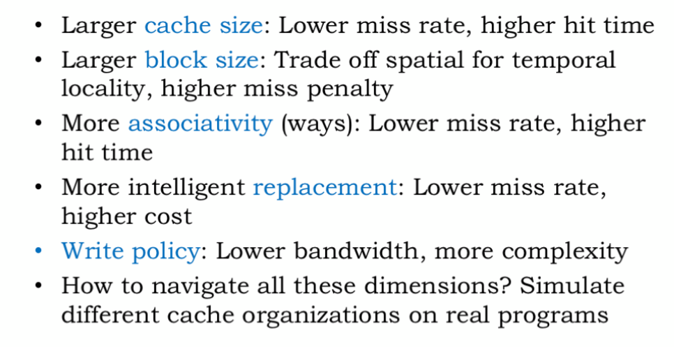

State: Waiting to find out more about the software project during the coming meetings, no blockers otherwise.

## Progress

- This is my first semester in SoCET, so I am still getting my bearings and finding out more about the project and the team's structure

- Joined the software subteam to work on their compiler project to translate C code to assembly-like instructions for the hardware. This will be my senior design project

- Read chapters 7, 14, 15 of the MIT Computation Structures course

## Reading notes

Chapter 7:

- Latency and Throughput
    - Total_PD_comb = N * (PD1 + PD2 + ...)
    - Total_PD_pipelined = N * Max(PD1, PD2, ...)
    - Pipelined systems: sustems that overlap provessing of a sequence of inputs
    - rate of inputs moving throught pipeline = rate of slowest stage
    - Latency: delay from when an input is established until the output associated with that input becomes valid
    - Throughput: rate at which inouts or outputs are processsed

- Pipelined circuits 
    - for comb logic: latency = $t_{PD}$, throughput = $1/t_{PD}$
    - for pipelined: throughput = 1/Max(stage PDs)
    - K-stage pipeline (or K-pipeline for short) is an acyclic circuit having exactly K registers on every path from input to output. An unpipelined combinational circuit is thus a 0-stage pipeline
    - we’ll adopt the convention that every pipeline stage, and hence every K-stage pipeline, has a register on its OUTPUT
    - K pipelines: latency = K * T_clock, throughput = 1/T_clock

- Pipelining methodology
    1. Draw ine that crosses every output, mark endpopints as terminal points
    2. Draw new lines between terminal points accross varous circuit connections, ensuring that every connectoons crosses each lines in the same direction, these demarcate pipeline stages

- Circuit interleaving
    - Simulate pipelined version of a slow component by replicating the critical element and alternate inputs between various copies
    - $2 *t_{clk} \ge (t_{PD,upstreamREG} + t_{PD,LATCH} + t_{PC,C} + t_{PD,MUX} + t_{SETUP,REG}) $
    - Can combine interleaving and pipelining
    - Moves the bottleneck to a different element

Chapter 14:

- SRAM cell: 2 CMOS inverters forming bistable element, 2 access transistors
- SRAM read:
    1. Drivers precharge all bitlines to Vdd and leave floating
    2. Access decoder activates one wordline
    3. Each cell in active word slowly pulls down one of the bitlines to GND
    4. Sense amplifiers sense change in bitline voltages, producing output data
- SRAM write: drive bitlines, activate wordline, overpower cells

- DRAM: 20x smaller area than SRAM cell, capacitor leaks charge - must be refreshed
- DRAM cell: transistor + capacitor
- Flash: uses floating gate transistors to store charge (dense but slow)
- Hard disk: rotating magentic panels (super slow, cheap)
- Memory hierarchy - locality principle
- Cache: small interim storage component - caches data from recently accessed locations 

Chapter 15:

- 5-stage pipelined datapath: IF, RF, ALU, MEM, WB
- Resolving hazards
    1. Stall - simple, wastes cycles, higher CPI
    2. Bypass - more expensive, lower CPI
    3. Speculate
- More pipeline stages -> More frequent data hazards
- Compilers can rearrange code to put dependent instructions farther away

