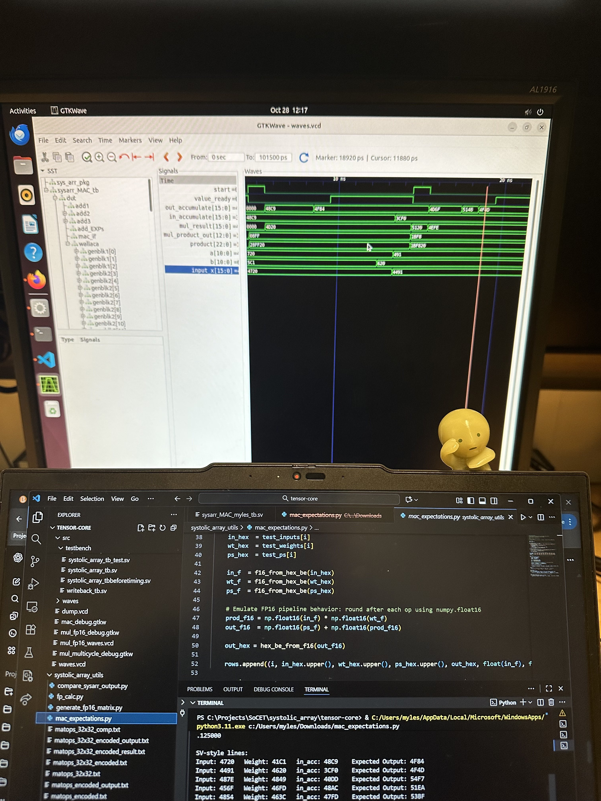
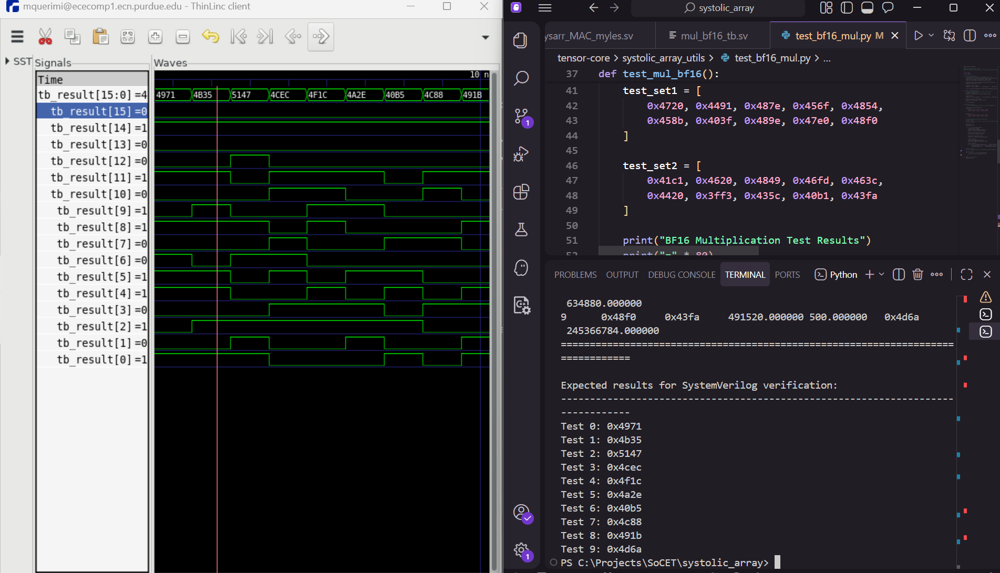

## State: I am not stuck with anything, don't need help right now. 

## Progress
  Locked in getting systolic array ready! Pretty productive week with me being able to accomplish a significant amount of progress. I finished simplifying the 2 cycle adder and managed to get it into a new MAC unit. I didn't end up cutting the subzero support, and just did the ifsub removal. I spent a while on trying to get verilator to actually let me run the testbench, but after Malcolm taught me about module load, I got everything to work. I reran Vinay's old testbench to verify the new 2 cycle adder and it managed to work in the new MAC unit!!!! 

 

 (All of the values match up as expected yay)

 Link to the new MAC module - https://github.com/Purdue-SoCET/atalla/blob/systolic_array_myles/src/modules/sysarr_MAC_myles.sv
  
  In addition due to Mixuan and Vinay not having Windows, I had to create a testbench to see if the new BF16 multiplier using pytorch!!! I would just solve the same multiplication using BF16 by using 1x1 tensor with the values that Vinay already made in the testbench. 

  Link to python file - https://github.com/Purdue-SoCET/atalla/blob/systolic_array_myles/systolic_array_utils/test_bf16_mul.py

  With this, I managed to run the waveform for the original module, and start comparing the values to see if it was the same as what I got on the python file.

  

  All of the test cases that Vinay wrote lined up with what the outputs of the python file got, meaning that the multiplier did function as expected. 
  
## Tasks
 The task for moving foward would be to start finalize the stalling logic, as the original one was only implemented in the control unit. 

## Notes
  No notes for this week, I will miss the upcoming meeting due to schedule conflicts.

## Future Plans 
 Work on stalling and help with Booth encoding.