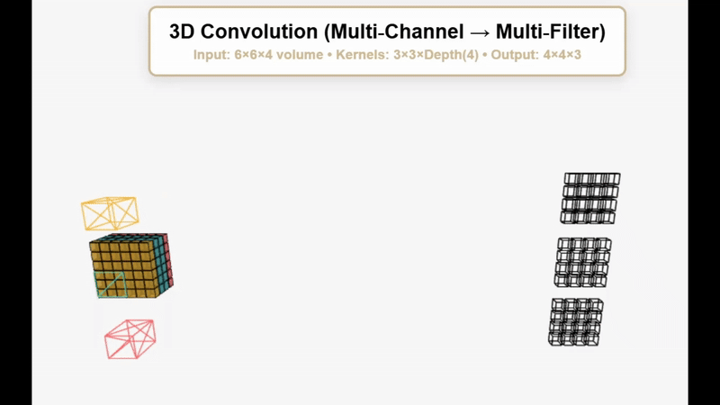
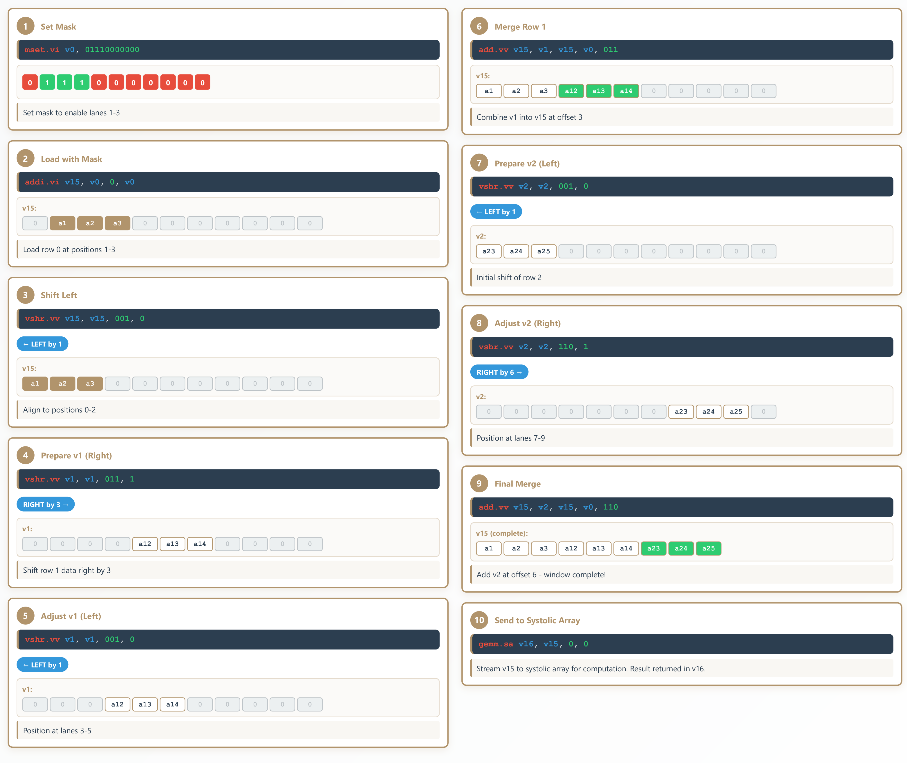
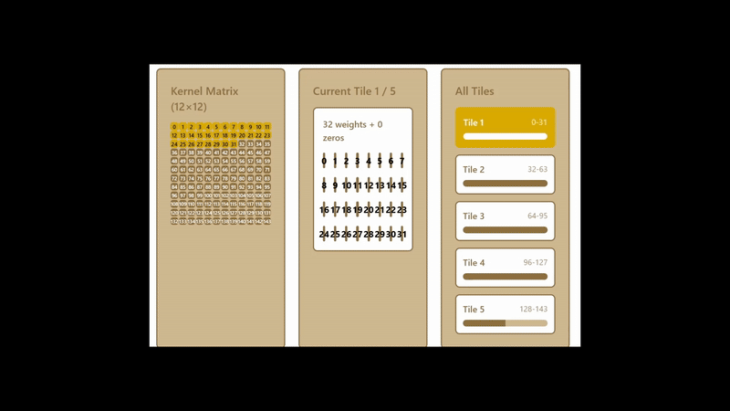

## State: I am not stuck with anything, don't need help right now. 

## Progress
  Completed most of the subnormal/NaN for FP16, leading me to mainly focus on creating visuals for the presentation that occured on Monday. FP16 file in Github, attached are the visuals for the presentation I made

  ### Convolution Demo
  

  This is the visualization showing how actual convolution works. The gif shows multi channel and multi input convolution.

  ### Convolution Timeline
  

  Instruction diagram on how we gather inputs for convolution and send them to the systolic array.
  
  ### Tiling For Larger Inputs 
  

  This is how we turn larger inputs to 5x5 kernels for us to use. 5x5 is max as it equals 25 and 6x6 is 36, and our systolic array only has 32 PEs.

## Tasks
  Work on Booth encoding

  Poster Session

## Notes
  N/A 

## Future Plans 
  Continue helping with systolic array for pipelining (maybe?).