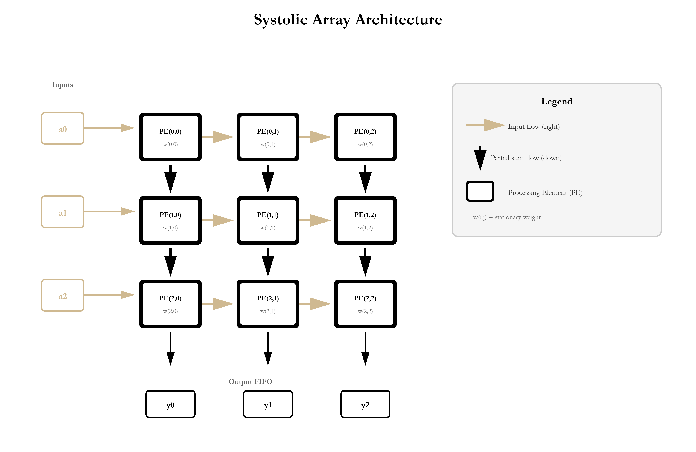

## State: I am not stuck with anything right now 

## Progress
  Complete major rebuild of the systolic top level (almost) done, replacing the old control-unit based design with a simplified module, mainly driven through the GSAU and the built in timing with the buffers.

  ### Implement Features
  Input buffer: Staggered column injection with circular buffer. Transforms the aligned input columns from the GSUA into a diagonal pattern required for the systolic array computation.

  Partial Sum Buffer: Reuses input buffer module with additonal register stage for the timing alignment for MAC computation. This ensures that PSUMs arrive at adders exactly when needed. 

  Output Buffer: Diagonal unstaggering logic to reconstruct the aligned output columns from the staggered results from the systolic array. 

  Stall Management: Better backpressure handling when the output buffer fills and the GSAU is not ready to read. 

  ### Architecture Changes and Details

  Removed the control unit in the top level in favor for handshake driven control from the GSAU 
  
  Weight-Stationary dataflow, with weights being load and activations and PSUMs flowing through the array.

  ### Weight Stationary Diagram 
  

  Weight Stationary Diagram for the systolic array. Probably will be on final report. 

  ### Known Issue: 
 At somepoint the input matrix becomes transposed. Something is probably wired incorrectly, this should be fixed relatively soon. Debugging is currently in progress. 

  Link on github - https://github.com/Purdue-SoCET/atalla/commit/74267560fda3a525c4a94e7719e983ba12a6b8ba

  Push is under Vinay's repo as we worked on it together for the past couple of days. 

  Testbench (by me)
  https://github.com/Purdue-SoCET/atalla/commit/40cda28ccc00f00b4d7289e90a8dd5a881c67615 

## Tasks
  Finish up the report by the 9th and debug 

## Notes
  N/A

## Future Plans 
  Finish up the report with Saandiya and Mixuan!!