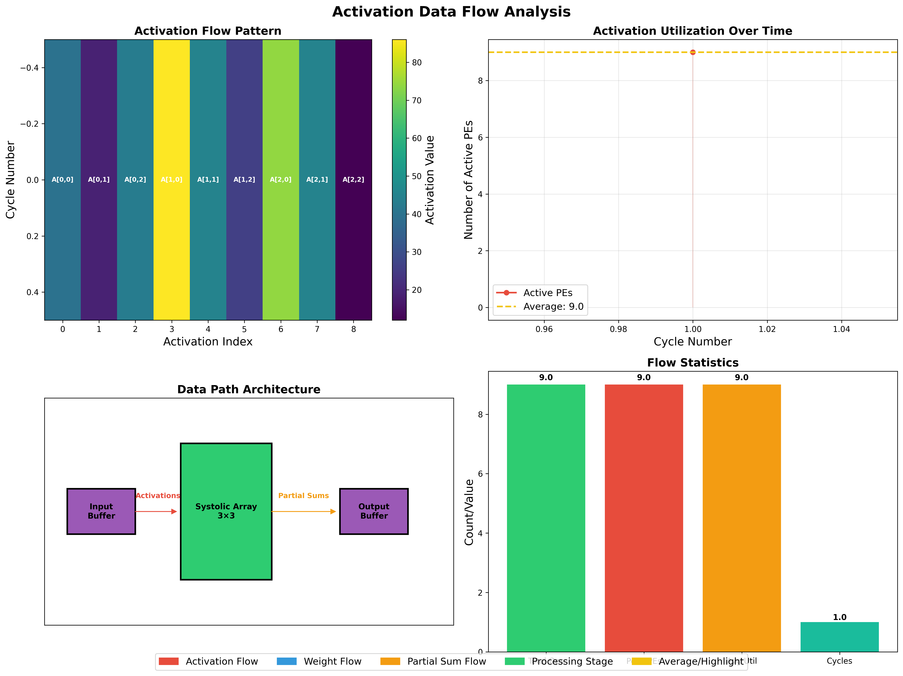
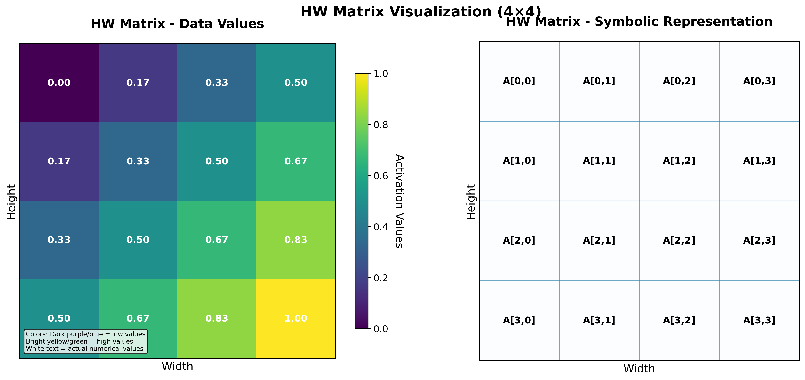
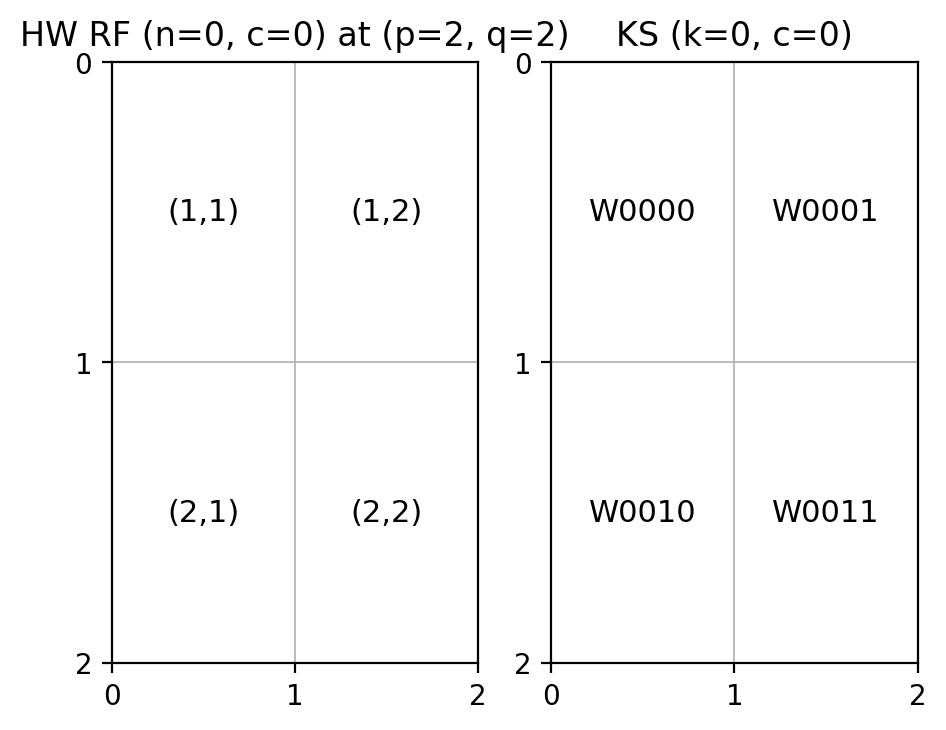

## State: I am not stuck with anything, don't need help right now. 

## Progress
   I finished rough versions of the Python simulator to help visualize the overall process of convolution. I made 2 versions, 1 only showing an overall grid of all of the data, and another with more indepth detail regarding activation values. 

   Attached are photos of the simulations I made.
  

  Image Description - 
    Visualizations of different stats for given kernel size in convolution. PE utilizaiton is show, overall flow pattern for activations, and the dataflow. 

  
    
  Image Description - 
    Visualizations of how activations flow through convolutions. As data goes right and down, the values slowly turn to actual usable figures. 

  
    Image Description - 
    Old HW simulation, produces an image of a given input, demonstrating zero padding and how the kernel could look at various positions. 

  

 Image Description - 
    Copmarison between the input kernel and what weights it would be multiplied with. 

  With this I also started reading a collection of documents to better understand PSUM routing, our next task before starting to write RTL.

  Nvidia - https://docs.nvidia.com/deeplearning/performance/dl-performance-convolutional/index.html 
  ECE 60146 Notes - https://engineering.purdue.edu/kak/pdf-kak/DemystifyConvo.pdf
                    https://engineering.purdue.edu/DeepLearn/pdf-bouman/DL-week-5.pdf

  By reading these documents, it should allow me to reach a better understanding on how we could create potential solutions to our PSUM routing issue. 

## Tasks
  The current task that we have is to finish the algorithm for PSUM routing and to start working on more python simulators to ensure that everything will work before we start implementing anything in SystemVerilog. I will work with Saandiya to help debug the new simulator, ensuring that the values created by it matches what we expect.  

## Notes
   Missed Tuesday Team meeting due to external conflicts.

## Future Plans 
  Once the new simulator is finished, we can hopefully start moving to the system verilog implmentation phase of the project! For the upcoming week, we will be working on the new simulator that once completed should be able to mimic the systolic array and PSUM routing through all of the operations.