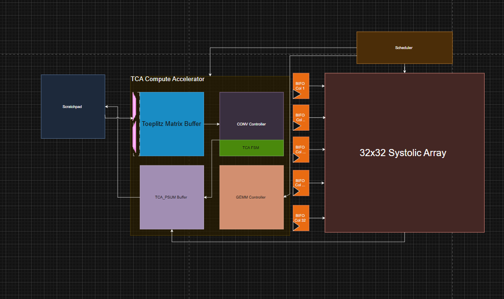

## State: I am not stuck with anything, don't need help right now. 

## Progress
  This week I started work on creating the general RTL for the TCA controller, after we solved the issues with how to handle the Toeplitz matrix and with PSUM routing. With this, I continued to read on how everything would function in the future, and how we could implement our modules in hardware. When we started to discuess it with Sooraj, we realized that we had to make some drastic changes to the overall architecture of the project. Due to this, Saandiya, Nikhil, and I will have to switch to the vector core team to better allign oursleves with our long-term goals. With this I started working on the slideshow that we would have to present for our design review on Sunday. I helped create visuals on the ISA and for the toeplitz matrix, and caught up with everything that happened. 

  Attached is the photo of the RTL me and Nikhil worked on [Now Defunct]
  

  ## Original Architecture Reasoning 
  We knew that we would have to construct a toeplitz matrix for every single time we needed to run a convolution, so the original idea was to create a buffer so we could accomplish all of this in hardware. One of the issue was this would consume an extreme amount of space, and create bandwidth issues with all of the times we would need to read from the scratchpad to produces the matrix. All of the data flow would be controlled by the convolution controller, sending the matrix to the systolic array. With the need for us to write back our partial sums back to the scratch pad, we also decided to make a PSUM buffer, to store these values before sending it back to the scratchpad.

  ## Why Vector Core 
  After talking to Sooraj, the team agreed that it would be significantly better to implement convolution with the vector core team. One of the biggest upsides to this, was the ability for us to use all of their made infrastrcutre, to complete what we needed to do. To construct the toeplizt matrix, instead of us doing it in hardware, it was possible to do it on the fly through a series of instructions, saving us space. This would also help us avoid any issues with bandwitdh, with the excessive amount of times that we would potential have to read from scratchpad. Overall, switching to the use of instructions to complete convolution would be easier in comparision through doing it all in hardware. 

## Tasks
  I have switched to work with the vector core team, as convultion is better suited out for that role. With this, I will start aiding my teammates with the implementation of it, espicially with the creation of the 2 new instructions that is needed for it. 

## Notes
  Had to switch to the vector-core team (may get more finalized on the Friday practice meeting) 

## Future Plans 
 Read on ISA and finalize our current plans moving foward so we have a more concrete idea moving forward. Currently we have 2 new instructions to create, that should be able fulfill all of the functionality that we want from convolution. 