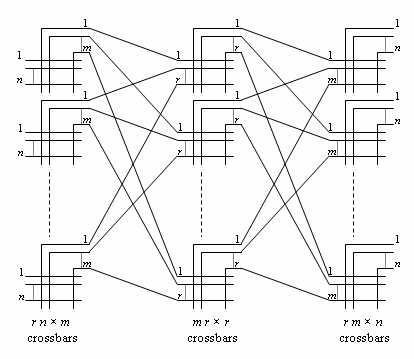

## State: I am not stuck with anything, don't need help right now. 

## Progress
  This week I went to the Vector Code meeting on Tuesday to gather insight in regards to how everything will function. The main goal for the week was to find alternatives to the current implementation to the Bene's network that we going to be utilizing in the Scratchpad. The issue of the Benes network was the fact that it would take around 17 cycles per permutation, with it requring 8 cycles to take the control bit and 9 cycles for the 9 switching stages. The extensive lengths of the Benes network in regars to latency is needed to minimize the total number to switch elements.

  An alternative that I did research on was the Clos Network 

  Link: https://en.wikipedia.org/wiki/Clos_network 

  Summary : It is a multi-stage non-blocking network that generalizes the idea of using to build an N * N switch. A 3-stage Clos network is comprised of an ingress stage, a middle stage, and egress stage. The way that the middle stge is sized is how the network is strictly non-blocking or rearrangeable non-blocking. A Benes network is actually a case of a Clos network. 

  

  ## Tradeoffs 

  ### Benefits 
  Utilizing a Clos network would dramatically reduce the network depth, and thus the overall latency in cycles. 
  
  The abstract of this paper https://oasis.library.unlv.edu/ece_fac_articles/900/#:~:text=blocking%20networks%20as%20alternatives%20to,The%20layout%20and%20simulation 

  States the ability to utilize half the number of stages as an equivalent Benes network with lower latency.

  ### Downsides

  Area is the biggest downside for the Clos network, with it normally utilize larger crossbars, which would make the area and routing in blocks significantly denser. In addition, the path assignment is more complex in comparision to the Benes network, and even though strictly non-blocking does make control more simple, the area demands increase. With all of the crossbars having higher fan-in/fan-out, it would also make timing harder in each stage. 

  ### Conclusion 

  Due to the fact that we are already being constrained by space, it may not be the best idea to try to implement a Clos Network, espically with the work on the Benes. We may just have to work around the higher cycle count. 

## Tasks
  Nikhil and Saandiya got the RTL diagram finished for the GSAU and finished the instruction set, with them setting a deadline of 10/15 to complete the code for all of the modules. We also have to make code for the barrel shifter, with both projects needing to be signed off by a GTA before we are completely done. I will help create code to get the modules done. 

## Notes
  N/A

## Future Plans 
  Once RTL gets fully verified, we can start working on the implementation of everything. Once we actually complete these modules, we can start the verification of them, continuing progress for convolution under vector core. 