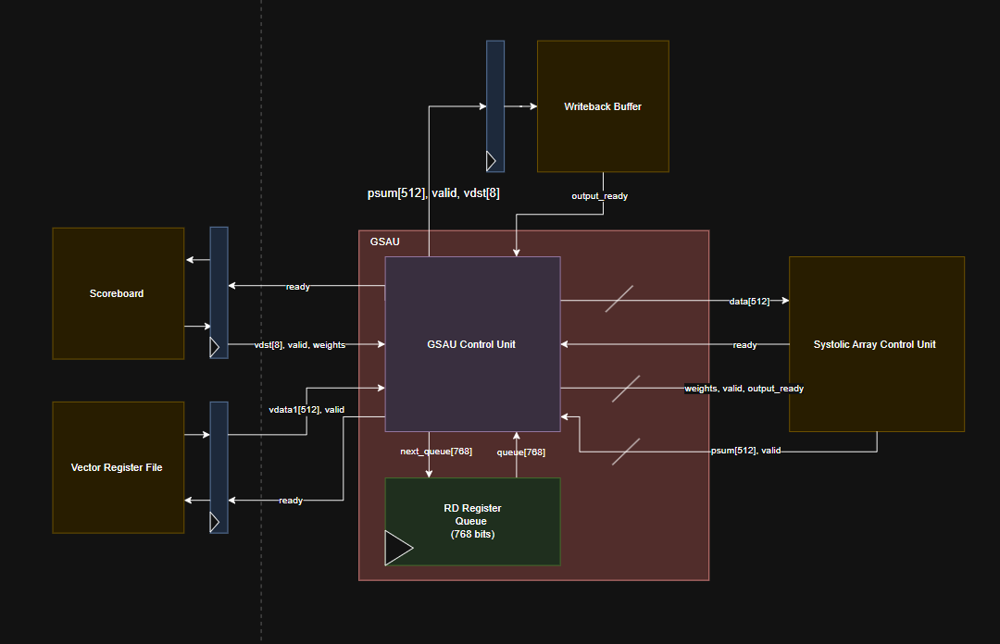
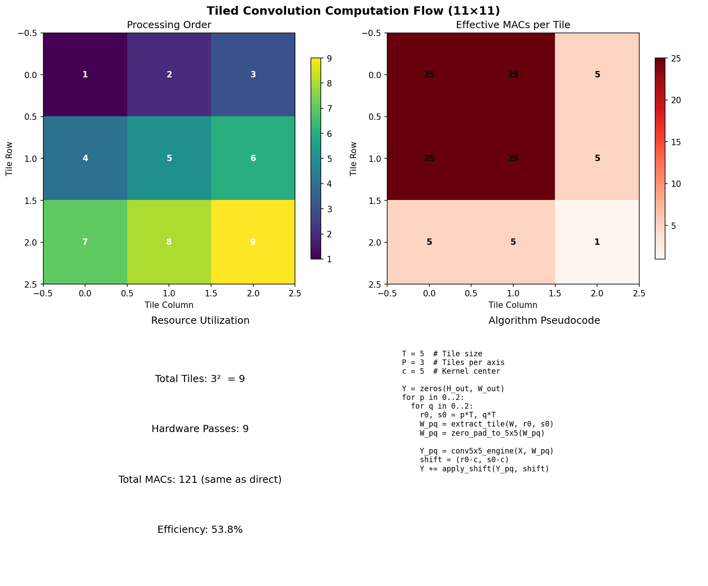

## State: I am not stuck with anything, don't need help right now. 

## Progress
  This week Saandiya, Nikhil, and I met up to start working on the interface file. We managed to finish the majority of the file, with everything being correct (with the exeption to latch a couple values), and it being pushed to the repository under Saandiya's branch. In addition, I started looking ahead, to see how we would adjust kernel sizes that are greater than 5x5. The reason why this is an issue, is that at 5x5 we have 25 values, where in 6x6 we have 36, while we only have 32 PE's. This will have to lead us to split up the larger kernel into multiple smaller ones, to ensure that we are able to actually calculate the values correctly. Below will be evidence of progress, and additional comments regarding where I am at. 

  Attatched below is the (hopefully) final RTL for the RSAU
   

  The GSAU is mainly consistent of 2 main modules, the control unit and the RD register queue. The control unit handles the interaction for the systolic array, and the overall dataflow for operation, while the RD register queue handles values for the ability for us to support multiple GEMM in flight. 

  This RTL was finalized during the Tuesday meeting, with the UVM team being present to verify everything. With the RTL set we started working on the interace file, where we discussed the values that would need to be latched together, to ensure proper functionality. These values are 
  ```Signals that will be latched
from scoreboard
vdst[8]
valid  
weights

from veggie  
vegg.n_vdata [512]
Vegg.vdata [512]
veggn_valid 
vegg.valid 
  ``` 

With this done, I started researching potential ways that we can split larger kernels up. Below is a photo of my current progress.
   

With this I tried to calculate how utilized all of our PE's would be with the algorith displayed. I still have to verify with the team to see if this is the way that we should approach splitting up larger kernels, as we still need to maintain speed through all of our usecases. 

## Tasks
  Heading into Fall Break, I was reassigned back to the systolic array team to aid in getting a couple of important tasks done. The one that I will be focusing on for the upcoming weeks will be adding a stalling capability to the systolic array. The current idea for a solution is to not completely stall all of the current operations, but if there is no backpressure, let everything in the systolic array to drain out. This is a good solution, as it reduces us needing to create a mess with wires to every single PE to stop indivudal operation the idea that a stall between  GEMM instructions shouldnt stall the whole array.

## Notes
  Due to the need for the systolic array to be finished soon, and the optimizations that are needed, I will be joining Vinay and Mixu,an to help get work down. 

## Future Plans 
  The stalling capabilities should be finished by Nov 2, alongside the other tasks for the systolic array. This includes the stalling capabilities, reducing the adder to 2 stages, pipelining the systolic array, bf16 correctness, and shared 3 input BF16 adders as an experiment. For the upcoming future, I will be working on adding stall signals, and helping with pipelining once I finish. 