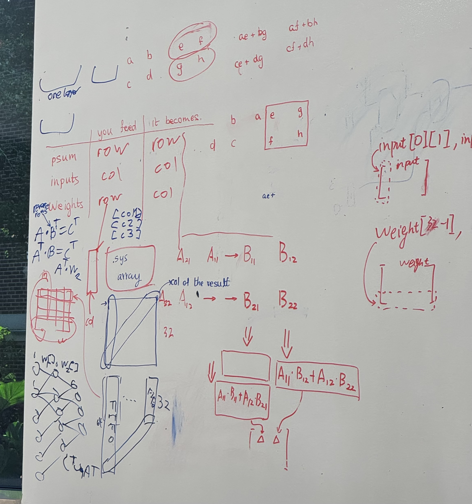
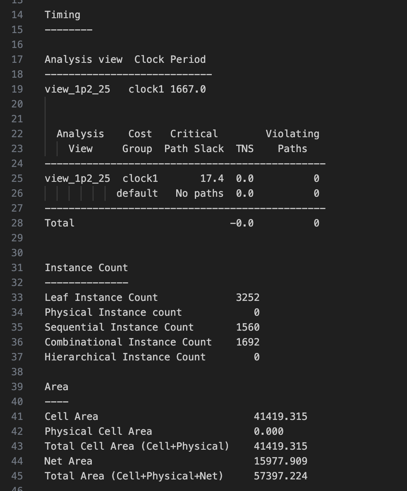

## State: I am not stuck with anything, don't need help right now.

## Progress
    On Sunday (10/26) I attended the SoCET meeting and refined a couple of ideas. I spoke with Sooraj and other team members and refined the FIFO size. I used the 4x4 case to prove that latency (assuming no stalls) is always 2 * length of the systolic array. Meaning once a instruction is issued from GSAU there will be a 64 cycle latency until systolic array signals that the corresponding GVMM (general vector matrix multiply) output is ready. This alters our fifo sizing. I also learned from Vinay that the systolic array will be issuable every cycle (VERY IMPORTANT) but also that 1 MAC cycle will be 3 clock cycles. This means we can generalize the fifo size to 64 MAC cycles latency * 3 clock cycles per MAC = 192 entries, with 8 bits (1 byte) per register we have 1536 bits of storage necessary. I talked with others about whether SRAM was necessary and it seems to be optimal for area if we can get it to work in the design. I also clarified with Vinay to ensure that our intended inputs will match the geometries that will ensure correctness in the Systolic Array. The results are below, refer to the table in the below image for the geometries. Software must ensure that these are followed. I spoke briefly with compiler & scheduler team about this and how the instruction functionally works.

Throughout the week before the vector core meeting on Wednesday, I spent lots of time making changes to the testbench to reflect our testplan and changing portions of the design to ensure correctness. The github links are below.

Github: 
https://github.com/Purdue-SoCET/tensor-core/blob/tensor_compute_accelerator_saandiya/src/modules/gsau_control_unit.sv
https://github.com/Purdue-SoCET/atalla/blob/tensor_compute_accelerator_saandiya/src/testbench/gsau_control_unit_tb.sv

I reran synthesis for the updated logic and fifo size and the results are below. Note: this is with registers and not SRAM.

During the week, Haejune got back to me with the python code for control bit generation, I will need to make a ROM for that and hook it up to the benes network.

## Tasks
   We have the RTL verified and I have made the FIFO and logic changes. I will investigate the SRAM IP in our fifo and Haejune's Benes and control bit code to implement for the shifting unit. I have confirmed with Joseph where the shifting unit will go. Jing also recommended fixing one test and getting the critical path so I will also work on those over the coming week.
   Deadlines:
     Integration Done - 11/9, not too clear on integration as of now.

## Future Plans
   We are coming up on integration and things are still likely to change. Some GTAs have emphasized making thing parameterizable so I will look at whether some changes should be made such that if we need to support other formats or sizes it's as close to a 1 line change as possible.