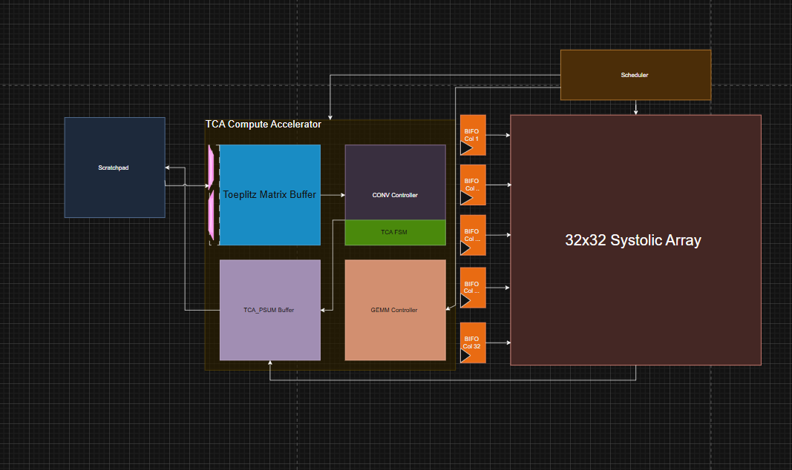

## State: I am not stuck with anything, don't need help right now.

## Progress
On Tuesday I met with Saandiya, Jing, and Joseph where we discussed how the TCA was going to be morphed into the vector core. We came up with the solution that the vector core would directly send Toeplitz columns directly to systolic array (new instruction) and we would have a shifting network (Benes network) to shift every instruction that has bits. This would result in a order of operations of mask -> shift -> operation. This means we can easily use N instructions to generate a Toeplitz column for a NxN kernel. On Thursday and Friday I worked on slides with the team, fleshing out the ISA additions (currently we have a 6 bit addition, 1 bit for shift L/R, 5 bits for shift amount up to 32, and a send.sys instruction to send to systolic array) and working on an example instruction flow of how we generate Toeplitz columns and send those to Systolic Array. The convolution team and I presented to AI HW GTAs on Friday and the larger subteam on Sunday. 

Slides: https://docs.google.com/presentation/d/1NUsgPNHckD6SQqHwr7apMZsKGGzt-dGIDLM42nVq9yI/edit?pli=1&slide=id.g383b35a1ff2_0_1#slide=id.g383b35a1ff2_0_1
New Vector Core RTL Diagram (includes GSU): https://app.diagrams.net/#G1JW5Jguhs4vChq-sziK6ZME-tJgycms2J#%7B%22pageId%22%3A%227TNEaft9gA3lZacV84dw%22%7D
Old deprecated RTL diagram for TCA worked on with Myles: 

## Tasks
   My current task is to work with Saandiya on the GSU (global shift unit) this is the interface between the Vector Core and the Systolic Array, it should keep track of which values we care about from the lanes somehow, and send the respective data to systolic array. I then need to verify with other team members that our ISA additions are final and won't need to be changed in the future.

## Notes
   Currently we have taken the role of the GSU, we may take more modules in the future as Vector Core offloads more work to us (since TCA is no more).

## Future Plans 
   Once we are finished with GSU and work on other modules within Vector Core, it's then the responsibility to give compiler team a good idea of how a convolution operation is specified in C, so that the Atalla ASM is deterministically going to be what we expect.
