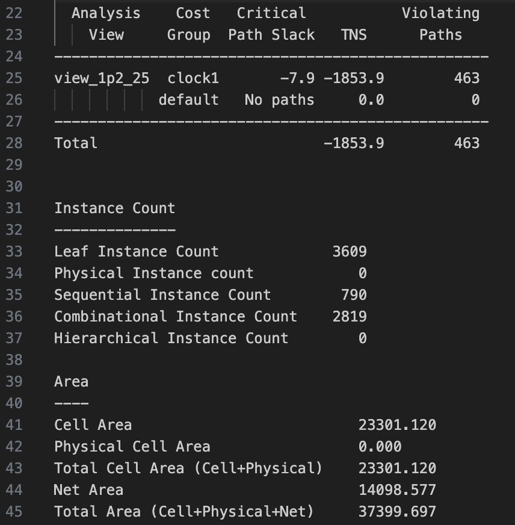

## State: I am not stuck with anything, don't need help right now.

## Progress
On Friday (10/17) I met with Saandiya to make further progress on GSAU. We worked through a couple flow issues like the simulation build not working as expected. We also finished/checked our test plan to ensure it covers all cases we could think of.

On Sunday (10/19) I attended the SoCET meeting and made further progress on the GSAU, and refined latency amounts to [96, 106] in the common case. We have decided not to report an absolute worst case latency because that is the very uncommon scenario. If we plan for the common worst case scenario, we can stall in the low % of cases that are worse than that, but in the situations that are better, we will exploit instruction level parallelism. Additionally, we have officially checked off our instructions. We confirmed a couple details with Vinay about timing, specifically about whether shifting can happen every cycle, determining whether systolic array would ever apply backpressure from us that is independent of our backpressure.

On Tuesday (10/21) I met with Saandiya to make further progress on GSAU. We simplified the code to only include what was most necessary and made the edited some of the logic to reflect the instructions that we outlined (i.e. ensuring two veggie file inputs, directly wiring WB buffer backpressue to SA_output_ready). All source changes can be found in the Github links.

On Wednesday (10/22) I met with Vector Core where we discussed some synthesis metrics and I gave my fifo file to some others in case they are able to use it to make their designs more efficient. Because Jing is gone for the weekend, our deadline for presenting waves will happen in the next meeting on 10/29.

On Thursday (10/23) I was finally given access to the EDA tools with cae group access. I went through the synthesis flow and after some troubleshooting, managed to get area and clock speed numbers for our unit. I reported the numbers to others and put it into the spreadsheet. The number of sequential units (790) is slightly off from what I expect (768), so I will do a little investigating of why that may be.

Github: https://github.com/Purdue-SoCET/tensor-core/blob/tensor_compute_accelerator_saandiya/src/modules/gsau_control_unit.sv

## Tasks
   We have the RTL done but not completely verified, we will need to finish the testbench so that it implements all of the things that we mentioned in the testplan.
   Deadlines:
     RTL Freeze (fully verified) - due by 10/26 or potentially vector core meeting 10/29
     Integration Done - 11/9? (Likely will confirm with Jing in next vector core meeting)

## Future Plans
   In the Vector Core meeting, Jing mentioned that I should be confirming details about interfaces and the shifting unit. While we are supposed to get the shifting unit from Scratchpad team (a stripped down Benes network), he said that we should contact the right people to ensure that we'll get it. We also need to completely confirm interfacing with systolic array as that's the most important interconnection that should be clarified with that team. I'll be meeting with Vinay in the coming days to solidify our interfacing.