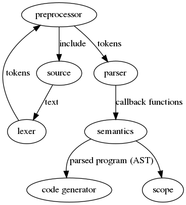

I'm not stuck with anything. 

Progress 
-Progessing on understanding PPCI's backend and fronend support
-finding ways to implement changes to PPCI front and backend
-implementing new keywords in parser 

Notes

-The ISA team is working on a 64bit ISA. 
-Research PPCI or LLVM and decide which implementation is better
-Implement theta parser handling in order to see if compiler has possibility to compile to assembly 
-Focused on understanding data type handling within the parser. We looked at registers, vector, and scalar instructions to be able to understand how each could be handled in the PPCI Library. 

Next Step
-implementing support for basic instructions 

