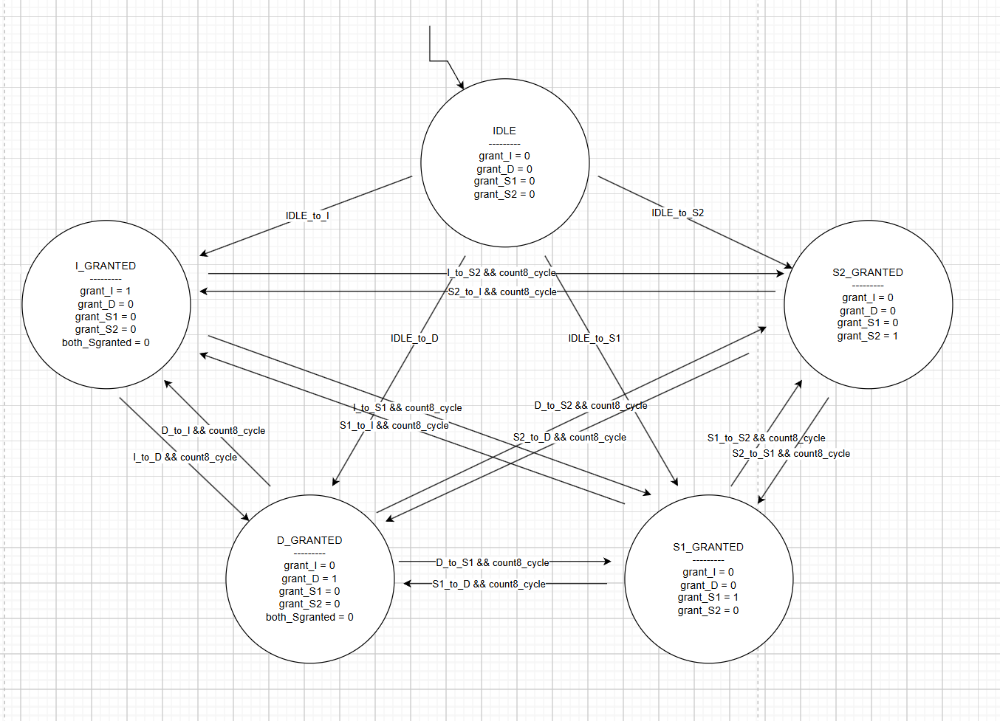
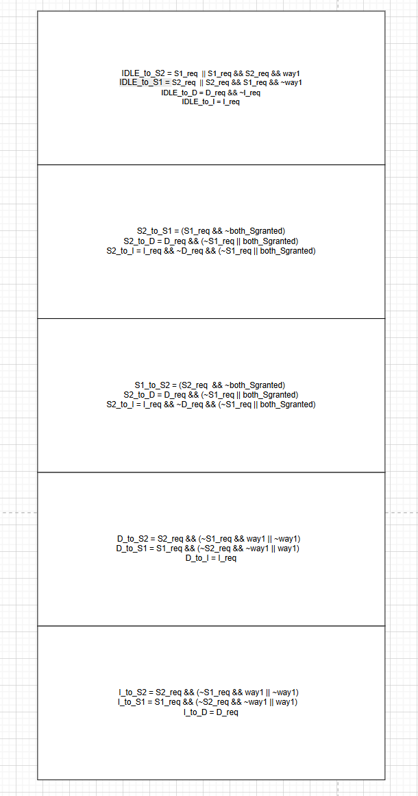

## State
I need some help with merging the code into the main branch.

## Progress
My progress this week is purely organizing the code and cleaning the folders so that I can merge with the main code, but I have issues in runnning the makefile (Following the instructions from Askshath as well), but got issues in setting up. So I decide to make a DRAM branch, clean it as attlas format to make it work, so that DRAM teammembers can pull it and use it with DRAM blocking-version.

I move on AXI-bus arbiter RTL design, the arbitration between AXI-queue and Load and Store queue that going to the non-blocking DRAM controller (2-3 hours). Me and Aaryan discussed upon arbitration logic and design choice. We decide to choose the lock requests, meaning we will handle requests per 8 cycles

I discussed the timming issue with Dhruv, right now we are having the issues in setting the timing configuration for DRAM clock, we are not able to switch a different speed non other than TS_1500, and TS_1250. The following protocol to resolve is we will keep moving on make a timing configuration for the DRAM timing constraint by following the JDEC document and starting off with the configuration that is currently working.
## Prove:
- AXI arbiter: 
- AXI arbiter logic: 

## Following updates
1. Interfaces AXI-RTL code
2. Setting the timing configuration for the blocking-DRAM version