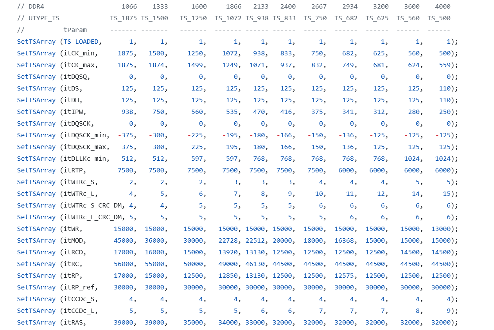

## State 
I'm not stuck with anything

## Progress
1) Disscussing the performance metrics in analyze the performance of DRAM controller with blocking-version and potential non-blocking
2) Working out and finalize the axi-arbiter with Aaryan and finishing the RTL diagram to support the writing cycle and reading cycle
3) Configuring, listing and update the timing constraint to the blocking DDR4 DRAM
    a. Initially the blocking DRAM is working with specific configuration TS-1500 speed, but with weird timing configuration. I found out the specific setting of timing parameters of tREF in precharge in different, which causing in different, I follow the JDEC standard and Micron update the timing parameter in TS-1500 Speed and parameterized the timing parameter in different speeds
    Prove: #Description: Timing tasks in different speed
4) Cleaning up the RTL diagrams of Command FSM (update it) and meet Json and Adrian to help them with connecting and extend the BLOCKING command FSM to their design

## Future plan: 
Preparing for senior design review and ECE565 HW .-.
