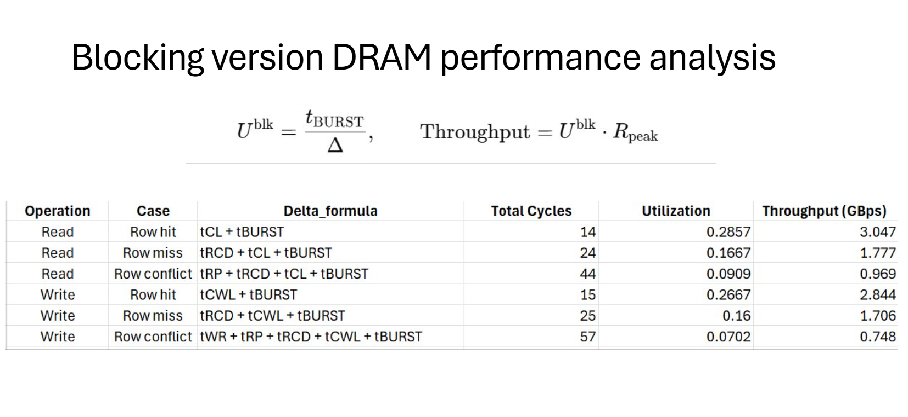
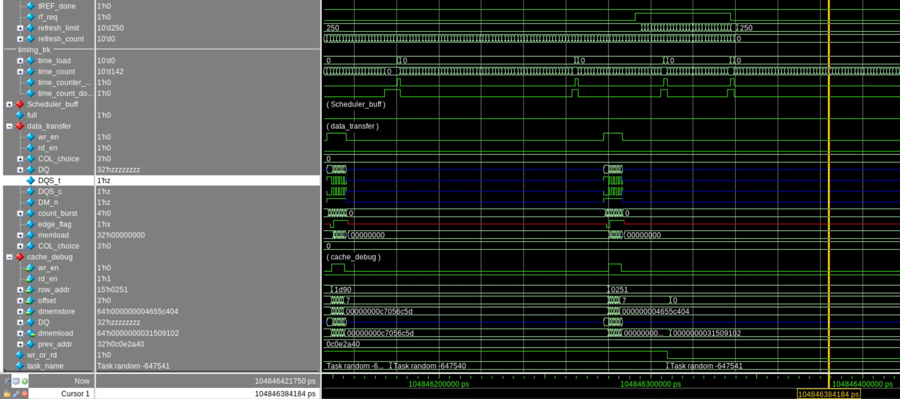

## State 
I'm not stuck with anything

## Progress
1) Working on the RTL slides with DRAM team
2) Adding the DRAM performance metric (mainly Utilization and throughput):
    a) The idea is that I use the efficient rate in the computer network The total number of cycle that need the data (tBURST = 4 cycles) / (Total number of cycles that need to go through to get it). The total number of cycles that need to go through is depending on 2 factors (read or write), (row hit, row miss, row conflict). I made a table for measuring the efficient rate and throughput. The configuration that I choose is that 1333MT/s -> 10GB/s peak bandwidth and go from there to make the table
        Prove: 
    b) I spent 1-2 hours to practice the design meeting with DRAM team
    c) I present design review with DRAM team and got request running 1M requests
    d) After testing, I realize that the refreshing logic of detecting all rows closed is not what I looking for. So my argument is because of the the DRAM memory controller will always busy and perform transactions. THE COMMON CASE IS THERE ALWAYS BE A ROW OPEN!. That being said, I fixed my command FSM is that if there is a refresh happened, it will go into the state to CLOSE ALL ROWS not checking whether other rows has closed or not
        Prove:  Description: the tb running more than 600k tests (not violating data fatal error) and only FAILED the timing configuration of micron DRAM
        Code: https://github.com/Purdue-SoCET/atalla/blob/memory_subsystem_tri/src/testbench/dram_top_tb.sv

## Future plan: 
future work and merging tWR optimize from DhruvE CE565 HW .-.
